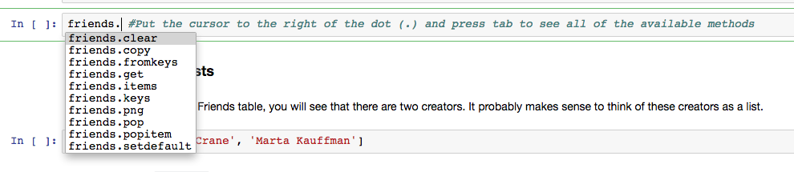
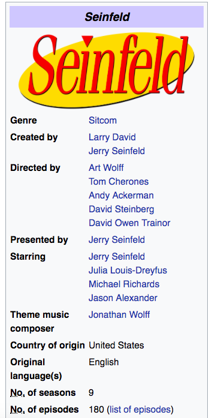

# Working With Dictionaries

## Introduction
After introducing and working with Lists, you might be wondering if there are other kinds of collections in Python that we should know about. Well, there are! In this lesson, we will introduce **dictionaries**. As we know, lists represent a collection of information that is ordered, like a list of the most watched TV shows.  However, in different situations, we may want our data to represent attributes of an entity, such as the various attributes of a single TV show like its name, genre, starring actors, etc.  For scenarios where the stored objects have no definitive order, but need to be retrieved, a **dictionary** is more natural. Dictionaries are _unordered_ collections of key-value pairs. Rather then specifying a positional index as with lists, we specify a key for a dictionary and are returned with the value associated with that key. For example, in a list, we could retrieve the third item with ExList[2] (remember indexing starts at 0), while in a dictionary, there is no specific third item. Instead, we would have to specify a key such as AcronymnDict['GDPR'] to retrieve the associated value attached to that key. This is similar to traditional dictionaries: you look up a specific word (the key) to find its associated definition (the value).

## Objectives
You will be able to:
* Understand dictionaries and how to use them

## Why Use a Dictionary When We Have Lists?

While lists are great, for *listing* information like we mentioned earlier, they can actually become very messy when we are trying to use them to organize data which is more a bit more complex. Let's look at a brief example of a person.

Every person has a **name**, **age**, **height** (in inches), **weight** (in lbs), and **fav_lang**. How we would represent a person using a list?

```python
terrance = ["Terrance", 25, "6'00", 165, "Python"]
```

Now, that looks *fine* but what do we do if we want to tell someone Terrance's fav programming language? We just have to ***remember*** that Terrance's favorite programming language comes fifth in his list of information? What if he has more attributes than just the five that are listed (i.e. native_language, hometown, etc.)? What if his attributes are in a different order than we expected? We can see that this list would easily breakdown and cause more problems than it solves.

However, if we use a dictionary, we can more neatly organize this information and make it easier for us to use as the dictionary grows. Let's see what Terrance's information would look like using a dictionary.

```python
terrance = {'name': "Terrance", 'age': 25, 'weight': 72, 'height': 165, 'fav_lang': "Python"}
```

This dictionary definitely has more text in it, but we can see a direct association between the *attribute* or **key** and its correlated **value** (i.e. `{"key": "value"}`). This datatype makes it easier to store and access information, such as the attributes of a person or other entity. Note that dictionaries are unordered, so trying to access information using an index number will not work! Accessing information is always done by calling the associated **key**.

Let's take a deeper look at how dictionaries are built and how they work.

## Creating a dictionary, and retrieving attributes

Imagine we want to represent information about the TV show Friends.  Our first step might be to go to Wikipedia to find some information.


As you can see, this information is presented in two columns, with the topics or headings to the left and their specific values to the right.  Now let's see how some of the above information can be represented as a dictionary in Python.


```python
friends = {'name': 'Friends', 'genre': 'sitcom', 'no_of_seasons': 10}
```

We create a dictionary with the braces, also called curly braces.  (On your keyboard, braces are located above the return key).  A dictionary is a group of key and value pairs, with the key to the left and the corresponding value to the right.      

Now that we have initialized a dictionary and assigned it to the variable, `friends`, we can retrieve the dictionary by referencing our variable.


```python
friends
```


    {'name': 'Friends', 'genre': 'sitcom', 'no_of_seasons': 10}


```python
friends['no_of_seasons']
```


    10


So to retrieve a specific value, we simply reference the dictionary, then the brackets, then the specific key.  The corresponding value is returned. 

## Assigning attributes and exploring the edge cases

Now that we know how to retrieve values, let's take our existing `friends` dictionary, and assign it more key-value pairs.  Here is what our dictionary currently looks like.


```python
friends
```


    {'name': 'Friends', 'genre': 'sitcom', 'no_of_seasons': 10}


Let's add a key of `no_of_episodes` with a value of 236.


```python
friends['no_of_episodes'] = 236
```


```python
friends
```


    {'name': 'Friends',
     'genre': 'sitcom',
     'no_of_seasons': 10,
     'no_of_episodes': 236}


So as you can see, our values of a dictionary can be any data type -- strings, numbers, and others.  How about keys?  Do keys have to be strings? Asking questions like this is important for improving your understanding! Moreover, we don't always have to look up the answer; we can experiment and note the results.


```python
friends[14] = 'some value'
```


```python
friends[14]
```


    'some value'


Apparently keys can also be integers.

Ok, let's get rid of that key - it doesn't make much sense.


```python
del friends[14]
```

We use the delete function, `del`, followed by the dictionary and the name of the key.  And now the key-value pair is gone.


```python
friends
```


    {'name': 'Friends',
     'genre': 'sitcom',
     'no_of_seasons': 10,
     'no_of_episodes': 236}


## More Dictionary Methods

There's plenty more that you can do with dictionaries, although worrying too much about specifics can be overwhelming early on. As a good starting point, recall that you can look up dictionary methods using tab completion, or the help method. Furthermore, if you wish to know how a specific method works, you can pull up the docstring.


```python
help(dict) #See all of the methods available to dictionary objects
```

    Help on class dict in module builtins:
    
    class dict(object)
     |  dict() -> new empty dictionary
     |  dict(mapping) -> new dictionary initialized from a mapping object's
     |      (key, value) pairs
     |  dict(iterable) -> new dictionary initialized as if via:
     |      d = {}
     |      for k, v in iterable:
     |          d[k] = v
     |  dict(**kwargs) -> new dictionary initialized with the name=value pairs
     |      in the keyword argument list.  For example:  dict(one=1, two=2)
     |  
     |  Methods defined here:
     |  
     |  __contains__(self, key, /)
     |      True if D has a key k, else False.
     |  
     |  __delitem__(self, key, /)
     |      Delete self[key].
     |  
     |  __eq__(self, value, /)
     |      Return self==value.
     |  
     |  __ge__(self, value, /)
     |      Return self>=value.
     |  
     |  __getattribute__(self, name, /)
     |      Return getattr(self, name).
     |  
     |  __getitem__(...)
     |      x.__getitem__(y) <==> x[y]
     |  
     |  __gt__(self, value, /)
     |      Return self>value.
     |  
     |  __init__(self, /, *args, **kwargs)
     |      Initialize self.  See help(type(self)) for accurate signature.
     |  
     |  __iter__(self, /)
     |      Implement iter(self).
     |  
     |  __le__(self, value, /)
     |      Return self<=value.
     |  
     |  __len__(self, /)
     |      Return len(self).
     |  
     |  __lt__(self, value, /)
     |      Return self<value.
     |  
     |  __ne__(self, value, /)
     |      Return self!=value.
     |  
     |  __new__(*args, **kwargs) from builtins.type
     |      Create and return a new object.  See help(type) for accurate signature.
     |  
     |  __repr__(self, /)
     |      Return repr(self).
     |  
     |  __setitem__(self, key, value, /)
     |      Set self[key] to value.
     |  
     |  __sizeof__(...)
     |      D.__sizeof__() -> size of D in memory, in bytes
     |  
     |  clear(...)
     |      D.clear() -> None.  Remove all items from D.
     |  
     |  copy(...)
     |      D.copy() -> a shallow copy of D
     |  
     |  fromkeys(iterable, value=None, /) from builtins.type
     |      Returns a new dict with keys from iterable and values equal to value.
     |  
     |  get(...)
     |      D.get(k[,d]) -> D[k] if k in D, else d.  d defaults to None.
     |  
     |  items(...)
     |      D.items() -> a set-like object providing a view on D's items
     |  
     |  keys(...)
     |      D.keys() -> a set-like object providing a view on D's keys
     |  
     |  pop(...)
     |      D.pop(k[,d]) -> v, remove specified key and return the corresponding value.
     |      If key is not found, d is returned if given, otherwise KeyError is raised
     |  
     |  popitem(...)
     |      D.popitem() -> (k, v), remove and return some (key, value) pair as a
     |      2-tuple; but raise KeyError if D is empty.
     |  
     |  setdefault(...)
     |      D.setdefault(k[,d]) -> D.get(k,d), also set D[k]=d if k not in D
     |  
     |  update(...)
     |      D.update([E, ]**F) -> None.  Update D from dict/iterable E and F.
     |      If E is present and has a .keys() method, then does:  for k in E: D[k] = E[k]
     |      If E is present and lacks a .keys() method, then does:  for k, v in E: D[k] = v
     |      In either case, this is followed by: for k in F:  D[k] = F[k]
     |  
     |  values(...)
     |      D.values() -> an object providing a view on D's values
     |  
     |  ----------------------------------------------------------------------
     |  Data and other attributes defined here:
     |  
     |  __hash__ = None
    


```python
friends. #Put the cursor to the right of the dot (.) and press tab to see all of the available methods
```


      File "<ipython-input-12-44c433242572>", line 1
        friends. #Put the cursor to the right of the dot (.) and press tab to see all of the available methods
                                                                                                              ^
    SyntaxError: invalid syntax


You should see something like this:
    



```python
#Pulling up documentation for a specific method
friends.get?
```

### Dictionaries with lists

If you look back up at our Friends table, you will see that there are two creators.  It probably makes sense to think of these creators as a list.


```python
creators = ['David Crane', 'Marta Kauffman']
```

So let's have our `friends` dictionary have a key of creators that points to this list. 


```python
friends['creators'] = ['David Crane', 'Marta Kauffman']
```


```python
friends
```


    {'name': 'Friends',
     'genre': 'sitcom',
     'no_of_seasons': 10,
     'no_of_episodes': 236,
     'creators': ['David Crane', 'Marta Kauffman']}


```python
friends['creators']
```


    ['David Crane', 'Marta Kauffman']


And of course, if we want to get the first creator in the list, and store it as a variable, we can.


```python
david = friends['creators'][0]
```

So in the above line, we referenced the dictionary, then got to the list of creators through using the key creators.  And now that we are pointing to that list, we use the brackets to reference the string at index zero.

###  Lists of Dictionaries

Now imagine we want to represent another TV show.



As you can see, Wikipedia provides us data similar to what we have for Friends.


```python
friends
```


    {'name': 'Friends',
     'genre': 'sitcom',
     'no_of_seasons': 10,
     'no_of_episodes': 236,
     'creators': ['David Crane', 'Marta Kauffman']}


  So let's represent our information for Seinfeld in a dictionary.


```python
seinfeld = {'name': 'Seinfeld', 'creators': ['Larry David', 'Jerry Seinfeld'], 'genre': 'sitcom', 'no_of_seasons': 10, 'no_of_episodes': 180}
```


```python
seinfeld
```


    {'name': 'Seinfeld',
     'creators': ['Larry David', 'Jerry Seinfeld'],
     'genre': 'sitcom',
     'no_of_seasons': 10,
     'no_of_episodes': 180}


Now that we have two TV shows, we can envision having a list of TV shows.


```python
tv_shows = [friends, seinfeld]
tv_shows
```


    [{'name': 'Friends',
      'genre': 'sitcom',
      'no_of_seasons': 10,
      'no_of_episodes': 236,
      'creators': ['David Crane', 'Marta Kauffman']},
     {'name': 'Seinfeld',
      'creators': ['Larry David', 'Jerry Seinfeld'],
      'genre': 'sitcom',
      'no_of_seasons': 10,
      'no_of_episodes': 180}]


This is a nested data structure.  And it can be confusing to disentangle.  A good technique is to describe the data structure first before working with it.

So `tv_shows` is a list, with each element of the list being a dictionary.  The dictionary has a key of `creators` which itself points to another list. In describing the data structure, we look to the braces and brackets at the beginning.  `[{` means we are starting a list with a dictionary as the first element.  

Ok, now let's start working with this nested data structure.  First let's select the second creator of Seinfeld and set it equal to the variable `jerry`.  We'll retrieve this data in steps.  First, we'll select the correct TV show.


```python
tv_shows[1]
```


    {'name': 'Seinfeld',
     'creators': ['Larry David', 'Jerry Seinfeld'],
     'genre': 'sitcom',
     'no_of_seasons': 10,
     'no_of_episodes': 180}


Now we have the correct TV show.  Let's keep going.


```python
tv_shows[1]['creators']
```


    ['Larry David', 'Jerry Seinfeld']


Ok, almost there, we have our list of creators.


```python
tv_shows[1]['creators'][1]
```


    'Jerry Seinfeld'


So as you see above, we are now selecting the correct creator from the list.


```python
jerry = tv_shows[1]['creators'][1]
jerry
```


    'Jerry Seinfeld'


Ok, so our approach here was to break this problem down into steps.  We first selected the correct TV show.  Then, we moved onto the `creators` attribute.  Finally, we retrieved the correct element from the list of creators.  

> As programmers, we tend not to get much smarter over time.  Instead, we develop skills for making problems easier to solve.  Taking the problem in steps, and checking our work at each of these steps is a technique we should continue to lean on.  It's the mark of a skilled developer.

## Summary

In this section, we saw a new type of collection, the dictionary.  A dictionary is an unordered collection of key-value pairs.  We mark the start and end of a dictionary with curly braces, `{}`, and then follow the pattern of `'key':'value'` for each of the associated attributes, with each attribute separated by a comma: `dictionary = {'key1':'value1', 'key2':'value2'}`.  

We retrieve a specific value from a dictionary by using the bracket accessor in combination with the key, so `dictionary['key2]'` returns `'value2'`. We can also add a new attribute with the format `dictionary['key3'] = 'value3'`.

Finally, we saw that we can represent data as nested data structures.  In working with nested data structures a good technique is to pay attention to the edges of the data structure as in `[{`, and then articulate how that data structure is nested.  Finally, when accessing data from a nested data structure, it is useful to break down the problem into steps to get feedback along the way.
