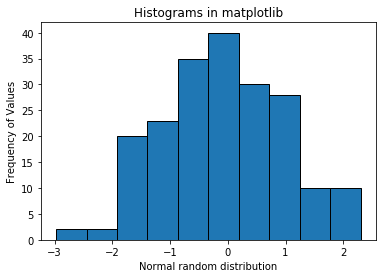

# Data Visualization

## Introduction

This lesson introduces data visualization using Python and the popular Matplotlib plotting library. You will look into the elements of standard Matplotlib plots and how to use them for creating and customizing visualizations. 

## Objectives
You will be able to:
* Understand the Matplotlib plot structure for drawing basic plots.
* Visualize data using scatterplots, barplots and histograms

## Matplotlib Plotting Library

The Matplotlib plotting library provides a range of built in functions to start visualizing data with minimal effort. 

First, import matplotlib's `pyplot` module (a module is a unit of prewritten code that you can use in your projects) into your working environment along with `numpy` (one of the most popular Python libraries for scientific computing) to create some sample data. You will see that importing the `pyplot` module from `matplotlib` provides simple and agile creation of desired plots. 

```python
import matplotlib.pyplot as plt

```

In jupyter notebooks, you can use the `%matplotlib` "magic command" with `inline` to show plots inside the notebook or `qt` for external/interactive plots. `inline` is recommended for most requirements (external plots are suitable for interactive visualizations).  


```python
# Import matplotlib
import matplotlib.pyplot as plt

# Set plot space as inline for inline plots and qt for external plots
%matplotlib inline
```

## Scatter plot

A scatter plot is a two-dimensional data visualization that uses dots to represent the values obtained for two different variables - one plotted along the x-axis and the other plotted along the y-axis. 

Scatter plots are used when you want to show the relationship between two variables. Scatter plots are sometimes called correlation plots because they show how two variables are correlated. 

For this example, you will use python's `numpy` library to create sample data. Since numpy is a specialized package for scientific computing, it is primarily used for performing numerical operations. Don't worry about all of the details surrounding numpy right now, it will be introduced formally later. For now, use [numpy's `linspace()` function](https://docs.scipy.org/doc/numpy-1.14.5/reference/generated/numpy.linspace.html) to quickly generate some dummy data for visualizations. The industry standard is to alias numpy as np.


```python
# Import numpy to generate some dummy data
import numpy as np

# Generate an array x of 30 equally spaced data points on a line space of 0 - 10.
x = np.linspace(0, 10, 30)
# Calcuate sin(x) and save in a new array y
y = np.sin(x)
```

Now that you have your data ready, create a scatter plot using the `plt.scatter()` function which takes in two vectors and shows their relationship. You can optionally pass in extra parameters like `label` to provide information to the plot, `plt.title()` for defining a title, and `plt.legend()` to add the label information to the plot. Finally, use the `plt.show()` function to display the plot.


```python
# Pass in x and y values with a label 
plt.scatter(x, y, label = "Function: sin(x)" )
plt.title('Scatter Plot in Matplotlib')
plt.legend()
plt.show()
```


In case you are wondering, the above plot shows a harmonic relationship between two variables i.e. the sine wave. You can customize the plot further to make it easier to read.

First, provide some labels for both axes by using `plt.xlabel` and `plt.ylabel`. You can also change the size of the plot with `plt.figure(figsize=(a,b))`, where a and b are inches for width and height of the plot. Let's see this in action below.


```python
# Set the figure size in inches
plt.figure(figsize=(10,6))

plt.scatter(x, y, label = "y = sin(x)" )

# Set x and y axes labels
plt.xlabel('X values')
plt.ylabel('Y values')

plt.title('Scatter Plot in Matplotlib')
plt.legend()
plt.show()
```


The nice thing is labeling and other customizations that you see here are applicable to almost all kinds of plots in matplotlib. 

### Bar Graph or Column Graph.

Bar charts are one of the most common plot types for showing comparisons between data elements. A bar chart or column graph allows comparisons across categories by presenting categorical data as rectangular bars with heights or lengths proportional to the values that they represent. One axis of the chart shows the specific categories being compared and the other axis represents a discrete value scale. The bars can be plotted vertically or horizontally.


Matplotlib comes packaged with a number of handy plotting functions. Matplotlib's `.bar()` and `.barh()` methods can be used to draw constant width vertical and constant height horizontal bar graphs for a simple sequence of x, y values. Let's plot a simple vertical bar graph with `.bar()` function. In the above example, we had the same number of values in both x and y. Let's generate some more data in numpy for plotting first. To do this, some functions from the ```np.random``` library will be used. This is a specialized library for generating random numbers. Don't worry if the code seems unfamiliar now, the details of using numpy for generating random numbers will be covered in detail later.


```python
# Set seed for reproducability
np.random.seed(100)

# Generate variable x as 10 categories using numpy's arange function for x-axis
x = np.arange(10)

# For y-axis, generate 10 random quantities from the “standard normal” distribution (zero mean) 
# using numpy's random.randn() function
y = np.random.randn(10)
```

Now plot a bar graph based on above data.


```python
plt.figure(figsize=(10,6))

# Use bar() function to create a plot using above values on both x and y co-ordinates. Add a label.
plt.bar(x, y, label='Sample Data')

plt.xlabel('X values - categories')
plt.ylabel('Y values - quantities')

plt.title('Bar Plot in Matplotlib')
plt.legend()

# Output the final plot
plt.show()
```


That bar graph above is useful because you can easily inspect the quantities in each category (0-10) and make informed decisions about how data are distributed across these categories. 

##  Histograms 

A histogram is a plot that lets you discover the underlying frequency distribution of a set of continuous data. This allows the inspection of the data for its underlying distribution (e.g., normal distribution), outliers, skewness, etc. An example of a histogram is shown below:


Basically, histograms are used to represent data that has been split into some number groups. The X-axis describes the groups and the Y-axis describes the frequency of occurrence. If this is a little confusing, consider the histogram of ages above. The X-axis shows ages in groups of 10 years. The Y-axis is a count of how many times a member from each group appears in the data. For example, there are 2 occurrences of ages between 20-30.

It is important to distinguish bar charts from histograms. Bar charts show category-specific values. Histograms show counts of how frequently a given range of values occurs in a data set. 

<br>

<br>

You can use the `plt.hist()` function in matplotlib to draw a histogram while passing in values from the required data variable. First, use the `np.random.randn()` function again to generate 200 numbers that are normally distributed around a mean of 0. Don't worry if you didn't catch that last sentence, distributions and means will be covered in detail later.


```python
# Set seed for reproducability
np.random.seed(100)

# Generate 200 values from 0 mean normal distribution
x = np.random.randn(200)

#Plot the histogram with hist() function
plt.hist(x, bins = 10, edgecolor='black')

plt.xlabel('Normal random distribution')
plt.ylabel('Frequency of Values')
plt.title('Histograms in matplotlib')
plt.show()
```





Recall, the Y-axis tells you the frequency a certain range of numbers appears in data set. Since this data are normally distributed, the probability of appearing increases as you move towards the mean, so it makes sense that the tallest bar is around 0.

### The `bins` argument
Say you want to change the range of values that define the groups of a histogram. You can optionally pass the `bins` argument to set the number of groups. In the plot above, the data have been separated into 10 groups. Check out what happens when you change the number of bins to 5:


```python
plt.hist(x, bins=5, edgecolor='black')
plt.xlabel('Normal Distribution')
plt.ylabel('Frequency of values')
plt.title('Histograms in matplotlib')
plt.show()
```


Note the scale of the Y-axis and the width of the bars compared to the histogram using 10 bins. The granularity of the bins can be changed according to your specific analytical needs and the amount of underlying data. For example, if you had 5 data points, you probably would not want to use 50 bins.  

For the next example, generate a lot of numbers and use a lot of bins. Take note of how the histogram starts to look more "bell-shaped" which is characteristic of the normal distribution:


```python
# Set seed for reproducability
np.random.seed(100)

# Generate 10000 values from 0 mean normal distribution
x = np.random.randn(10000)

#Plot the distogram with hist() function
plt.hist(x, bins=50, edgecolor="black")

plt.xlabel('Normal random distribution')
plt.ylabel('Frequency of Values')
plt.title('Histograms in matplotlib')
plt.show()
```


Definitely looks more like the usual "bell curve"! Try increasing the number of values and bins further and inspect how this changes the shape of the distribution.

## Summary

In this lesson, you learned how to use matplotlib's basic plotting techniques to visually describe your data. You also identified use cases for each of these techniques and learned how to customize and add basic details to a plot. 
