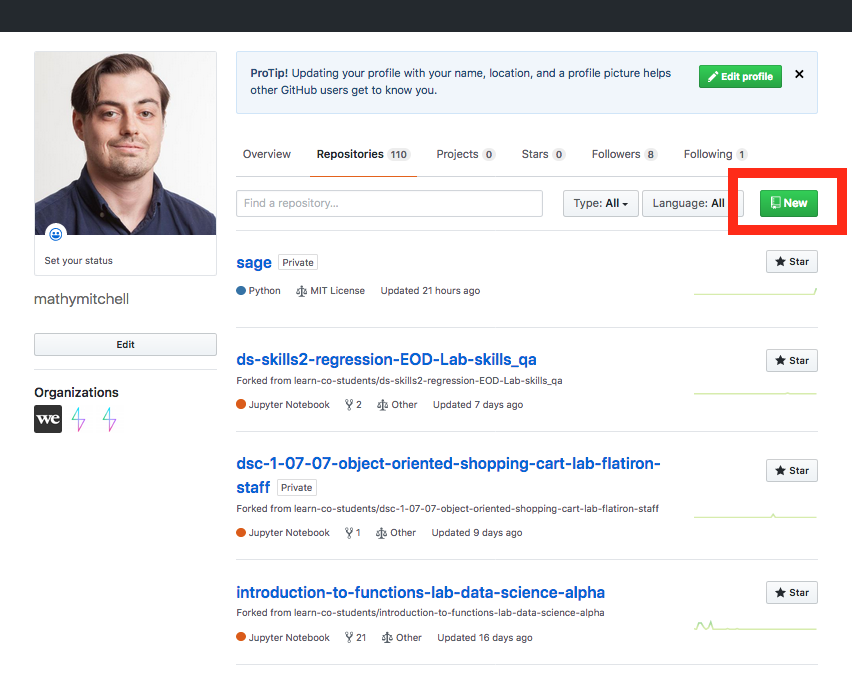
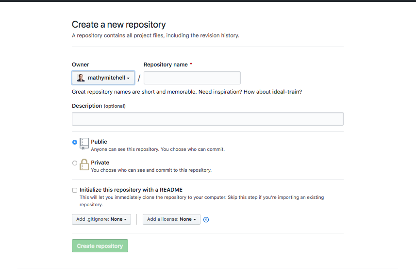
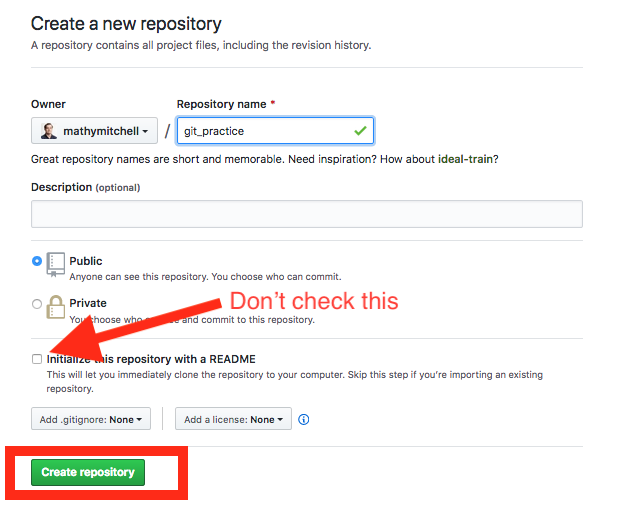
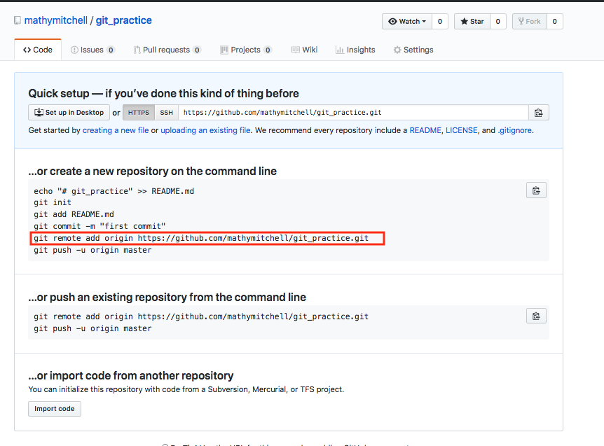
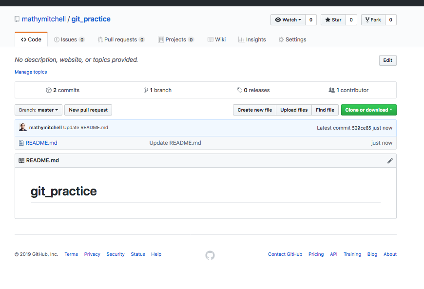

# Git Practice

## Introduction

Now that you've seen a little bit of the bash shell and cloned a git repository from github, its time to practice a full workflow cycle in a little more detail. In this lesson, we'll start by taking a look at how to create a new git repository if you are not working from an existing one. From there, we'll further investigate how the concepts of `git add`, `git commit` and `git push` work in practice.

## Objectives

You will be able to:

* Create a new github repo online
* Initialize a github repo from the command line
* Add, Commit and Push changes via git

## Creating a New Git Repository

In order to create a new git repository, start by going to `https://github.com/new`.

(Alternatively, you can click the New button under the repositories tab of you profile page)

Either way, you'll then end up at the `https://github.com/new` page:

Here, you have several options to go through:

1. Naming the repository
    1. For this example, make the repository name `git_practice`. 
2. Description
    1. Optional as described; leave it blank for now
3. The public vs private 
    1. Do you want this code to be publically visable to all on github or do you wish to keep it private?
    2. Public is probably fine for this
4. Initialize this repository with a README
    1. **This option is very important!**
        1. If you check this box then you will clone the online repository as we did before and work from there
        2. If you don't check this box, then you will start from your local computer and then attach that work to the online repository.

For now, name the repository `git_practice`, select public and **do NOT check the readme box**.
Then click create repository.

You'll see a page like this:

This says it all!

Here's an explanation of the steps we're going to follow:

1.  Make a directory (github doesn't tell you to do this, but we want to organize and contain what we're sending to the web) 
2.  echo "# git_practice" >> README.md
    1. echo is a bash command: this will create a markdown file README.md with the text "# git_practice"
3. git init
    1. This turns the current directory into a git repository
4. git add README.md
    1. Now that the current folder is a git repository from `git init`, we can add files for git to track
5. git commit -m "first commit"
    1. Once files have been added to git, we commit them. The -m option is for leaving a comment which is required.
6. git remote add origin url_goes_here
    1. By default, git does not have to be connected to an online platform like github. You can use git locally for version control too. There are also other online git platforms like bitbucket and gitlab. Here, you're adding a link to github's online hosting so that you can also sync your work with the cloud. This is super handy for sharing your work with others, collaborating, or any of the other reasons why cloud services are used.
    
Again, now that you have an overview, let's have at it!

## Create a new directory for your repo

* Open up your command line (mac: terminal, windows: git bash).
* Navigate to the appropriate directory such as /Documents/Flatiron/Section2_Bash_and_Git (or however you plan to organize your course materials)
* Create a new folder for this lesson `mkdir git_practice`

## Navigate into your new folder

`cd git_practice`

## Initialize this folder as a git repository

`git init`

## Create a README

* `echo "# git_practice" >> README.md` as described works perfectly well
* Alternatively, if you're feeling adventurous, you can try a text editor such as nano, vim or emacs.
    * If you're going the adventurous route, try `nano README.txt` for now and then type "# git_practice" in the file. Press "Ctrl+X" to quit and press "Y" to confirm you wish to save your changes.

## Git Status

While not required, let's get familiar with what's going on with `git status`.

## Git Add

Add your file. You can use `git add README.md` or `git add --all` (if there were multiple file you would add all of them)

## Git Status

Again, not required but helpful to get familiar with everything. Try it again and note the difference. `git status`

## Git Commit

Now that we've added or files, we're ready to finalize them to our version history. Commit them with `git commit -m "your message here"`

## Add a Remote Location

Again, remember that git itself is a version control system that can be used anywhere. Github is an online hosting platform allowing us to take git repositories to the cloud to share and collaborate. By adding a remote location, we are able to sync our work between online and offline and collaborate with other. The `origin` is simply a default naming convention symbolizing that the online version will be the central source of truth for this repository.

With that, we can set it up with

`git remote add origin the_url_for_the_repo`

Generally, it's easiest to simply copy and paste from the code provided by github.

## Pushing our changes

We've already added our README.md file to git and commited the changes. While these changes are present and up to date (take a look at `git status` again), they are not reflected online yet as we haven't synced our updates with our online version. To do this, type `git push origin master`.  

If you are wondering what `master` is, it's the name of our branch. You can use branches in git to seperate versions of code from each other. A common example comes from web development or production environments. The `master` branch would contain the working code for the website or app in production, and then other branches can be created for developing updates and new features, while not breaking the current working version. `master` is the default branch for all git repositories, and we'll take a further look into branches in general in the upcoming lessons.

## Previewing Changes

Now that you've pushed your changes online, refresh the github page. You should now see a little page like this:

Congratulations! You just created your first git repository!

## Summary

In this lesson, we continued to practice our bash skills with the command line and started practicing our version control skills with git. We created our first git repository from scratch, and practiced adding, commiting and pushing those changes to github.
