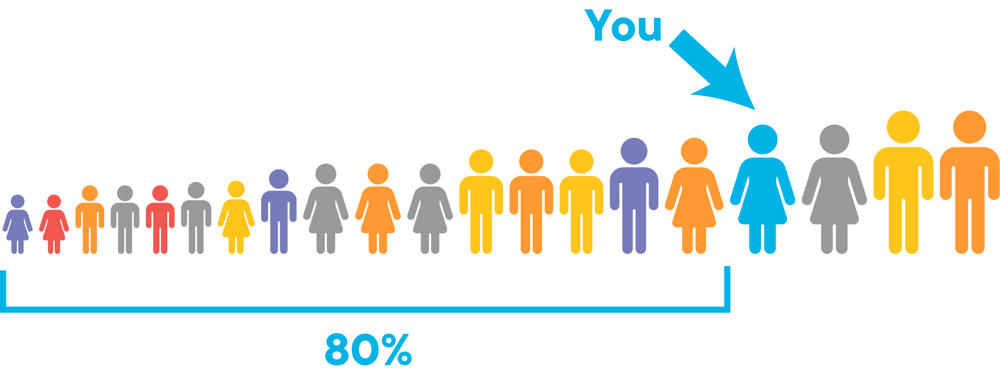
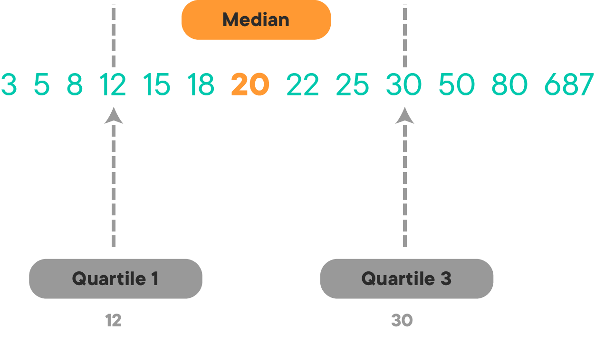
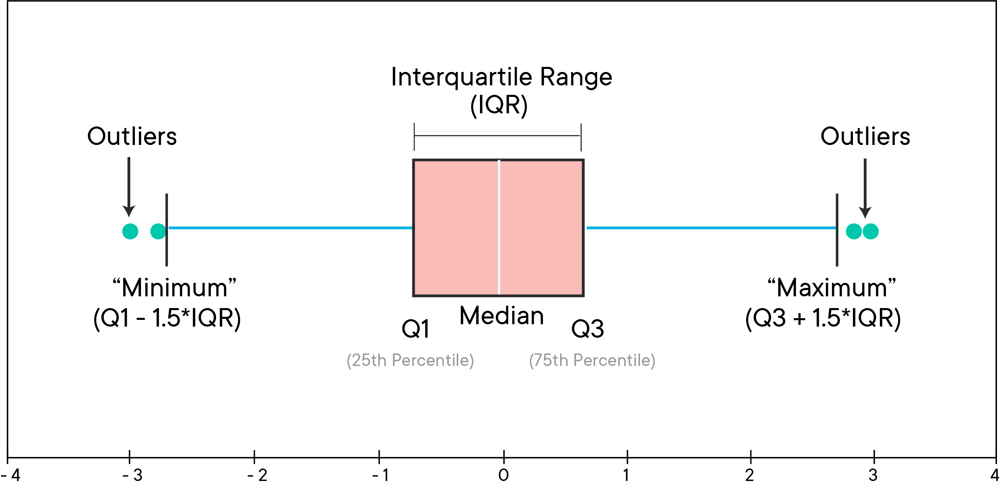
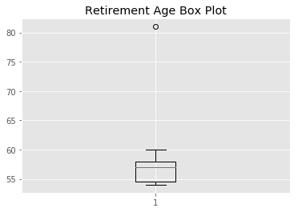
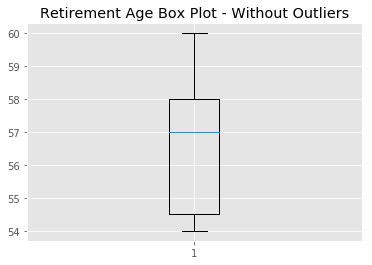

# Measures of Dispersion

## Introduction

Previously, you learned about three Measures of Central Tendency: the mean, median and mode. These metrics can give you a general understanding of where data values lie within the range of the whole data set but they don't tell you the whole story. In fact, they can often be misleading!

To truly understand your data, you also need **Measures of Dispersion**, namely: absolute deviation, standard deviation, and variance. These measures tell you how tightly (or loosely) your data is clustered around its center. Generally, measures of dispersion report on how "noisy" your dataset is. 

In this lesson, you'll learn about the different measures of dispersion and explore how they are related to each other as well as other summary statistics.

## Objectives
You will be able to:
- Describe the significance of calculating measures of dispersion for data
- Understand the formula and intuition behind absolute deviation, variance, and standard deviation
- Understand quantiles, quartiles, percentiles, and interquartile range
- Understand, interpret, and visualize interquartile distances with box plots


## Absolute Deviation

**Absolute Deviation** is the simplest way of calculating the dispersion of a data set. It is calculated by taking a value from the data set and subtracting the mean of the data set. This helps to identify the "distance" between a given value and the mean. In other words, how much a value *deviates* from the mean.  

> $\left|x_i - \bar{x}\right|$

Here $x_i$ denotes an element from $[x_1, x_2, .., x_n]$ , where n is the total number of data points in the data set. Recall, the symbol $\bar{x}$ (pronounced "x-bar") represents the sample mean. The vertical bars are used to denote absolute value so all absolute deviation values are positive. This is important because when measuring deviation, you just want to focus on how big the difference is, not its sign.

If that sounded a little confusing, consider this example: Say the mean test score for a group of 100 students is 58.75 out of 100. If a particular student scored 60 out of 100, the absolute deviation of that score from the mean is:

> $ \left|60 - 58.75\right| = 1.25 $ 

**Average Absolute Deviation** is calculated by taking the mean of all individual absolute deviations in a data set as shown in the formula below:

$$\large \dfrac{1}{n}\sum^n_{i=1}\left|(x_i-\bar x)\right| $$

The advantage here is that the average absolute deviation yields one number to describe dispersion. To illustrate this, consider this example: In a group of four people, two people earn 50K USD a year and two earn 60K USD a year. The mean of the data set is 55K USD. The absolute deviations are:

> $ \left|50 - 55\right| = 5 $   
> $ \left|50 - 55\right| = 5 $   
> $ \left|60 - 55\right| = 5 $     
> $ \left|60 - 55\right| = 5 $     

The average absolute deviation is:

> $ \large \frac{5+5+5+5}{4} = 5 $

## Variance

A more complex measure of dispersion is **Variance**. Remember, measures of dispersion emphasize the magnitude of differences from the mean, not their sign. Unlike the absolute deviation, which uses the absolute value of the deviation to take care of negative values, the variance achieves positive values by *squaring* each of the deviations. Similar to what you saw with the average absolute deviation, the next step in calculating variance is to add up the squared deviations (the **sum of squares**), then divide by the total number of values in your data set. 

OK, that was a mouthful but you can break it down mathematically as follows:

$$ \large \sigma^2 = \dfrac{1}{n}\displaystyle\sum^n_{i=1}(x_i-\mu)^2 $$

> Recall the distinction between the sample mean ($\bar{x}$) and the population mean ($\mu$) - namely, that a sample mean is calculated using a subset of the population whereas the population mean is calculated using the entire population. You'll see here that the population mean is used. This is because unlike the mean, the variance formula changes slightly depending on whether you are working with data from a sample or data from the entire population. Don't worry if this is a little confusing now, the details will be discussed later. 

Say you want to calculate the variance of our salary data above. The first step is to calculate all of the differences from the mean:

> $ 50 - 55 = -5 $   
> $ 50 - 55 = -5 $   
> $ 60 - 55 = 5 $     
> $ 60 - 55 = 5 $  

*Note: no absolute values, the signs are kept*

Next, square the differences:

> $ (-5)^2 = 25 $   
> $ (-5)^2 = 25 $   
> $ 5^2 = 25 $     
> $ 5^2 = 25 $

Finally, add them up and divide by the total number:

> $ \large \frac{25+25+25+25}{4} = 25 $

As a measure of dispersion, the variance is very useful. If the values in the data set are spread out about their mean, the variance will be a large number. On the other hand, if the values are clustered closely around their mean, the variance will be a much smaller number. 

There are, however, two potential problems with the variance. First, because the deviations of values from the mean are squared, this gives more weight to extreme values. Outliers, which differ substantially more from the mean than the rest of the data in a data set, will impact the variance. Secondly, the variance is not in the same *units* as the individual values in a data set. Variance is measured in the *units squared*. This means we cannot directly relate a variance value to the values in our data set. If this isn't clear, go back to the salary example above. The salaries are measured in USD but the variance is measured in *USD squared* which is not the same thing.

Fortunately, calculating the standard deviation rather than the variance fixes this problem. 

## Standard Deviation

The **Standard Deviation** is another measure of the spread of values within a data set. 
It is simply the square root of the variance. In the above formula, $\sigma^2$ is the variance so $\sigma$ is the standard deviation. 

$$ \large \sigma = \sqrt{\dfrac{1}{n}\displaystyle\sum^n_{i=1}(x_i-\mu)^2} $$

So for the salary example above, you can calculate:

> $ \sigma = \sqrt{\sigma^2} = \sqrt{25} = 5 $

Now, the units are in USD again!

## Quantiles, Percentiles, and Quartiles

**Quantiles** are points in a distribution that relate to the *rank order* of values in that distribution. Rank ordering just means the data are sorted in ascending order. You can find any quantile by sorting the sample. The middle value of the sorted sample (middle quantile, 50th percentile) is known as the **median**. The **limits** are the **minimum** and **maximum** values. Any other locations between these points can be described in terms of **percentiles**.

Percentiles are descriptions of quantiles relative to 100. So the 80th percentile is 80% of the way up an ascending list of sorted values of data. For example, take a look at the image below: 80% of people in the data set are shorter than you so you are in the 80th percentile for height. 




## InterQuartile Range - IQR
The **quartiles** of a data set divide the data into **four** equal parts. Since there are four equal parts, there are 3 quartile positions that divide them. These are denoted by Q1, Q2, and Q3. The second quartile position, Q2, is the median of the data set, which divides the data set in half. Q1 divides the lower half and is known as the "lower quartile". Similarly, Q3 divides the upper half and is known as the "upper quartile". The image below illustrates how this looks:



The **InterQuartile Range (IQR)** is a measure of where the “middle fifty” is in a data set which is given by $ Q3 - Q1 $. This is useful because it tells you where the bulk of the values lie. To relate these concepts back to percentiles, Q1 is the 25th percentile and Q3 is the 75th percentile. The IQR is calculated by subtracting the 25th percentile from the 75th percentile. 

In practice, there are actually several different methods for determining percentiles which are accepted and you may have encountered some of these methods before. For now, you can just focus on the method shown below which is what is used by default in the go-to statistical and mathematical Python packages, you will throughout this course and your career, like numpy.

### Calculating IQR for a Given Data Set

You will now get a feel for how IQR is calculated using the collection of numbers from the image above. First, put the numbers in a list.


```python
# List of numbers
x = [3, 5, 8, 12, 15, 18, 20, 22, 25, 30, 50, 80, 687]
```

**Step 1:** Sort the data in ascending order (these numbers are already sorted but don't skip this step when you do this on other data, it's important!).


```python
# Sort in ascending order
x = sorted(x)
```

**Step 2:** Calculate the distance between the last element and the first element.


```python
# Distance between last and first element
distance = len(x) - 1
```

**Step 3:** Multiply the distance by the desired percentiles, 25th and 75th, expressed as fractions. This will yield the indices of the elements that correspond to the 25th percentile and 75th percentile, respectively.


```python
# Multiply distance by percentiles

# Index of 25th percentile
index_p25 = 0.25*distance
index_p25
```


    3.0


```python
# Index of 75th percentile
index_p75 = 0.75*distance
index_p75
```


    9.0


**Step 4:** Using the indices calculated above, determine the 25th and 75th percentiles.


```python
# 25th Percentile
p25 = x[int(index_p25)]
p25
```


    12


```python
# 75th Percentile
p75 = x[int(index_p75)]
p75
```


    30


**Step 5:** Calculate the IQR by subtracting the 25th percentile from the 75th percentile.


```python
# IQR
iqr = p75 - p25
iqr
```


    18


In practice, you will probably never calculate the IQR by hand since numpy has a built-in method for calculating percentiles.  


```python
import numpy as np

np.percentile(x, 75) - np.percentile(x, 25)
```


    18.0


You might have noticed that the indices calculated above happened to be whole numbers. Whole numbers are great to work with here since they can be used as indices directly. The calculation becomes a little more complicated when the indices are fractional numbers. In this case, numpy will use a technique called "linear interpolation" to take the fractional components into account. This is beyond the scope of what you need to know but if you are curious about how it works you can check out the [documentation]("https://docs.scipy.org/doc/numpy/reference/generated/numpy.percentile.html"). 

## Visualizing Dispersion with Box Plots

As a data scientist, you will need to be able to present your analysis visually. Box plots are a commonly used visual representation of centrality and spread of data that is based on quartiles.

A general depiction of a box plot is shown below:



An important feature of the box plot is the set of lines that radiate from the middle to the "minimum" and "maximum" values. These lines are commonly called **"whiskers"**. You've probably noticed in the image above that the lines do not go to the true minimum and maximum values (confusing right?) but rather $ Q1 - 1.5*IQR $ and $ Q3 + 1.5*IQR $, respectively. Any values that fall outside this range are shown as individual data points. These values are considered outliers. 

 > Note: you might have read about some alternative definitions for how to draw the whiskers. Though these alternative definitions may be acceptable in some contexts, the definition presented here is what Python uses so it's best to stick with that.

Matplotlib can be used to generate box plots given a collection of values. Consider the retirement age data again:


```python
import matplotlib.pyplot as plt
%matplotlib inline

plt.style.use('ggplot') # for viewing a grid on plot
x = [54, 54, 54, 55, 56, 57, 57, 58, 58, 60, 81]
plt.boxplot(x)
plt.title ("Retirement Age Box Plot")
plt.show()
```





In this box plot, you can see that it is very easy to visualize the central tendency of the data. The median is drawn as a blue line at 57. The IQR identifies the middle 50% of the data which is shown as the box. The whiskers (two horizontal lines) show the minimum (54) and maximum (60) values in our dataset that fall within $Q1-1.5*IQR$ and $Q3+1.5*IQR$, respectively. The point at 81 falls outside the range of the whiskers so it is shown as a data point and is considered an outlier.

The outlier data point squishes the visualization of the box. Sometimes, it is convenient to hide the outliers to get a better view of the box. You can pass the argument `showfliers=False` to hide the outliers:


```python
plt.boxplot(x, showfliers=False)
plt.title ("Retirement Age Box Plot - Without Outliers")
plt.show()
```





Use the ```showfliers``` option with caution. You don't want to ignore data! 


## Summary

In this lesson, you learned about some commonly used measures of dispersion. These measures identify the spread or deviation present in a data set. You also looked at quantiles, percentiles, quartiles, and IQR as well as how to use those concepts to construct box blots for visualizing the distribution of data in a given data set. You will revisit these topics continuously throughout the course and will see how these concepts are used toward effective data analysis. 
