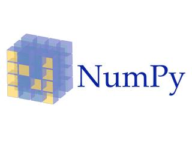

# Introduction - Python Libraries: Numpy and Pandas

## Introduction

In this section, you'll be introduced to two libraries you will use extensively during your career as a Data Scientist: Numpy and Pandas!

## Objectives

You will be able to:

* Identify the importance of Numpy, Pandas, and Matplotlib for Data Scientists.
* Understand why this topic will help you become a Data Scientist. 

## Python and the Open-Source Movement

Now that we've learned some python skills and some data science knowledge, it's time to start gaining experience with the tools the professionals use. There are 2 languages that are heavily used in Data Science: Python and R. As you've probably surmised by now, we'll be focusing on Python. One of the great benefits of the Python language is that it has a very active Open-Source community, which means tons of great libraries and frameworks we can use to do the heavy lifting. One of the main reasons that Python is such a great choice for Data Science is that the Scientific Community has written plenty of great packages to do all advanced things we need. This means that when we use Python, we have access to wealth of robust, effective tools written and maintained by an army of volunteers and professionals. 

In this section, we're going to dig into 2 of the most foundational libraries in the Data Science toolbox--**_Numpy_** and **_Pandas_**!

## The Data Science Stack: Numpy and Pandas

|   |   |
|---|---|

The two most foundational libraries in the Data Science 'Stack' are **_Numpy_** and **_Pandas_**.  In this section, we're going to dig into both libraries and get a feel for how they can make our lives easier and allow us to do amazing things with data with just a few lines of code. 

### Numpy: Numerical Computation

The Python library that's most important to Data Scientists is almost certainly [Numpy](http://www.numpy.org/). Numpy is a _Numerical Computation_ Library, because it provides the building blocks for all of the other amazing Python libraries such as Pandas, in addition to providing a quick and easy way to do avanced mathematical computations. In a few short lessons, we're going to learn all about how Numpy works, how we can use it to quickly perform advanced math and computations, and how it fits into Data Science as a whole. 

### Pandas: For Working With Data

[Pandas](https://pandas.pydata.org/) is a library for Data Analysis that makes Python a much more effective tool for Data Science. Pandas allows us to create **_DataFrames_** to organize and work with any dataset. You'll probably recognize DataFrames when you see them--they look just like an Excel Spreadsheet! In this section, we're going to get **A LOT** of practice in with Pandas. You'll learn how Data Scientists use pandas to quickly and effectively read, store, manipulate, and export data. The best part is, it's a one-stop shop, since it is built on top of libraries like Numpy and Matplotlib!

## Summary

In this lesson, we learned about Numpy and Pandas, and how they'll be the focus of this section. 
