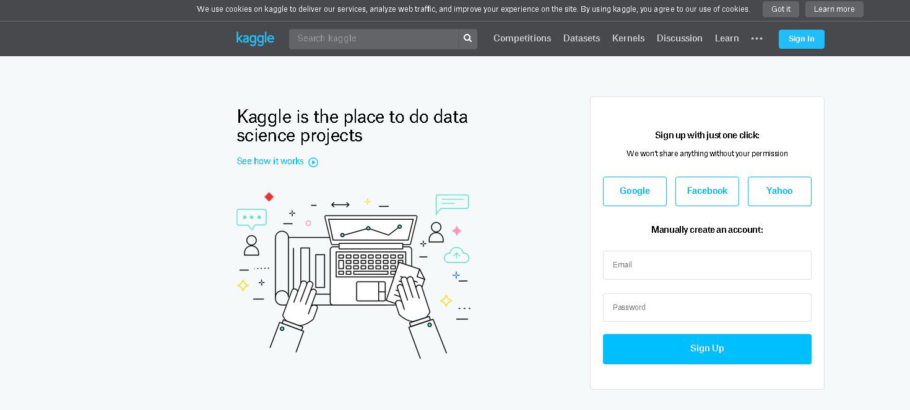
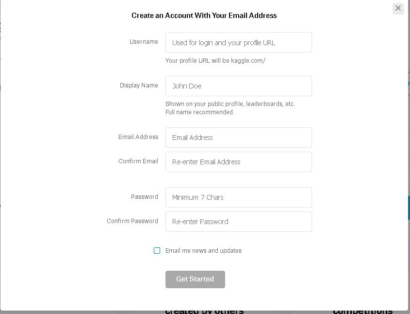

# Kaggle and The Boston Housing Dataset

## Introduction

Kaggle hosts numerous data science competitions where you can grab datasets and practice your skills at creating machine learning algorithms to answer useful questions. Here we'll sign up for an account and begin investigating a classic data science problem using the Boston housing dataset.

## Objectives

* Create a kaggle account and download a data set

## Navigate to kaggle.com

## Click Sign In and then 
* Fill out the basic information
* Accept the terms and agreements
    

## Congratulations! 

You should now be signed up for kaggle where you'll have access to a range of datasets, competitions and other data science resources! Welcome to the community!

## Summary

In our upcoming lab, you'll then be working with this dataset: https://www.kaggle.com/c/boston-housing. To download it, click on the "data" tab and then click the "download all" to get a copy of the data.
