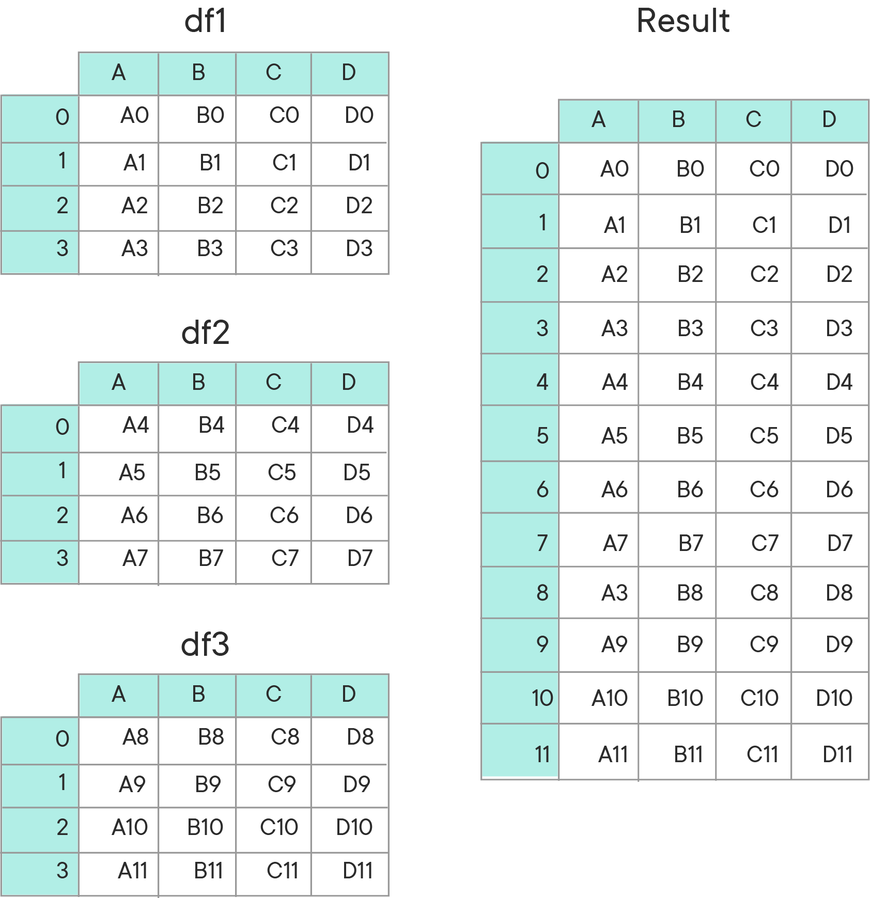

# Combining DataFrames With Pandas

## Introduction

In this section, you'll learn about how to combine DataFrames with concatenation.  You'll also learn how to read in tables from SQL databases and store them in DataFrames, as well as the various types of joins that exist and how you can perform them in pandas.  

## Objectives
You will be able to:
* Understand and explain when to use DataFrame joins and merges
* Be able to use pd.merge when combining DataFrames based on column values
* Understand, explain and use a range of DataFrame merge types: outer, inner, left and right
* Use pd.concat() to stack DataFrames


## Concatenating DataFrames

Recall that "concatenation" means adding the contents of a second collection on to the end of the a first collection.  You learned how to do this when working with strings.  For instance:

```python
print('Data ' + 'Science!')
# Output: "Data Science!"
```
Since strings are a form of collections in python, you can concatenate them as above.  

DataFrames are also collections, so it stands to reason that pandas provides an easy way to concatenate them.  Examine the following diagram from the pandas documentation on concatenation:



In this example, 3 DataFrames have been concatenated, resulting in one larger dataframe containing the contents in the order they were concatenated.  

To perform a concatenation between 2 or more DataFrames, you pass in an array of the objects to concatenate to the `pd.concat()` function, as demonstrated below:

```python
to_concat = [df1, df2, df3]
big_df = pd.concat(to_concat)
```

Note that there are many different optional keyword arguments you can set with `pd.concat()`--for a full breakdown of all the ways you can use this method, take a look at the [pandas documentation](http://pandas.pydata.org/pandas-docs/stable/merging.html).

### Keys and Indexes

Every table in a Database has a column that serves as the **_Primary Key_**. In pandas, the index is the primary key for that table. You'll use these keys, along with the **_Foreign Key_**, which points to a primary key value in another table, to execute **_Joins_**. This allows us to "line up" information from multiple tables and combine them into one table. You'll learn more about Primary Keys and Foreign Keys in the next future when you'll dive into SQL and relational databases, so don't worry too much about these concepts now. That said, you can use similar functionality in Pandas.

Often, it is useful for us to set a column to act as the index for a DataFrame.  To do this, you would type:

```python
some_dataframe.set_index("name_of_index_column", inplace=True)
```

Note that this will mutate the dataset in place and set the column with the specified name as the index column of the DataFrame.  If `inplace` is not specified it will default to False, meaning that a copy of the DataFrame with the requested changes will be returned, but the original object will remain unchanged. 

**_NOTE:_** Running cells that make an `inplace` change more than once will often cause pandas to throw an error.  If this happens, just restart the kernel.

By setting the index columns on DataFrames, you make it easy to join DataFrames later on. Note that this is not always feasible, but it's a useful step when possible.  

### Types of Joins

Joins are always executed between a **_Left Table_** and a **_Right Table_**.  There are four different types of Joins you can execute.  Consider the following Venn Diagrams:


When thinking about Joins, it is easy to conceptualize them as Venn Diagrams.  

An **_Outer Join_** returns all records from both tables. 

An **_Inner Join_** returns only the records with matching keys in both tables.

A **_Left Join_** returns all the records from the left table, as well as any records from the right table that have a matching key with a record from the left table.

A **_Right Join_** returns all the records from the right table, as well as any records from the left table that have a matching key with a record from the right table. 

DataFrames contain a built-in `.join()` method. By default, the table calling the `.join()` method is always the left table.  The following code snippet demonstrates how to execute a join in pandas:

```python
joined_df = df1.join(df2, how='inner')
```

Note that to call `.join()`, you must pass in the right table.  You can also set the type of join to perform with the `how` parameter.  The options are `'left'`, `'right'`, `'inner'`, and `'outer'`.

**If** `how=` **is not specified, it defaults to `'left'`.**

**_NOTE:_** If both tables contain columns with the same name, the join will throw an error due to a naming collision, since the resulting table would have multiple columns with the same name.  To solve this, pass in a value to `lsuffix=` or `rsuffix=`, which will append this suffix to the offending columns to resolve the naming collisions. 

## Summary

In this section you learned how to use concatenation to join together multiple DataFrames in Pandas.


