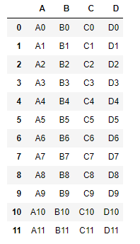
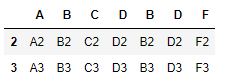
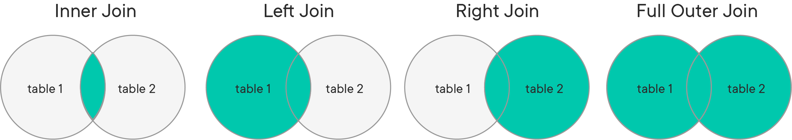

# Combining DataFrames With Pandas - Lab

## Introduction

In this lab, you'll gain practice combining DataFrames through concatenation.  You'll also practice executing various types of joins to selectively combine the information stored in the tables!

## Objectives

* Concatenate multiple DataFrames together into a single DataFrame
* Understand and execute the various types of joins (inner, outer, left, and right joins)


## Getting Started

You'll start with a quick section to gain practice with concatenating datasets using `pd.concat()`.

## Concatenating DataFrames

Run the cell below to create some sample DataFrames for us to work with.  


```python
import pandas as pd
df1 = pd.DataFrame({'A': ['A0', 'A1', 'A2', 'A3'],
                    'B': ['B0', 'B1', 'B2', 'B3'],
                    'C': ['C0', 'C1', 'C2', 'C3'],
                    'D': ['D0', 'D1', 'D2', 'D3']},
                    index=[0, 1, 2, 3])


df2 = pd.DataFrame({'A': ['A4', 'A5', 'A6', 'A7'],
                    'B': ['B4', 'B5', 'B6', 'B7'],
                    'C': ['C4', 'C5', 'C6', 'C7'],
                    'D': ['D4', 'D5', 'D6', 'D7']},
                    index=[4, 5, 6, 7])

df3 = pd.DataFrame({'A': ['A8', 'A9', 'A10', 'A11'],
                    'B': ['B8', 'B9', 'B10', 'B11'],
                    'C': ['C8', 'C9', 'C10', 'C11'], 
                    'D': ['D8', 'D9', 'D10', 'D11']},
                    index=[8, 9, 10, 11])
```

Now that you have multiple DataFrames to work with, you can execute a concatenation to join them together.  

In the cell below, concatenate the 3 DataFrames together using the appropriate function.  


```python
combined_df = None
```

**_EXPECTED OUTPUT:_**



## Setting Join Conditions With Concatenation

You can also specify if the concatenation is an **_Outer Join_** or an **_Inner Join_**.  Next, you'll execute an inner join. Before you do, you need to create another table that contains some overlapping index values with a DataFrame that already exists.  

Run the cell below to create the new DataFrame.


```python
df4 = pd.DataFrame({'B': ['B2', 'B3', 'B6', 'B7'],
                    'D': ['D2', 'D3', 'D6', 'D7'],
                    'F': ['F2', 'F3', 'F6', 'F7']},
                    index=[2, 3, 6, 7])
```

Now, in the cell below, use the `pd.concat()` method to join DataFrames 1 and 4.  However, this time, specify that the `join` is `'inner'`, and `axis=1`. 


```python
df1_and_4 = None
df1_and_4
```

**_EXPECTED OUTPUT:_**



You'll notice that in this case, the results returned contain only the rows with indexes that exist in both tables--rows 2 and 3.  The resulting table contains the values for each column in both tables for the rows.  

Note that there are many, many ways that you can make full use of the `concat()` functionality in pandas to join DataFrames together--these are just a few of the most common examples pulled from the pandas documentation on the subject.  For a full view of all the ways you can use `pd.concat()`, see the [pandas documentation](http://pandas.pydata.org/pandas-docs/stable/merging.html)!

## Loading In Data
Now, it's time to move on to working with the Hearthstone cards database.  This database contains information on cards from the popular game, [Hearthstone](https://playhearthstone.com/en-us/)! For full information on the dataset, see the  [kaggle page](https://www.kaggle.com/jeradrose/hearthstone-cards) for this dataset. 

This database consists of the following tables:

* _cards_
* *dust_costs*
* _entourages_
* _mechanics_
* *play_requirements*

Many of rows in each table--but not all--correspond to the same cards. As such, each table contains a column called `card_id` which acts as a **_Primary Key_** for each table.  You'll make use of these keys to **_join_** the different tables together into a single DataFrame.  You'll also experiment with different types of joins to help us decide exactly what information you wish to combine.  

Simply run the cell below to import the tables from the database as DataFrames.


```python
cards_df = pd.read_csv('cards.csv')
dust_df = pd.read_csv('dust.csv')
entourages_df = pd.read_csv('entourages.csv')
mechanics_df = pd.read_csv('mechanics.csv')
play_requirements_df = pd.read_csv('play_requirements.csv')
```

Great.  Now, let's set the correct column, `card_id`, as the index column for each of these tables, and then display each to ensure that everything is as expected.  

For each of the dataframes you created in the cell above, call the `.set_index()` method and pass in `card_id`.  Also set `inplace=True`.  Then, display the head of each respective DataFrame to ensure everything worked.  

**_NOTE:_** Since you are performing this operation in place, running any cell a second time will result in pandas throwing an error.  If you need to run something a second time, restart the kernel using the jupyter notebook menu at the top of the page.  

## Executing Joins

Now that you have the tables loaded correctly, we're going to execute some joins. There are 4 different kinds of joins, which can best be visualized with venn diagrams:



In these diagrams, each circle represents a DataFrame or SQL Table.  The left table is the table you are working with, and the right table is the table you want to join to the table you are working with.  You'll start by executing the most common type of join, an **_Inner Join_**.

In the cell below, join `cards_df` with `mechanics_df` using the built-in `.join()` method on the `cards_df` object. 

Pass in the following parameters:
* the table you want to join with, `mechanics_df`
* The `how` parameter set to the type of join you want, `'inner'`


```python
cards_with_mechanics_df = None
cards_with_mechanics_df
```

Examine the output from the cell above and compare it to the original output of both the `cards_df` and `mechanics_df` DataFrame heads you displayed earlier.  Notice how it this now combines the columns from both?

**_Question_**

If you inspect the original `cards_df` DataFrame, you'll notice that it contains  2,819 records.  The result of our inner join, `cards_with_mechanics_df`, conntains only 1079 rows.  Why?

Write your answer below this line:
________________________________________________________________________________

First performed an inner join, which only includes records that are present in both tables.  Although there were 2819 records in the left table, there were only 1079 records that existed in both tables, which are what you see in the resulting dataframe. 

## Other Types of Joins

By default, the `.join()` method performs a left join if no parameter is passed in for `how=`.  In the cell below, perform a **_Left Join_** of `cards_with_mechanics_df` and `play_requirements_df`, with `cards_with_mechanics_df` as the left table.  

Then, display `left_join_df` to inspect our results. 


```python
left_join_df = None
left_join_df
```

Note that the results of this sort of join are dependent upon the position of each table--if you were to make `cards_with_mechanics_df` the right table and `play_requirements_df` the left table and then perform a **_Right Join_**, our results would be the same. 

**_Question:_**

Describe what was included from each table in this join.

Write your answer below this line:
________________________________________________________________________________

Every record from `cards_with_mechanics_df`, as well as any records from `play_requirements_df` that have matching index values with a record from the left table.  

#### Outer Joins

In the cell below, perform an outer join between `cards_df` and `dust_df`. Since these tables contain columns with the same name, we'll need to specify a suffix for at least one of them, so that the column can be renamed to avoid a naming collision. 

During this join, set the `rsuffix` parameter to `_dust`


```python
outer_join_df = None
outer_join_df
```

Inspect the output above.  Note that the naming collision has been avoided by renaming the `cost` column from the right table to `cost_dust`.  

## Summary

In this lab, you learned how to:

* Concatenate multiple DataFrames together into a single DataFrame
* Understand and execute the various types of joins (inner, outer, left, and right joins)
