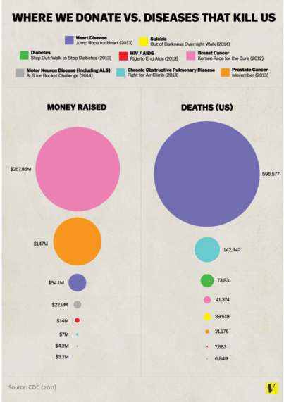
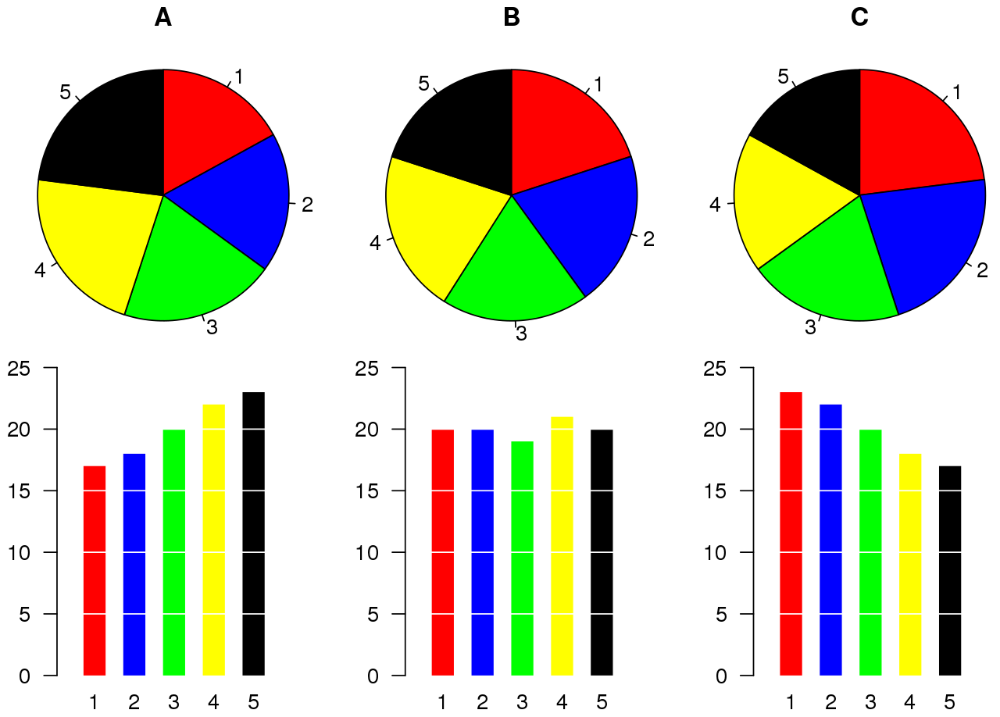
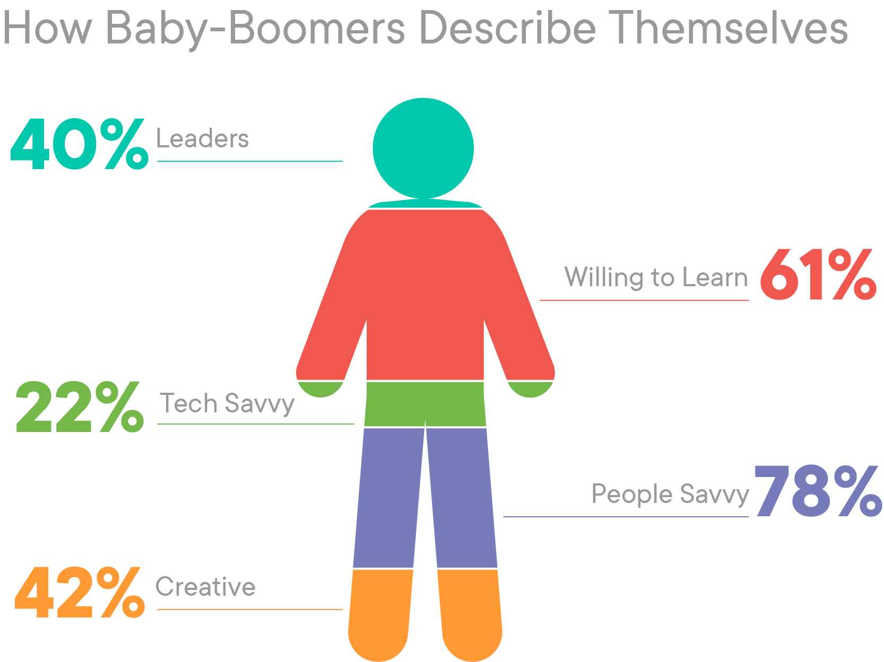
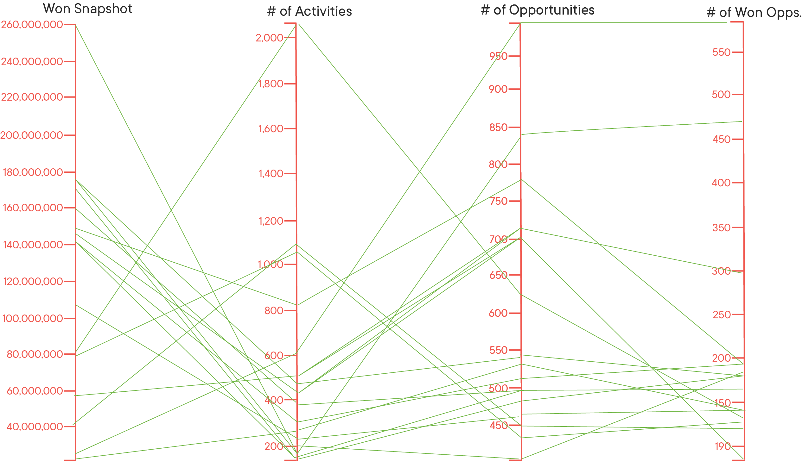
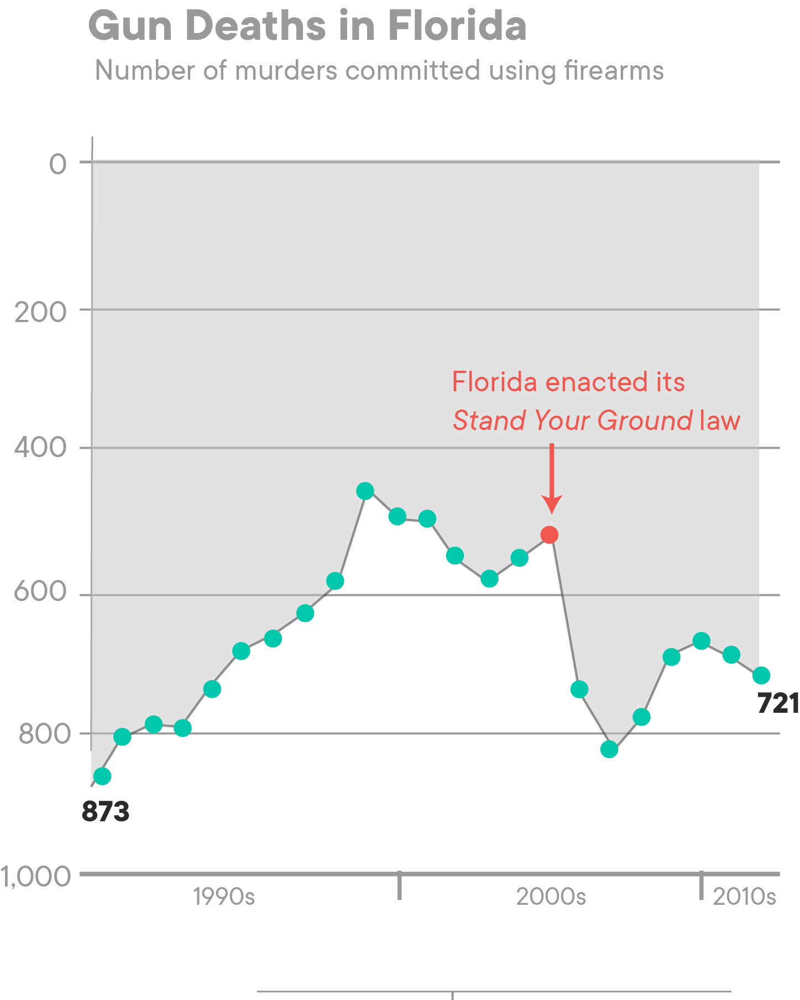
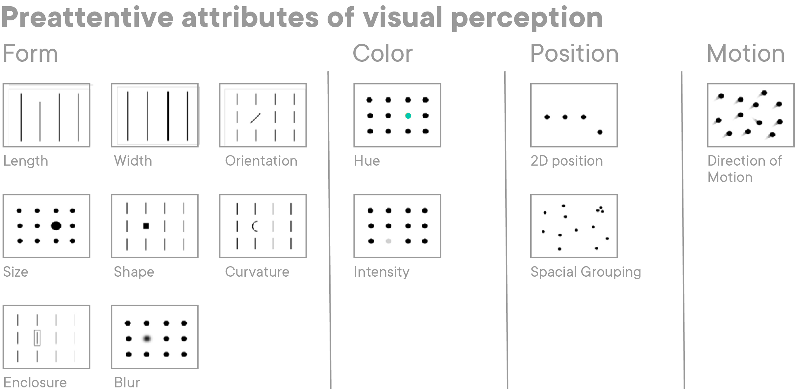
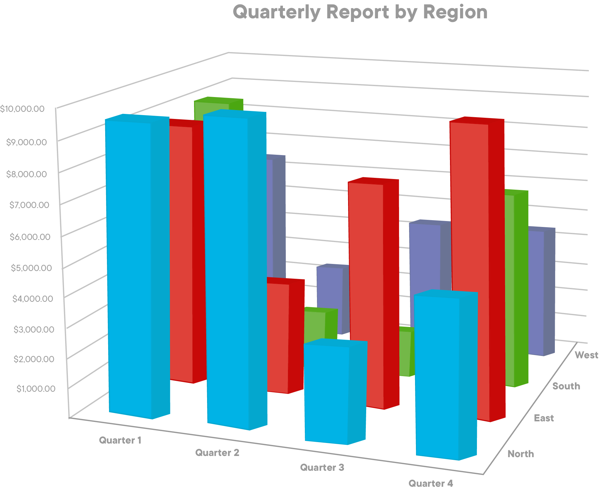

# Data Visualization - Best Practices and Common Mistakes

## Introduction

In this lesson, we'll learn some best practices for creating high-quality data visualizations, as well as some common mistakes to avoid!

## Objectives

You will be able to:

* Identify the 'must-haves' for any data visualization
* Identify common mistakes

## Creating High-Quality Data Visualizations

Creating your own data visualizations can be trickier than it looks. Not because they're hard to code, but because there are so many different stylistic choices you have to make! Most of Data Science is based in math, where there is a provably correct answer. Unfortunately, there is no "right answer" when it comes to building the best data visualization for a given task or project. However, there are some good rules we can follow, and some common mistakes we can avoid. The goal of this lesson is to get you thinking about both of them by looking at some real-world examples. 

## Don't: Use a Pie Chart

From the Wikipedia page on Pie Charts:

> "Pie charts are very widely used in the business world and the mass media. However, they have been criticized, and many experts recommend avoiding them, pointing out that research has shown it is difficult to compare different sections of a given pie chart, or to compare data across different pie charts. Pie charts can be replaced in most cases by other plots such as the bar chart, box plot or dot plots."

This is the _second paragraph_ on the page. What does this tell us? Pie charts are such a bad choice for data visualizations that it's own Wikipedia page starts with a warning against using them!

So why are Pie Charts a bad choice? The simple answer is because humans don't think in radians, and we aren't good at judging the area of a circle. For instance, take a look at the following infographic:



Infographic from [Vox](https://www.vox.com/2014/8/20/6040435/als-ice-bucket-challenge-and-why-we-give-to-charity-donate)

It takes a little while to get a feel for the information this misguided data visualization is trying to get across. It's hard to compare the different items, which is a problem, because the entire goal of this visualization is to show comparisons between the different diseases! 

## Do: Choose the Right Tool for the Job

Consider the following Pie Charts:





The pie charts all look pretty much the same. It's hard for us to tell the differences between them, especially when it comes to ranking the different colored sections by size in the each chart. However, when we examine the bar charts below the image,the differences in each become immediately apparent--you couldn't miss them if you tried. 

When deciding what visualization to use, consider what information you're trying to communicate, and then pick the plot that communicates that information in the most obvious manner. 


## Don't: Get Your Percentages Wrong

This one seems like an easy mistake to avoid, but it still happens all the time. Double check your math, and always double check your calculations! Nothing destroys a Data Scientist's credibility in front of a crowd like simple arithmetic errors or visualizations that don't match your numbers. 

Consider the following infographic, and try to figure out what is wrong with it:




There are two things wrong with this infographic. The first is that the percentages add up to 243%, which makes no sense. We can intuit that respondents were allowed to choose more than one category, but that's too ambiguous on its own, and doesn't tell us anything!

The second issue with this visualization is that the area taken up by each colored section doesn't fit with their corresponding percentages. In a good data visualization, if 78%  of the respondents chose the category represented by purple, then 78% of the person should be purple!  Mismatches like this undermine the message of your visualization because they are confusing and ambiguous. Avoid them!


## Don't: Make Your Visualizations Too Busy or Unique

One of the easier mistakes to make is to make visualizations that simply have so much going on that they are almost impossible to interpret. Consider the line graph below. Take a minute and try to make sense of it.



Almost impossible, right? Mistakes like this can be avoided by breaking information up into a series of smaller graphs, or by picking a more appropriate type of visualzation, when possible. 

Another big mistake is to try and create new, unique visualizations that people haven't seen before. While it may seem like a good idea to get creative, fight the urge. You don't see weird, unique stuff often for a reason--because they don't work well. Stick to formats people are used to. Switching up things to try and be unique can make your visualization confusing, or in the case below, purposefully misleading!




In this visualization, the author broke the common convention of having a line go up as a number goes up. Instead, the line goes down as the number of gun deaths in Florida increases. However, most people that view this visualization leave with the exact opposite impression, because they are paying more attention to the direction of the line than they are to the numbers on the y-axis. That's because we focus on **_Preattentive Attributes_** first!

## Do: Use Preattentive Attributes

**_Preattentive Attributes_** are things that our eyes are drawn to. We can't help but notice them, because our brains are wired to. There will be times when you need a visualization to communicate a specific piece of information, that you want to make as obvious as possible. The best way to do this is to pick the right preattentive attribute to highlight this!

Take a look at some of the examples in the chart below: 




Note that preattentive attributes are not one size fits all. Most of them work well for certain types of data, but not others. Consider the following chart, and refer back to the preattentive attributes listed above and consider how they would look trying to highlight each different type of information. 

## Don't: Use 3D Visualizations

The final mistake we'll cover today is the use of 3D Visualizations. While they may seem like a cool idea, in practice, they are almost always trouble. The reason for this is because they easily cause **_Occlusion_**, which is just a fancy way of saying that the things in front block the things in back so that you can't see them! For example:



Note that there may be some times where a 3D visualization may actually be your best choice, but those are almost always going to be related to visualizing a point cloud in a 3D space. If you absolutely have to use a 3D visualization (or any other sort of visualization where occlusion could be a problem), consider changing the opacity of the visualization to make items more see-through. 


## Summary

In this lesson, we saw many examples of bad data visualizations, and learned about how to make great data visualizations by avoiding these mistakes and following the best practices!


```python

```
