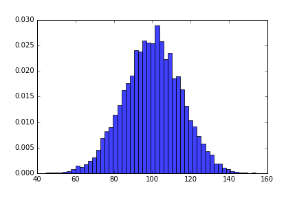

# Seaborn

## Introduction

In this lesson, we'll be introduced to a second, more powerful data visualization library, **_Seaborn_**!

## Objectives

You will be able to:

* Understand the relationship between Seaborn and Matplotlib, and when to use each
* Create basic visualizations with Seaborn

## What is Seaborn?

[Seaborn](https://seaborn.pydata.org/) is a Data Visualization library that makes it really, really easy to create professional-quality statistical visualizations with only one or two lines of code. Seaborn also makes it really easy to modify the _aesthetics_ of a plot, so that we can make sure all of our visualizations are eye-catching and easy to interpret, which isn't always the case with Matplotlib. 

## Seaborn and Matplotlib

If seaborn is so awesome, you may be wondering why we bothered teaching you Matplotlib at all! The answer is that Seaborn is not a competing library--it's actually built on top of Matplotlib! Whereas Matplotlib provides the basic functionality for creating plots and filling them with different kinds of shapes and colors, Seaborn takes this functionality a step farther by providing a bunch of ready-made mathematical visualizations that are commonly used in Data Science. Best of all, Seaborn is written to be simple to use and easy to understand, so most visualizations only take 1 or 2 lines of code! 

The plot on the left is a standard plot from Matplotlib. The plot on the right is from Seaborn. What a difference!

|  |  |
|---------------------------|-----------------------------|

### When to Use Each

When you're just performing some basic EDA and exploring a dataset, there are times when matplotlib may be most useful to you. If that's the case, don't be afraid to stick to matplotlib. However, Seaborn shines in two particular areas--providing ready-made plots for statistical analysis, and making beautiful plots for presenting to others.  Perhaps, during your EDA, you want to see the regression line between two features. If that's the case, Seaborn should be your choice, because it only takes a single line of code, whereas Matplotlib would be more complicated. 

When it comes to presentations, it is highly recommended to use Seaborn. Whether in a PowerPoint Presentation or just a Jupyter Notebook you'll be making publicly available, Seaborn visualizations are easier on the eyes, and worth the time.  As a rule of thumb, if you plan on showing the plot to other people, consider using Seaborn. 

##  Basic Plots with Seaborn

Like any python library, the first thing we have to do to use Seaborn is to import it. The standard alias for Seaborn is `sns`. Once we've imported Seaborn, most visualizations are as simple as calling the function for the plot we want, and passing in the data and necessary parameters. 

The main parameter you'll need to specify is `data`. This would be where you pass in your DataFrame. Some plots, such as a boxplot, don't need more than that--Seaborn can usually figure the rest out on its own (depending on the shape and complexity of your data). For bivariate plots that show the relationship between two different columns, you'll need to specify which column should be used for the x-axis and which should be used for the y-axis. 

Let's look at some examples from the Seaborn documentation.

### Simple Univariate Boxplot

```python
import seaborn as sns

tips = sns.load_dataset('tips') # Seaborn comes prepackaged with several different datasets that are great for visualizing!

boxplot = sns.boxplot(data=tips["total_bill"])
```


### Boxplot Grouped by Categorical Variable

```python
sns.boxplot(x="day", y="total_bill", data=tips)
```


### More Complex Boxplot with Nest Grouping of Categorical Variables

```python
sns.boxplot(x="day", y="total_bill", hue="smoker", data=tips, palette="Set3")
```


## Regression Plots

One of the coolest features of Seaborn is the ability to create complex plots like **_Regression Plots_**, which automatically perform regression and fit a line to your data. We'll learn to create these ourselves in the next lab--as you'll see, it's quite simple!


## Summary

In this lesson, we learned all about Seaborn!
