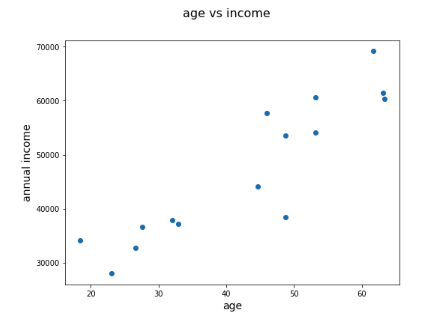
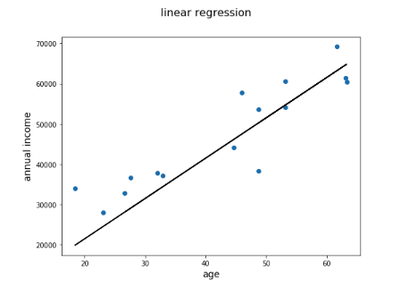
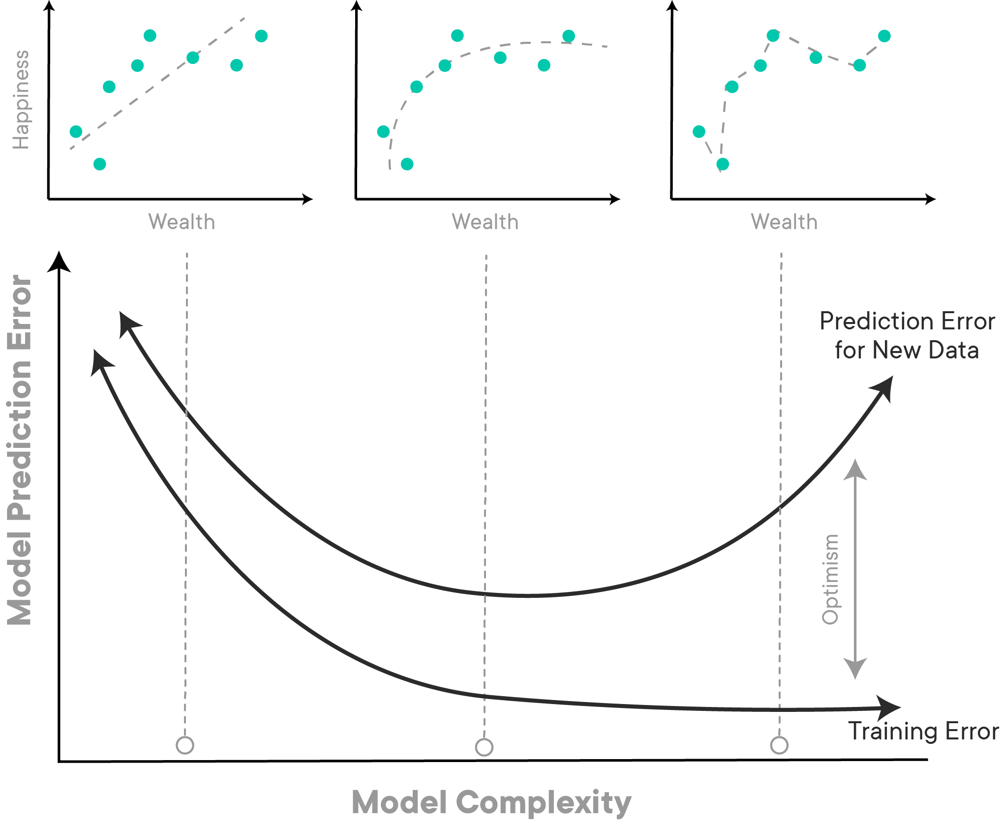
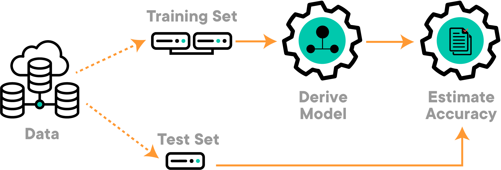
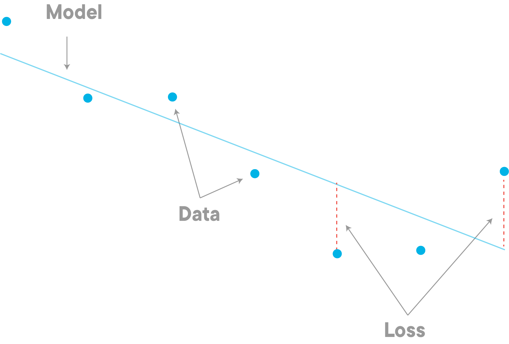

# Statistical Learning Theory

## Introduction

In this lesson, you'll be introduced to Statistical Learning Theory and some key components in the framework of this theory. This is a particularly important theory as it encompasses the majority of statistical inference and functional analyses approaches. Statistical Learning Theory has applications in a wide variety of fields such as image and speech recognition, bio-informatics, sports, etc.

## Objectives

You will be able to: 

* Describe the Statistical Learning Theory 
* Explain what dependent and independent variables are key components of statistical learning approaches
* Explain how parameters are essential parts of model estimation
* Demonstrate a basic understanding of ideas of model loss and model validation

## Statistical Learning Theory

> Statistical Learning Theory is a framework that is based on the idea of using data along with statistics to provide a framework for learning.

In Statistical Learning Theory, the main idea is to **construct a model** to draw certain conclusions from data, and next, to **use this model** to make predictions.


## Types of Data in Statistical Learning 

In the context of Statistical learning, there are two main types of data:

* **Dependent variables**: data that can be controlled directly (other names: outcome variables, target variables, response variables) 
* **Independent variables**: data that cannot be controlled directly (other names: predictor variables, input variables, explanatory variables, features)


In models, the independent variable(s) are the variables that will affect (or will lead to a change in) the dependent variable(s).


Two examples of common **independent variables** are age and time. There is nothing you can do to speed up or slow down time or increase or decrease age. They are independent of everything else.

An example of a **dependent variable** is how much you weigh at different ages. Here, the dependent variable (weight) depends on the independent variable (age). As someone's weight fluctuates over time, you can observe and record your weight as a dependent variable on your age. 

Independent and dependent variables are normally shown on a graph under a standardized approach. This makes it easy for you to quickly see which variable is independent and which is dependent when looking at a graph or chart. 

Conventionally, the independent variable goes on the x-axis, or the horizontal axis. Let's consider another example, one where we look at someone's income depending on their age. Below, you see a scatter plot where age is the independent variable, and income is the dependent variable. In this setting, **we want to study if age has some effect on annual income**.



## Statistical Model 

> **A statistical model can be thought of as some kind of a transformation that helps us express dependent variables as a function of one or more independent variables**. 

 A statistical model defines a **relationship** between a dependent and an independent variable. 

For the plot we see above, the relationship between age and income can be shown using a **straight line** connecting all the individual observations in the data. So this line here would be our **model** as shown in the image below. 

. 


We can define and **fit** such a straight line to our data following a straight line equation: 

$$y = m  x + c$$ 

You'll often come across greek letters talking about models like this. Another common way of writing a linear equation is ($\beta$ is the Greek letter "beta"):

$$y = \beta_0 + \beta_1  x $$ 

$\beta_0$ has the same role as $c$ in the first expression and denotes the _intercept with the y-axis_.
$\beta_1$ has the same role as $m$ in the first expression and denotes the _slope of the line_. More on this below.


Such a simple model would describe a person's height has **almost** a linear relationship with weight i.e. weight increases with height. 


So this is our simple model for the relationship. Of course, we can use more sophisticated models like quadratic equations or polynomial equations for a **better fit**, and you may see this later on if you dig into more advanced modeling. 

Looking at this line above, we can define it as **Income = 1500 + 1000 * Age**, based on slope ($m$ or $\beta_1$) and intercept (c or $\beta_0$) values.  

This would be our **linear model** (Linear refers to a model consisting of a straight line, or "linear regression"), which can help us work out a weight value for a given height. In summary,

> A model is expressed as a mathematical equation showing the relationship between dependent and independent variables. 


## Statistical Model Parameters

> **Model Parameters are the coefficients of the model equation for estimating the output**. 

Statistical Learning is all about learning these parameters. A statistical learning approach would help us **learn** these parameters so we have a clear description of their relationship which we can replicate and analyze under different circumstances. 

For the straight line above, we need to learn the **slope** and **intercept** for the line that best describes the relationship between the data elements in the dataset. We gave you the two values here, but in general, you'll have to **learn these values**. These values are denoted by **parameters**.

Once we have learned the $m$ (or $\beta_1$) and $c$ (or $\beta_0$) values, we can predict a value of $y$ (income in our example) for a given value of $x$ (age). In our next lab, you'll learn how to calculate these for a given dataset.  Let's have a look at another example:

### What Else Determines an Individual's Income? 

If we suppose that income is a a function of not only age, but also education level. A model that estimates the income could look like:

$$income = \beta_0 + \beta_1 *  \text{age} + \beta_2 * \text{education level}$$

Here we have two independent variables i.e. age and education level, with the same dependent variable, income. $\beta_0$, $\beta_1$ and $\beta_2$ are model parameters.


## Model Generalization

As the data which is available to us for modeling is finite, the available data needs to be used very effectively to build and **validate** a model. Validation of the model usually makes the model more **generalizable** for unseen situations. 

Training the model is like the infancy stage for humans. Examples are presented to the model and the model tweaks its parameters to better understand the data. Once the training is over, the model is unleashed upon new data and then uses what it has learned to explain that data.  This is where problems can emerge. If we **over-train** the model on the training data i.e. make the model every detail of shown data, it will be able to identify all the relevant information in the training data, but will fail miserably when presented with the new data. 

We then say that the **model is not capable of generalizing**, or that **model is over-fitting the training data**. 


Here's a great example of the phenomenon: modeling happiness as a function of wealth. 




The top three diagrams we have data and models (dashed curves). From left to right the models have been trained longer and longer on the training data. The training error curve in the bottom box shows that the training error gets better and better as we train longer (increasing model complexity). You may think that if we train longer we'll get better! Well, yes, but **only better at describing the training data**. The top right box shows a very complex model that hits all the data points. This model does great on the training data, but when presented with new data (examine the Prediction error curve in the bottom box) then it does worse! 

In order to create good predictive models in machine learning that are capable of generalizing, one needs to know when to stop training the model so that it doesn't over-fit.


### Model Validation

>**Model validation is a process of controlling over-fitting and allow a higher degree of generalizability.**

Here is how we perform validation, in its simplest form:

* Split the data into two parts with a 70/30 , 80/20 or s similar split

* Use the larger part for training so the model learns from it. This set of data is normally called the **training Data**

* Use the smaller part for testing the model. This is data is not being used during the model learning process and used only for testing the performance of a learned model. This dataset is called as the **testing Data**

This setup looks like as shown below:


In statistical learning, if the model has learned well from the training data, it will perform well on both training data **and** test data. You can then use the test data to calculate the **accuracy**, which is assessed based on how close it has estimated the output to the actual value.


## Model Loss 

> **A loss function evaluates how well your model represents the relationship between data variables**. 

If the model is unable to identify the underlying relationship between the independent and dependent variable(s), the loss function will output a very high number. Consider the age vs. income example above. You can see that the linear model is not exactly touching each data point because these points do not exist in a line. the individual distance of each point from the line is the **loss** that the model exhibits. 



These individual losses, which is essentially the **vertical distance between the individual data points and the line** are taken into account to calculate the overall model loss. 

If the relationship is well modeled, the loss will be low. As we change parameters of our model to try and improve results, our loss function is our best friend, telling us if we are on the right track. 

You'll learn about loss in further detail in upcoming lessons.

## Additional Resources

- [Youtube: Introduction to Statistical Learning Theory](https://www.youtube.com/watch?v=rqJ8SrnmWu0)

- [An Overview of Statistical Learning Theory with examples](https://www.princeton.edu/~harman/Papers/SLT-tutorial.pdf) 

## Summary 

In this lesson we briefly looked at statistical learning theory and its main components. We looked at what a statistical model is and what the model parameters. We looked at this in the context of the most simple model, a straight line. Next we shall see the "learning" part of statistical learning theory by learning slope and intercept parameters of a straight line. 


```python

```
