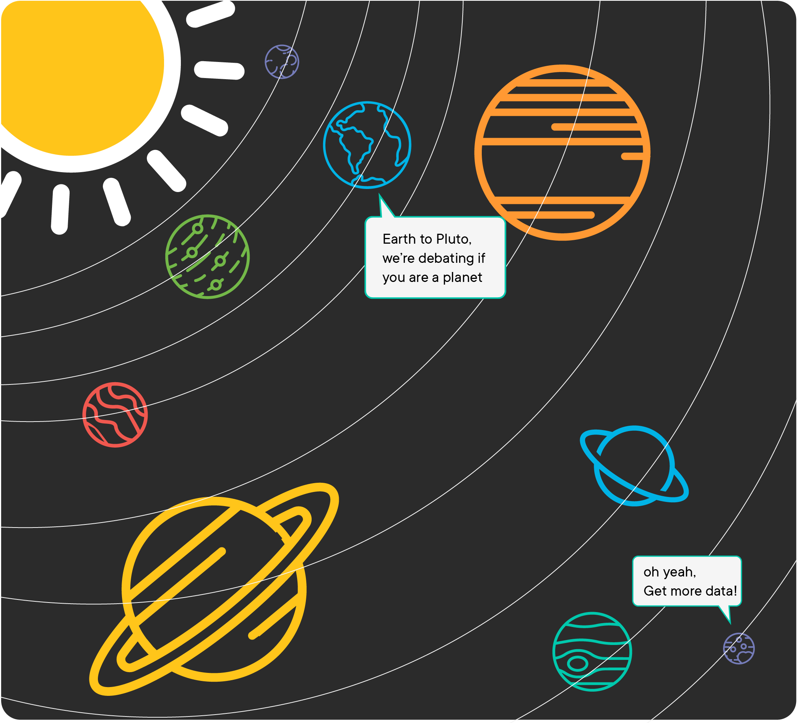

# Selecting Data - Lab


## Introduction 

NASA wants to go to Mars! Before they build their rocket, NASA needs to track information about all of the planets in the Solar System. In this lab, you'll practice querying the database with various `SELECT` statements. This will include selecting different columns and implementing other SQL clauses like `WHERE` to return the data desired.



## Objectives
You will be able to:
* Retrieve all the information from a table
* Retrieve a subset of records from a table using a `WHERE` clause
* Retrieve a subset of columns from a table

## Connecting to the DataBase

To get started import pandas and sqlite3. Then, connect to the database titled `planets.db`. 

Don't forget to instantiate a cursor so that you can later execute your queries.


```python
# Your code here
```

## Selecting Data

Here's an overview of the planet's table you'll be querying.

|name   |color |num_of_moons|mass|rings|
|-------|-------|-------|-------|-------|
|Mercury|gray   |0      |0.55   |no     |
|Venus  |yellow |0      |0.82   |no     |
|Earth  |blue   |1      |1.00   |no     |
|Mars   |red    |2      |0.11   |no     |
|Jupiter|orange |67     |317.90 |no     |
|Saturn |hazel  |62     |95.19  |yes    |
|Uranus |light blue|27  |14.54  |yes    |
|Neptune|dark blue|14   |17.15  |yes    |

Write SQL queries for each of the statements below using the same pandas wrapping syntax from the previous lesson.

## Select just the name and color of each planet


```python
# Your code here
```


<div>
<style scoped>
    .dataframe tbody tr th:only-of-type {
        vertical-align: middle;
    }

    .dataframe tbody tr th {
        vertical-align: top;
    }

    .dataframe thead th {
        text-align: right;
    }
</style>
<table border="1" class="dataframe">
  <thead>
    <tr style="text-align: right;">
      <th></th>
      <th>name</th>
      <th>color</th>
    </tr>
  </thead>
  <tbody>
    <tr>
      <th>0</th>
      <td>Mercury</td>
      <td>gray</td>
    </tr>
    <tr>
      <th>1</th>
      <td>Venus</td>
      <td>yellow</td>
    </tr>
    <tr>
      <th>2</th>
      <td>Earth</td>
      <td>blue</td>
    </tr>
    <tr>
      <th>3</th>
      <td>Mars</td>
      <td>red</td>
    </tr>
    <tr>
      <th>4</th>
      <td>Jupiter</td>
      <td>orange</td>
    </tr>
    <tr>
      <th>5</th>
      <td>Saturn</td>
      <td>hazel</td>
    </tr>
    <tr>
      <th>6</th>
      <td>Uranus</td>
      <td>light blue</td>
    </tr>
    <tr>
      <th>7</th>
      <td>Neptune</td>
      <td>dark blue</td>
    </tr>
  </tbody>
</table>
</div>


## Select all columns for each planet whose mass is greater than 1.00


```python
# Your code here
```


<div>
<style scoped>
    .dataframe tbody tr th:only-of-type {
        vertical-align: middle;
    }

    .dataframe tbody tr th {
        vertical-align: top;
    }

    .dataframe thead th {
        text-align: right;
    }
</style>
<table border="1" class="dataframe">
  <thead>
    <tr style="text-align: right;">
      <th></th>
      <th>id</th>
      <th>name</th>
      <th>color</th>
      <th>num_of_moons</th>
      <th>mass</th>
      <th>rings</th>
    </tr>
  </thead>
  <tbody>
    <tr>
      <th>0</th>
      <td>5</td>
      <td>Jupiter</td>
      <td>orange</td>
      <td>68</td>
      <td>317.90</td>
      <td>0</td>
    </tr>
    <tr>
      <th>1</th>
      <td>6</td>
      <td>Saturn</td>
      <td>hazel</td>
      <td>62</td>
      <td>95.19</td>
      <td>1</td>
    </tr>
    <tr>
      <th>2</th>
      <td>7</td>
      <td>Uranus</td>
      <td>light blue</td>
      <td>27</td>
      <td>14.54</td>
      <td>1</td>
    </tr>
    <tr>
      <th>3</th>
      <td>8</td>
      <td>Neptune</td>
      <td>dark blue</td>
      <td>14</td>
      <td>17.15</td>
      <td>1</td>
    </tr>
  </tbody>
</table>
</div>


## Select the name and mass of each planet whose mass is less than or equal to 1.00


```python
# Your code here
```


<div>
<style scoped>
    .dataframe tbody tr th:only-of-type {
        vertical-align: middle;
    }

    .dataframe tbody tr th {
        vertical-align: top;
    }

    .dataframe thead th {
        text-align: right;
    }
</style>
<table border="1" class="dataframe">
  <thead>
    <tr style="text-align: right;">
      <th></th>
      <th>name</th>
      <th>mass</th>
    </tr>
  </thead>
  <tbody>
    <tr>
      <th>0</th>
      <td>Mercury</td>
      <td>0.55</td>
    </tr>
    <tr>
      <th>1</th>
      <td>Venus</td>
      <td>0.82</td>
    </tr>
    <tr>
      <th>2</th>
      <td>Earth</td>
      <td>1.00</td>
    </tr>
    <tr>
      <th>3</th>
      <td>Mars</td>
      <td>0.11</td>
    </tr>
  </tbody>
</table>
</div>


## Select the name and color of each planet that has more than 10 moons


```python
# Your code here
```


<div>
<style scoped>
    .dataframe tbody tr th:only-of-type {
        vertical-align: middle;
    }

    .dataframe tbody tr th {
        vertical-align: top;
    }

    .dataframe thead th {
        text-align: right;
    }
</style>
<table border="1" class="dataframe">
  <thead>
    <tr style="text-align: right;">
      <th></th>
      <th>name</th>
      <th>color</th>
    </tr>
  </thead>
  <tbody>
    <tr>
      <th>0</th>
      <td>Jupiter</td>
      <td>orange</td>
    </tr>
    <tr>
      <th>1</th>
      <td>Saturn</td>
      <td>hazel</td>
    </tr>
    <tr>
      <th>2</th>
      <td>Uranus</td>
      <td>light blue</td>
    </tr>
    <tr>
      <th>3</th>
      <td>Neptune</td>
      <td>dark blue</td>
    </tr>
  </tbody>
</table>
</div>


## Select the planet that has at least one moon and a mass less than 1.00


```python
# Your code here
```


<div>
<style scoped>
    .dataframe tbody tr th:only-of-type {
        vertical-align: middle;
    }

    .dataframe tbody tr th {
        vertical-align: top;
    }

    .dataframe thead th {
        text-align: right;
    }
</style>
<table border="1" class="dataframe">
  <thead>
    <tr style="text-align: right;">
      <th></th>
      <th>id</th>
      <th>name</th>
      <th>color</th>
      <th>num_of_moons</th>
      <th>mass</th>
      <th>rings</th>
    </tr>
  </thead>
  <tbody>
    <tr>
      <th>0</th>
      <td>4</td>
      <td>Mars</td>
      <td>red</td>
      <td>2</td>
      <td>0.11</td>
      <td>0</td>
    </tr>
  </tbody>
</table>
</div>


## Select the name and color of planets that have a color of blue, light blue, or dark blue


```python
# Your code here
```


<div>
<style scoped>
    .dataframe tbody tr th:only-of-type {
        vertical-align: middle;
    }

    .dataframe tbody tr th {
        vertical-align: top;
    }

    .dataframe thead th {
        text-align: right;
    }
</style>
<table border="1" class="dataframe">
  <thead>
    <tr style="text-align: right;">
      <th></th>
      <th>name</th>
      <th>color</th>
    </tr>
  </thead>
  <tbody>
    <tr>
      <th>0</th>
      <td>Earth</td>
      <td>blue</td>
    </tr>
    <tr>
      <th>1</th>
      <td>Uranus</td>
      <td>light blue</td>
    </tr>
    <tr>
      <th>2</th>
      <td>Neptune</td>
      <td>dark blue</td>
    </tr>
  </tbody>
</table>
</div>


## Select the name, color, and number of moons for the 4 largest planets that don't have rings and order them from largest to smallest


```python
# Your code here
```


<div>
<style scoped>
    .dataframe tbody tr th:only-of-type {
        vertical-align: middle;
    }

    .dataframe tbody tr th {
        vertical-align: top;
    }

    .dataframe thead th {
        text-align: right;
    }
</style>
<table border="1" class="dataframe">
  <thead>
    <tr style="text-align: right;">
      <th></th>
      <th>name</th>
      <th>color</th>
      <th>num_of_moons</th>
    </tr>
  </thead>
  <tbody>
    <tr>
      <th>0</th>
      <td>Jupiter</td>
      <td>orange</td>
      <td>68</td>
    </tr>
    <tr>
      <th>1</th>
      <td>Earth</td>
      <td>blue</td>
      <td>1</td>
    </tr>
    <tr>
      <th>2</th>
      <td>Venus</td>
      <td>yellow</td>
      <td>0</td>
    </tr>
    <tr>
      <th>3</th>
      <td>Mercury</td>
      <td>gray</td>
      <td>0</td>
    </tr>
  </tbody>
</table>
</div>


## Summary

Congratulations! NASA is one step closer to embarking upon its mission to Mars. In this lab, You practiced writing select statements that query a single table to get specific information. You also used other clauses and specified column names to cherry pick the data we wanted to retrieve. 
