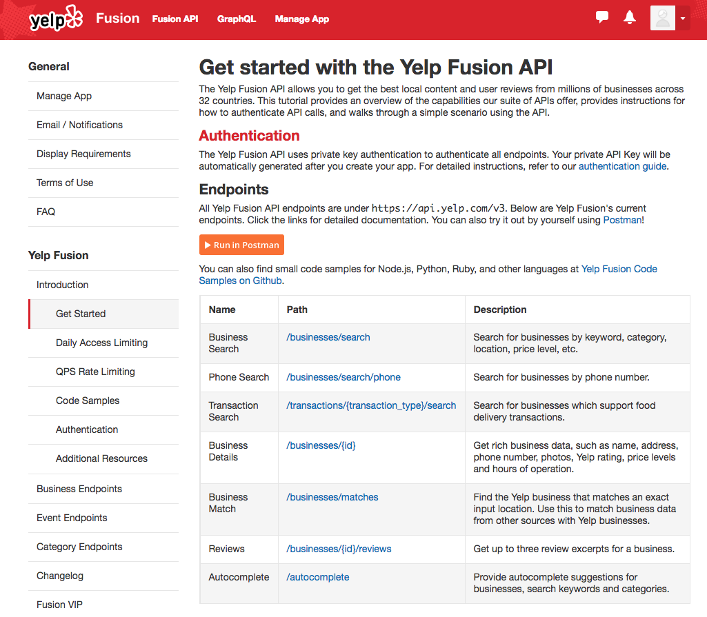
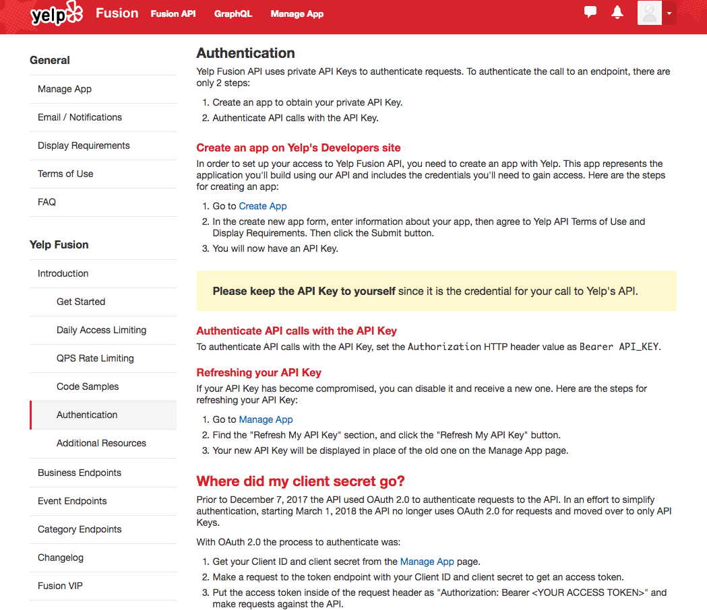

# Reading API Documentation

## Introduction 
We've now covered an example API request, but how on Earth would you know how to do that on your own? The answer is through documentation! All APIs will have associated documentation, and while there are substantial similarities, all will be different to one degree or another. The best way to get more comfortable is to practice! So with that, let's take a look at the yelp documentation associated with our previous example.  

## Objectives

You will be able to:

* Read API Documentation
* Translate documentation into Python code
* Execute get requests in order to utilize the Yelp API

Start by navigating to: https://www.yelp.com/developers/documentation/v3/get_started and having a look for yourself!  



As you see at the top, the first piece of almost every API is authentication. 

This is where we started in the previous codealong, where we went to https://www.yelp.com/developers/v3/manage_app and created a new app. 


Let's take a closer look at Yelp's authentication documentation:  
https://www.yelp.com/developers/documentation/v3/authentication
    


Notice in the documentation, it gives us the specific format "Put the API Key in the request header as "Authorization: Bearer <YOUR API KEY>"." This is what we passed in our get request.   


Before we do this, let's import your authentication token which you have appropriately stored in **a seperate file** from the codealong before.


```python
import json

#Our previous function for loading our api key file
def get_keys(path):
    with open(path) as f:
        return json.load(f)
```

> **Note**: Like before, change the file path below to be your root directory. 
If you're not sure what your username is, check it with `pwd`  
For example, my current working directory is ```/Users/matthew.mitchell/Documents/dsc-using-yelp-api-codealong```  
So the line below would become:
```keys = get_keys("/Users/matthew.mitchell/.secret/yelp_api.json")```


```python
keys = get_keys("/Users/YOUR_USERNAME_HERE/.secret/yelp_api.json")

api_key = keys['api_key']

#While you may wish to print out these api keys to check that they imported properly,
#be sure to clear the output before uploading to Github. 
#Again, you don't want your keys stolen!!!
```


```python
import requests
```


```python
url = #This will be our next step
header = {"Authorization" : "Bearer {}".format(api_key)}
response = requests.get(url, header=header)
```

 With that, let's take a look at how the rest of our request should be formatted. Go to https://www.yelp.com/developers/documentation/v3/business_search  and take a couple minutes to look things over.
 
 

Notice the first part is the format of the get request! This is the url we pass into our get request. From there, the available parameters that you can pass are listed. These define your query, some are required while others are optional.

Reviewing our python package we thus have:


```python
url = 'https://api.yelp.com/v3/businesses/search'

headers = {
        'Authorization': 'Bearer {}'.format(api_key),
    }

url_params = {
                'location': 'NYC'
            }
response = requests.get(url, headers=headers, params=url_params)
```

Note that location or latitude and longitude are the only required parameters. That said, you are free to pass as many parameters as you want such as:


```python
url = 'https://api.yelp.com/v3/businesses/search'

headers = {
        'Authorization': 'Bearer {}'.format(api_key),
    }

url_params = {
                'location': 'NYC',
                'term' : 'pizza',
                'limit' : 50,
                'price' : "1,2,3,4",
                'open_now' : True
            }
response = requests.get(url, headers=headers, params=url_params)
```

The final important note is how some of the parameters have alternative formats. For example, `limit` is an integer and `open_now` is a boolean according to the documentation. Following these conventions is essential to receiving valid responses.

# Summary

Congratulations! Not only have you seen an API now, you've also practiced sifting through the documentation. The last piece in working with APIs is developing a more solid understanding of JSON files; the data format typically returned by modern APIs. Take some additional time and familiarize yourself with some further aspects of the documentation which you may wish to investigate in the upcoming lab!
