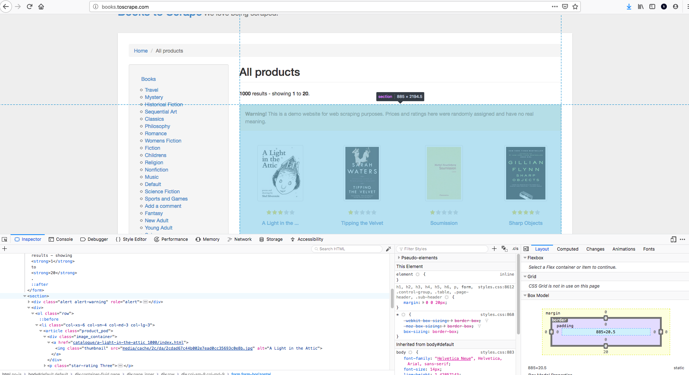
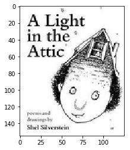

# Scraping Images

## Introduction

You've definitely started to hone your skills at scraping now! With that, let's look at another data format you're apt to want to pull from the web: images! In this lesson, you'll see how to save images from the web as well as display them in a pandas DataFrame for easy perusal!

## Objectives

You will be able to:

* Save Images from the Web
* Display Images in a Pandas DataFrame

## Grabbing an HTML Page

Start with the same page that you've been working with: books.toscrape.com.




```python
from bs4 import BeautifulSoup
import requests
```


```python
html_page = requests.get('http://books.toscrape.com/') #Make a get request to retrieve the page
soup = BeautifulSoup(html_page.content, 'html.parser') #Pass the page contents to beautiful soup for parsing
warning = soup.find('div', class_="alert alert-warning")
book_container = warning.nextSibling.nextSibling
```

## Finding Images

First, simply retrieve a list of images by searching for `img` tags with beautiful soup:


```python
images = book_container.findAll('img')
ex_img = images[0] #Preview an entry
ex_img
```


    


```python
#Use tab complete to preview what types of methods are available for the entry
ex_img.
```


    


```python
#While there's plenty of other methods to explore, simply select the url for the image for now.
ex_img.attrs['src']
```


    'media/cache/2c/da/2cdad67c44b002e7ead0cc35693c0e8b.jpg'


## Saving Images

Great! Now that you have a url (well, a url extension to be more precise) you can download the image locally!


```python
import shutil
```


```python
url_base = "http://books.toscrape.com/"
url_ext = ex_img.attrs['src']
full_url = url_base + url_ext
r = requests.get(full_url, stream=True)
if r.status_code == 200:
    with open("images/book1.jpg", 'wb') as f:
        r.raw.decode_content = True
        shutil.copyfileobj(r.raw, f)
```

## Showing Images in the File Directory

You can also run a simple bash command in a standalone cell to preview that the image is indeed there:


```python
ls images/
```

    book-section.png  book1.jpg


## Previewing an Individual Image


```python
import matplotlib.pyplot as plt
import matplotlib.image as mpimg
```


```python
img=mpimg.imread('images/book1.jpg')
imgplot = plt.imshow(img)
plt.show()
```





## Displaying Images in Pandas DataFrames

You can even display images within a pandas DataFrame by using a little HTML yourself!


```python
import pandas as pd
from IPython.display import Image, HTML
```


```python
row1 = [ex_img.attrs['alt'], '']
df = pd.DataFrame(row1).transpose()
df.columns = ['title', 'cover']
HTML(df.to_html(escape=False))
```


<table border="1" class="dataframe">
  <thead>
    <tr style="text-align: right;">
      <th></th>
      <th>title</th>
      <th>cover</th>
    </tr>
  </thead>
  <tbody>
    <tr>
      <th>0</th>
      <td>A Light in the Attic</td>
      <td></td>
    </tr>
  </tbody>
</table>


## All Together Now


```python
data = []
for n, img in enumerate(images):
    url_base = "http://books.toscrape.com/"
    url_ext = img.attrs['src']
    full_url = url_base + url_ext
    r = requests.get(full_url, stream=True)
    path = "images/book{}.jpg".format(n+1)
    title = img.attrs['alt']
    if r.status_code == 200:
        with open(path, 'wb') as f:
            r.raw.decode_content = True
            shutil.copyfileobj(r.raw, f)
        row = [title, ''.format(path)]
        data.append(row)
df = pd.DataFrame(data)
print('Number of rows: ', len(df))
df.columns = ['title', 'cover']
HTML(df.to_html(escape=False))   
```

    Number of rows:  20


<table border="1" class="dataframe">
  <thead>
    <tr style="text-align: right;">
      <th></th>
      <th>title</th>
      <th>cover</th>
    </tr>
  </thead>
  <tbody>
    <tr>
      <th>0</th>
      <td>A Light in the Attic</td>
      <td></td>
    </tr>
    <tr>
      <th>1</th>
      <td>A Light in the Attic</td>
      <td></td>
    </tr>
    <tr>
      <th>2</th>
      <td>A Light in the Attic</td>
      <td></td>
    </tr>
    <tr>
      <th>3</th>
      <td>A Light in the Attic</td>
      <td></td>
    </tr>
    <tr>
      <th>4</th>
      <td>A Light in the Attic</td>
      <td></td>
    </tr>
    <tr>
      <th>5</th>
      <td>A Light in the Attic</td>
      <td></td>
    </tr>
    <tr>
      <th>6</th>
      <td>A Light in the Attic</td>
      <td></td>
    </tr>
    <tr>
      <th>7</th>
      <td>A Light in the Attic</td>
      <td></td>
    </tr>
    <tr>
      <th>8</th>
      <td>A Light in the Attic</td>
      <td></td>
    </tr>
    <tr>
      <th>9</th>
      <td>A Light in the Attic</td>
      <td></td>
    </tr>
    <tr>
      <th>10</th>
      <td>A Light in the Attic</td>
      <td></td>
    </tr>
    <tr>
      <th>11</th>
      <td>A Light in the Attic</td>
      <td></td>
    </tr>
    <tr>
      <th>12</th>
      <td>A Light in the Attic</td>
      <td></td>
    </tr>
    <tr>
      <th>13</th>
      <td>A Light in the Attic</td>
      <td></td>
    </tr>
    <tr>
      <th>14</th>
      <td>A Light in the Attic</td>
      <td></td>
    </tr>
    <tr>
      <th>15</th>
      <td>A Light in the Attic</td>
      <td></td>
    </tr>
    <tr>
      <th>16</th>
      <td>A Light in the Attic</td>
      <td></td>
    </tr>
    <tr>
      <th>17</th>
      <td>A Light in the Attic</td>
      <td></td>
    </tr>
    <tr>
      <th>18</th>
      <td>A Light in the Attic</td>
      <td></td>
    </tr>
    <tr>
      <th>19</th>
      <td>A Light in the Attic</td>
      <td></td>
    </tr>
  </tbody>
</table>


## Summary

Voila! You really are turning into a scraping champion! Now go get scraping!
