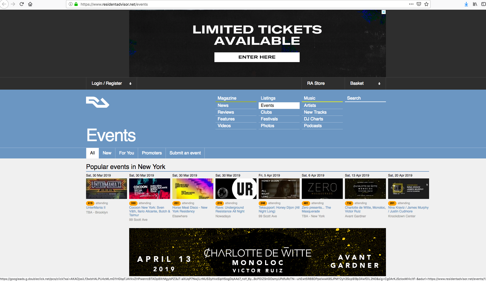

# Scraping Concerts - Lab

## Introduction

Now that you've seen how to scrape a simple website, it's time to again practice those skills on a full-fledged site!
In this lab, you'll practice your scraping skills on a music website: https://www.residentadvisor.net.
## Objectives

You will be able to:
* Scrape events from a website
* Follow links to those events to retrieve further information
* Clean and store scraped data

## View the Website

For this lab, you'll be scraping the https://www.residentadvisor.net website. Start by navigating to the events page [here](https://www.residentadvisor.net/events) in your browser.




```python
#Load the https://www.residentadvisor.net/events page in your browser.
```

## Open the Inspect Element Feature

Next, open the inspect element feature from your web browser in order to preview the underlying HTML associated with the page.


```python
#Open the inspect element feature in your browser
```

## Write a Function to Scrape all of the Events on the Given Page Events Page

The function should return a Pandas DataFrame with columns for the Event_Name, Venue, Event_Date and Number_of_Attendees.


```python
def scrape_events(events_page_url):
    #Your code here
    df.columns = ["Event_Name", "Venue", "Event_Date", "Number_of_Attendees"]
    return df
```

## Write a Function to Retrieve the URL for the Next Page


```python
def next_page(url):
    #Your code here
    return next_page_url
```

## Scrape the Next 1000 Events for Your Area

Display the data sorted by the number of attendees. If there is a tie for the number attending, sort by event date.


```python
#Your code here
```

## Summary 

Congratulations! In this lab, you successfully scraped a website for concert event information!
