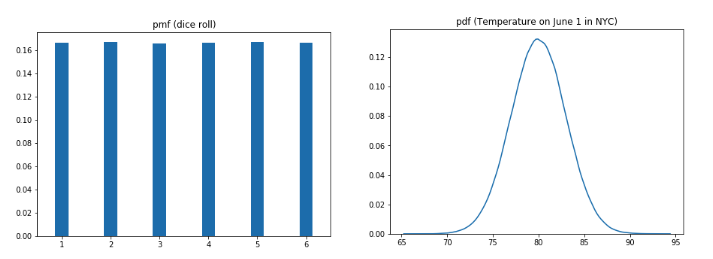
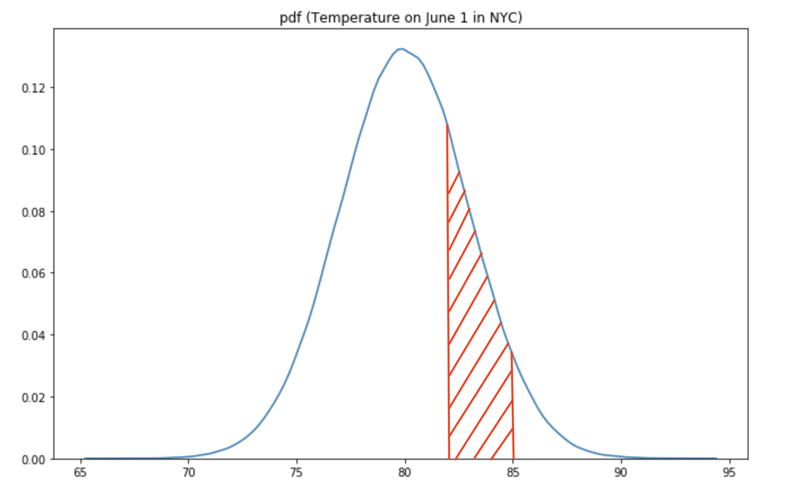
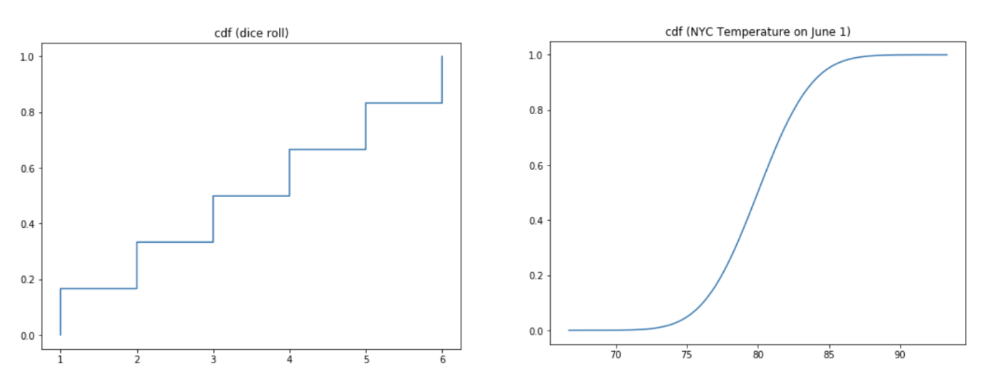

# The Cumulative Distribution Function (CDF)

## Introduction

The PMF function that we saw before works great for inspecting discrete random variables and calculating their expected values. However, we did see that when moving towards continuous random variables, obtaining probabilities for observing a specific outcome is not possible (or simply put, the probabilities were 0). We also noted that when working with PDFs, you can't really read the y-axis and have to be careful with interpretation. In this lesson, you'll learn about the cumulative distribution function and how it is useful to overcome these issues.

## Objectives

You will be able to:

* Differentiate between a PMF, PDF and a CDF in terms of cumulative probabilities 
* Calculate CDF in python for a given discrete variable with limited set of possible values
* Visualize and inspect a given cdf in order to make assumptions about the underlying data 

## Limitations of PMFs and PDFs

To illustrate the use of Cumulative Distribution Functions, let's have another look at the PMF and PDF of our dice and temperature example:

Recall how we could easily read probabilities from the dice PMF plot ("The probability of throwing a 4 is 16.66%"), but it is much harder to interpret the temperature pdf. What is the probability that the temperature is exactly 80 degrees? We learned in the previous lesson that all these so-called "point probabilities" are 0, so the bottom line is that it is very hard to "read" any interesting information from a PDF. The PDF is mainly there to get a sense of the data density, but you cannot readily read the y-axis to get to probabilities.

We did see last that when you want to get to probabilities, you need to take integrals and look at ranges of values of your continuous random variables. For example, you can ask yourself the questions: "What is the probability the temperature in NYC is betweemn 82 and 85 degrees on June 1?" The answer is the surface of the red shaded area!

From the last lesson, you learned that you can use the integral to get this "area under the curve" value by taking the integral as follows:

$$\large P(82 \leq X \leq 85) = \int_{82}^{85} f_x(x) dx \geq 0 $$

This is the rationale that is being used when working with Cumulative Density Functions, which will be introduced next.

## How does a Cumulative Density Function (CDF) work?

The CDF is a function of $x$ just like a pmf or a pdf, where $x$ is any value that can possibly appear in given distribution. To calculate CDF(x) for any value of x, we compute the proportion of values in the distribution less than or equal to x as follows:

$$\large F(x) = P(X \leq x)$$

> The Cumulative Distribution Function, CDF, gives the probability that the variable $X$ is less than or equal to a certain possible value $x$. 

The cumulative distribution functions for a dice roll and the weather in NYC are plotted below.

This is also what cumulative means - you're simply adding up probabilities.

You'll notice that in general, CDFs are smooth curves for continuous random variables, where they are "step functions" when looking at discrete random variables. Looking at these curves, we can answer questions by looking at the y-axis.

What is the probability that you throw value $\leq$ 4 when throwing a dice? 0.6667 or 66.67. For this discrete example it is pretty straightforward, as this is the probability of throwing a 1 OR 2 OR 3 OR 4, so $0.1666 * 4$.

What is the probability that the temperature in NYC is $\leq$ has 79? Looking at the associated y-value when looking at an $x$-value of 79, this probability is around $40\%$ or $0.4$.

## Calculating more probabilities using the CDF

Let's go back to our weather example introduced before. An additional advantage of CDFs is that you can use the CDF to easily calculate things like:

The idea is that
$$\large P(82 \leq X \leq 85) = P(X \leq 85) - P(X \leq 82)= F_X(85)- F_X(82)$$

This means that you can look at the y-value of your culumative density function to get the answer to this question.

$$\large F_X(85)- F_X(82)	\approx 0.95-0.6 = 0.35$$

## Summary 

In this lesson we looked at a cdf as a so-called "percentile probability function" of discrete or continuous random variable. You looked at how to calculate and visualize a CDF, and how to use them to calculate certain probabilities.
