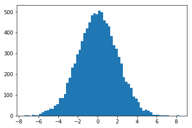
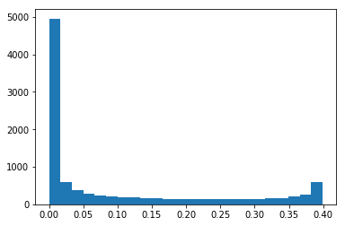

# Skewness and Kurtosis - Lab

## Introduction

In this lab, you'll calculate skewness and kurtosis for a given dataset in SciPy using Python.

## Objectives
You will be able to:
* Measure, visualize, and interpret the kurtosis of a dataset
* Measure, visualize, and interpret the skewness of a dataset

## Bring in SciPy
In the previous lesson, you have seen formulas to calculate skewness and kurtosis for your data. Scipy comes packaged with these functions and provides an easy way to calculate these two quantities, see [scipy.stats.kurtosis](https://docs.scipy.org/doc/scipy/reference/generated/scipy.stats.kurtosis.html#scipy.stats.kurtosis) and [scipy.stats.skew](https://docs.scipy.org/doc/scipy/reference/generated/scipy.stats.skew.html). Check out the official SciPy documentation to dig deeper into this. Otherwise, simply pull up the documentation within the Jupyter notebook using `shit+tab` within the function call or pull up the full documentation with `kurtosis?` or `skew?`, once you have imported these methods from the SciPy package.

Where $x$ is a random variable. 

You'll generate two datasets and measure/visualize and compare their skew and kurtosis in this lab.


```python
# Import required libraries
import numpy as np
import matplotlib.pyplot as plt

from scipy.stats import kurtosis, skew
```

## Take 1
* Generate a random normal variable `x_random` in numpy with 10,000 values. Set the mean value to 0 and standard deviation to 2.
* Plot a histogram for the data, set bins to `auto` (default). 
* Calculate the skewness and kurtosis for this data distribution using the SciPy functions.
* Record your observations about the calculated values and the shape of the data. 


```python
x_random = None

# Skewness = -0.0025781248189666343
# kurtosis = 0.03976806960642154

```

    Skewness = -0.01442829768952485
    kurtosis = 0.016922288438713018





```python
# Your observations here 


#
#
#
```

## Take 2

Let's generate another distribution 


```python
x = np.linspace( -5, 5, 10000 )
y = 1./(np.sqrt(2.*np.pi)) * np.exp( -.5*(x)**2  )  # normal distribution
```

* Plot a histogram for data $y$, and set bins to auto (default).
* Calculate the skewness and kurtosis for this data distribution using the SciPy functions.
* Record your observations about the calculated values and the shape of the data.


```python


# Skewness = 1.109511549276228
# kurtosis = -0.31039027765889804
```

    Skewness = 1.109511549276228
    kurtosis = -0.31039027765889804





```python
# Your observations here 

#
#
#
```

## Summary

In this lesson we learned how to calculate, visualize and analyze the skewness and kurtosis for any given distribution. We worked with synthetic datasets at this stage to get the concepts cleared up. Later we will try these techniques on real datasets to see if they are fit for analysis (or not). 
