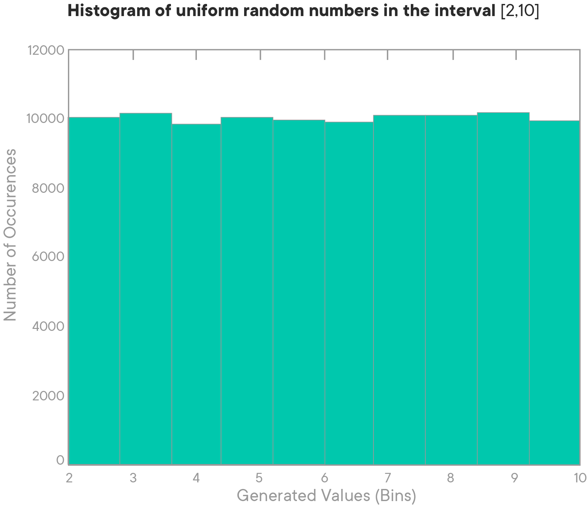

# The Uniform Distribution

## Introduction

Now that you've been introduced to both discrete (Binomial) and continuous (Normal) distributions, and know how to perform a simple test, let's move on with some more distributions. The uniform distribution is a special one, as there is a discrete as well as a continuous version of this distribution!

## Objectives

You will be able to:

* Understand what a uniform distribution is
* Understand the formula for the mean and standard deviation of a uniform distribution

## Uniform Distribution

The **Uniform Distribution** describes an event where every possible outcome is equally likely.  No single outcome carries any more or less probability of happening than any other possible outcome.  **The Uniform Distribution can be discrete or continuous**. 




## The Discrete Uniform Distribution

You've seen an example of a Discrete Uniform Distribution before: rolling a 6-sided dice. This idea can be extended to an $n$-sided dice. No matter how many sides the dice has, with a fair dice, you'd be equally likely to roll every side.  

If $a$ is the smallest number, and $b$ is the biggest number that can be observed (for a fair dice, $a=1$, $b=6$)

**Probability Mass Function:**

$$p(x) = \dfrac{1}{(b − a+1)}\text{ when } a \leq x \leq b, \text{and} $$ 
$$p(x) = 0\text{ when }x \notin ]a, b[ $$

**Uniform Distribution Mean:**

$$E(X)= \frac{a + b}{2}$$

**Uniform Distribution Variance**:

$$Var(X) = \sqrt{\frac{(b-a)(b-a+2)}{12}}$$


## The Continuous Uniform Distribution
An example of a **Continuous Uniform** would be the waiting for an elevator that could be on any floor in the building when you call it and can take between 0 and 40 seconds to arrive at your floor. Since the elevator is equally likely to be at any given floor, you can assume every amount of time between 0 and 40 seconds before the elevator arrives (decimals and fractions allowed, to an infinite amount of precision). The formulas for a continuous uniform distribution diverge slightly!

**Probability Density Function:**

$$f(x) = \dfrac{1}{(b − a)}\text{ when } a \leq x < b, \text{and} $$ 
$$f(x) = 0\text{ when }x \notin [a, b[ $$

**Uniform Distribution Mean:**

$$E(X)= \frac{a + b}{2}$$

**Uniform Distribution Variance**:

$$Var(X) = \frac{(b - a)^2}{12}$$


**_NOTE:_** If you're confused why there is a 12 in the denominator of the formula of the variance for a Uniform Distribution, you're not alone.  The short answer is that it involves calculus. As a data scientist, you don't need to understand the derivation of this formula and where this 12 comes from. However, if you're interested, this [quora answer gives an excellent explanation](https://www.quora.com/Why-is-there-a-12-in-the-variance-of-uniform-distribution)!

## Summary

In this lesson, you learned about the uniform distribution, its applications, and its formulas.


```python

```
