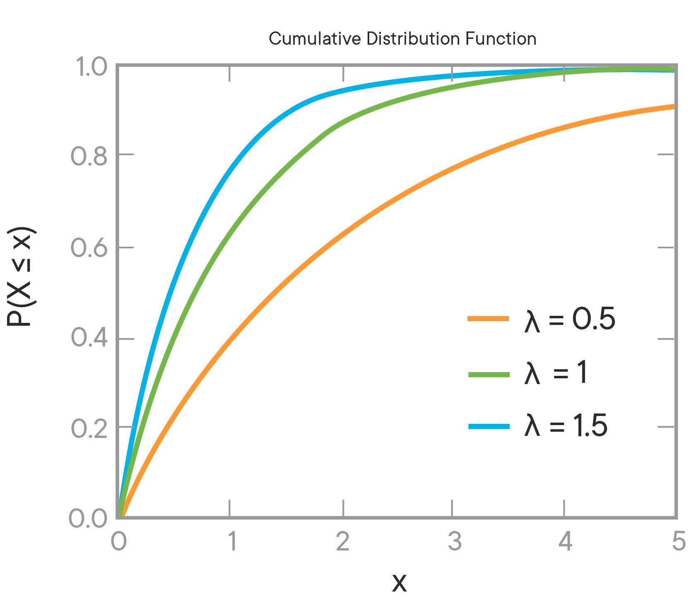

# Exponential Distributions

## Introduction

In this lesson, you'll learn about the Exponential Distribution and the types of questions you can answer using this distribution.

## Objectives

You will be able to:

* Understand and explain the Exponential Distribution and its use cases.  


## What is the Exponential Distribution?

The **Exponential Distribution** describes the probability distribution of the amount of time it takes before an event occurs.  In a way, it solves the inverse of the problem solved by the Poisson Distribution.

The **Poisson Distribution** lets you ask how likely any given number of events are over a set interval of time.  

The **Exponential Distribution** lets you ask how likely the _length of an interval of time_ is before an event occurs exactly once. 

## Sample Problem Statements for Exponential Distribution

Let's look at some examples of the type of questions you can answer with knowledge of the Exponential Distribution:

1. How long before a sensor in this factory breaks down?

2. How long until the next earthquake happens?

3. How long will the next customer interaction take?

4.  How long until the next person visits my website?

As you can see, any type of question that we can ask about the length of time before a random event happens is a question that falls under the _Exponential Distribution_.  

## Parameters & Formulas

As with the other distributions we've learned about, our goal is to discover the probability that our **_Random Variable, $X$_** will turn out to be a specific value, $x$. 

In order to figure this out, we need to know the **Decay Parameter**, $\lambda$ (although you may also see this denoted by the letter $m$).  To calculate the decay parameter, we just divide 1 by the average length of time it takes for an event to occur (e.g. the average number of minutes a customer interaction takes, or the average number of days before a machine breaks down). The average interval length is usually labeled as $\mu$.

### Decay Rate Formula

$$\lambda = \frac{1}{\mu}$$

Once we know the decay rate, we can use the **Probability Density Function** to tell us the exact point probability for any length $x$.

$$PDF(x) = \lambda e^{-\lambda x}$$

The **Probability Density Function** allows us to answer questions such as "What is the probability that it takes _exactly_ 4 minutes to ring up this customer?"


Since we are talking about a Continuously-valued function, we'll also often want to make use of the **Cumulative Density Function**.  This allows us to answer questions such as "what is the probability that it will take less than 4 minutes to ring up this customer?"

$$CDF(x) = 1 - e^{-\lambda x}$$




Note that we discussed the mean of this distribution above, but not the standard deviation. This distribution is somewhat unique in that the **Standard Deviation**, $\sigma$ is equal to the **_mean_**, $\mu$.

$$\sigma = \mu$$


## Solving a Sample Problem

Let's use some python to solve a sample problem described above.  Let's assume that the average customer interaction at a grocery store takes 4 minutes.  What is the probability that ringing up the next customer takes exactly 3 minutes? What about the probability that it takes 3 minutes or less?

Let's write a few quick functions to calculate the PDF and CDF for us in the cell below. Then, we can use it to solve the problem above. 


```python
import numpy as np

def exp_pdf(mu, x):
    decay_rate = 1 / mu
    return decay_rate * np.exp(-decay_rate * x)
    

def exp_cdf(mu, x):
    decay_rate = 1 / 4
    return 1 - np.exp(-decay_rate * x)
    
print("Point probability for exactly 3 minutes: {:.4f}%".format(exp_pdf(4, 3) * 100))
print("Cumulative probability of 3 minutes or less: {:.4f}%".format(exp_cdf(4, 3) * 100))
```

    Point robability for exactly 3 minutes: 11.8092%
    Cumulative probability of 3 minutes or less: 52.7633%


## Summary

In this lesson, we learned about the **Exponential Distribution**, and we can use the **Decay Rate** to calculate both **Probability Density** and **Cumulative Density**!
