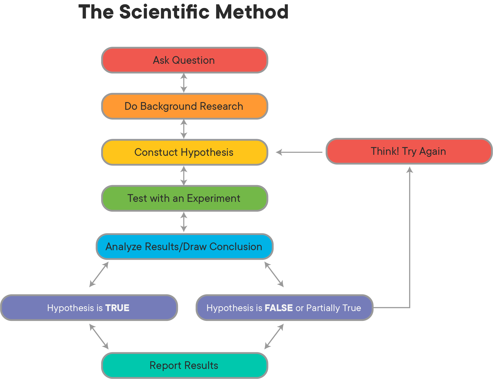
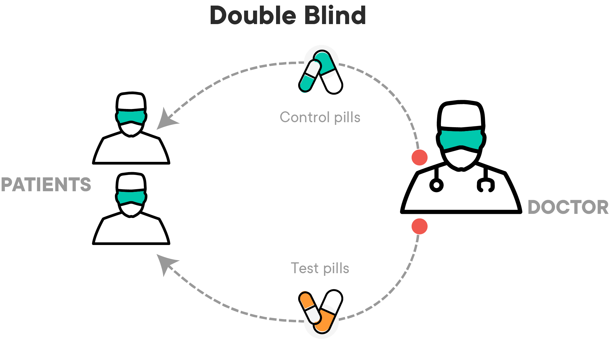
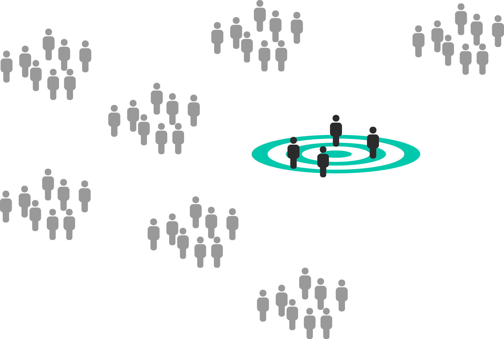

# Introduction to Experimental Design

## Introduction

In this lesson, you'll learn about the importance of sound experimental design, and how it underpins every decision you will make as a Data Scientist!

## Objectives

You will be able to:

* Understand and explain the concepts behind sound experimental design 
* Understand and explain the purpose of **_Control Groups_** in experiments
* Understand and explain how **_Random Controlled Trials_** work, and why randomness is important


## The Scientific Method

You probably remember at least a little bit about the **_Scientific Method_** from your time in school.  This lesson will focus on the thing that makes it work--sound experimental design! The scientific method has been responsible for all the great progress humanity has seen in everything from medicine to physics to electronics, all because scientists working on problems knew how to design experiments in a way that helped them answer important questions with as little ambiguity as possible. If the scientific method was a car, then experimental design would be the engine that allows that car to move. This is especially important to Data Scientists, because it allows them to examine any problem through the lens of the **_Null Hypothesis_**!

The general structure of an experiment is as follows:

### 1. Make an Observation

The first step of the scientific method is to observe something that you want to test. During this step, you must observe phenomena to help refine the question that you want to answer.  This might be anything from "does this drug have an effect on headaches?" to "does the color of this button affect the number of sales a website makes in a day?".  Before testing these ideas, you need to observe that there might be some phenomena occurring and then come up with a specific question to answer. 

### 2. Examine the Research

Good data scientists work smart before they work hard.  In the case of the scientific method, this means seeing what research already exists that may help you answer your question, directly or indirectly.  It could be that someone else has already done an experiment that answers your question--if that's the case, you should be aware of that experiment before starting your own, as it could inform your approach to structuring your experiment, or maybe even answer your question outright!  

### 3. Form a Hypothesis

This is the stage that most people remember from learning the scientific method in grade school. In school, you learned that a hypothesis is just an educated guess that you will try to prove by conducting an experiment. In reality, it's a bit more complicated than that.  During this stage, you'll formulate 2 hypotheses to test--your educated guess about the outcome is called the **_Alternative Hypothesis_**, while the opposite of it is called the **_Null Hypothesis_**.  This is where the language behind experimental design (and the idea of what you can actually **_prove_** using an experiment) gets a bit complicated--more on this below. 

### 4. Conduct an Experiment

This step is the part of the scientific method that will be the focus of this section. You can only test a hypothesis by gathering data from a well-structured experiment.  A well-structured experiment is one that accounts for all of the mistakes and randomness that could give you false signals relating to the effect of an intervention.  Just because you're running an experiment doesn't prove that A causes B, or that there's even a relationship between A and B! A poorly designed experiment will lead to false conclusions that you haven't considered or controlled for. A well-designed experiment leaves you no choice but to acknowledge that the effects seen in a dependent variable are related to an independent variable.  The world is messy and random. You have to account for this messiness and randomness in experiments so that you can filter it out and be left only with the things you're actively trying to measure. 

### 5. Analyze Experimental Results

Whether you realize it or not, you've already gotten pretty good at this step! All the work you've done with statistics is usually in service of this goal--looking at the data and understanding what happened. During this step, you will tease out relationships, filter out noise, and try to determine if something that happened is **_statistically significant_** or not. 

### 6. Draw Conclusions

This step is the logical endpoint for an experiment.  You've asked a question, looked at experimental results from others that could be related to your question, made an educated guess, designed an experiment, collected data and analyzed the results.  All that is left is to use the results of the analysis step to evaluate whether you believe the hypothesis was correct or not! While the public generally oversimplifies this step to determining causal relationships (e.g. "my experiment showed that {x} causes {y}"), true scientists rarely make claims so bold.  The reality of this step is that you use your analysis of the data to do one of two things: either **_reject the null hypothesis or fail to reject the null hypothesis_**.  This is a tricky concept, so you'll explore it in much more detail in a future lesson. 




## The Foundations of a Sound Experiment

All experiments are not created equal--simply following the steps outlined above does not guarantee that the results of any experiment will be meaningful. For instance, there's nothing stopping a person from testing the hypothesis that "wearing a green shirt will make it rain tomorrow!", seeing rain the next day, and rejecting the null hypothesis, thereby incorrectly "proving" that their choice of wardrobe affected the weather.  Good experiments demonstrate that independent variables {X} have an effect on the dependent variables {Y} because you control for all the other things that could be affecting {Y}, until you are forced to conclude that the only thing that explains what happened to {Y} is {X}!

Although there are many different kinds of experiments, there are some fundamental aspects of experimental design that all experiments have:

### 1. A Control Group/Random Controlled Trials

One of the most important aspects of a sound experiment is the use of a **_Control Group_**. A Control Group is a cohort that receives no treatment or intervention--for them, it's just business as usual.  In a medical test, this might be a **_placebo_**, such as a sugar pill. In the example of testing the color of a button on a website, this would be customers that are shown a version of the website with the button color unchanged.  Using a control group allows researchers to compare the results of doing nothing (the control) with the effects  of doing something (the **_intervention_**).  Without a control group, you have no way of knowing how much of the results you see can be attributed to the intervention, and how much would have happened anyways. 

To make this more obvious, consider what you can actually know with confidence after an experiment that doesn't use a control. Assume that a pharmaceutical company decides to test a new drug that is supposed to reduce the amount of time someone has the flu.  The company gives the drug to all participants in the study.  After analyzing the data, you find that the average length of time a person had the flu was 12 days.  Was the drug effective, or not? Without a control, you don't know how long this flu would have lasted if these people were never given a drug.  It could be that your drug reduced the time of infection down to 12 days.  Then again, it could be that these people would have gotten better on their own after 12 days, and the drug didn't really do anything--or maybe they would have gotten better in 10 days, and the drug made it worse! By using a control group that gets no drugs and recovers naturally, you can compare the results of the treatment (people that received the experimental flu drug) to your control group (people that recovered naturally).

Note that a control group is only a control group if they are sampled from the same population as the treatment groups! If they aren't the same, then there's no way of knowing how much the difference in recovery time should be attributed to the flu drug, and how much should be attributed to the way(s) in which the control group is different.  For instance, the experiment would not be very effective if the average age of one group was much higher or lower than another. If that was the case, how would you know the age difference isn't actually causing the difference in results (or lack thereof) between the control and treatment groups, instead of the drug intervention?

The main way scientists deal with this is through **_Random Controlled Trials_**.  In a Random Controlled Trial, there is a control group and an intervention (also called treatment) group, where subjects are **_randomly assigned to each_**.  You may have heard the term **_Single-Blind_** and **_Double-Blind_** studies--these refer to people knowing which groups they are in. In a sound experiment, people should not know if they are in the treatment group or the control group, as that could potentially affect the outcome of the trial! 

A **_Single-Blind_** or **_Blind Trial_** is one where the participant does not know if they are receiving the treatment or a placebo. 

A **_Double-Blind Trial_** is one where the participant does not know if they are receiving the treatment or a placebo, and neither does the person administering the experiment (because their bias could affect the outcomes, too!).  Instead, knowing whether someone received the treatment or a placebo is kept hidden from everyone until after the experiment is over (obviously, _someone_ has to know for recordkeeping purposes, but that person stays away from the actual experiment to avoid contaminating it with bias from that knowledge). 



### 2. Appropriate Sampling Techniques and Sample Size

When data scientists are performing experiments, they rarely have the opportunity to work with an entire population of data. Rather, they must obtain a sample that is representative of the population. In order to get a high quality sample, you should follow these four assumptions related to sampling techniques and sample size. 

* **Sample is independent**

Independence means the value of one observation does not influence or affect the value of other observations. Independent data items are not connected with one another in any way (unless you account for it in your model). This includes the observations in both the “between” and “within” groups of your sample. Non-independent observations introduce bias and can make your statistical test give too many false positives.  

* **Sample is collected randomly** 

A sample is random when each data point in your population has an equal chance of being included in the sample; therefore, the selection of any individual observation happens by chance, rather than by choice. This reduces the chance that differences in materials or conditions strongly bias results. Random samples are more likely to be representative of the population; therefore, you can be more confident with your statistical inferences with a random sample. 

* **The sample is approximately normally distributed**

The normal distribution assumption is that the sampling distribution of the mean is normal. That is, if you took a sample, calculated its mean, and then you took another (independent) sample (from the same population) and got its mean (and repeated this an infinite number of times), then the distribution of the values that you wrote down would always be a perfect bell curve. This is the principle behind the Central Limit Theorem, and it is this idea  that allows us to perform hypothesis tests. While maybe surprising, this assumption turns out to be relatively uncontroversial, at least when each of the samples is large, such as N ≥ 30. 

* **Appropriate Sample Size** *

Randomness is a big problem in experiments. It can lead you to false conclusions by making you think that something doesn't matter when it does, or vice versa. Small sample sizes make experiments susceptible to the problem of randomness; whereas, large sample sizes protect experiments from it.  The following scenario illustrates this point:

A person tells you that they can predict the outcome of a fair coin flip. You flip a coin, they call "tails", and they are correct.  Is this enough evidence to accept or reject this person's statement?  What if they got it right 2 times in a row? 5 times in a row? 55 times out of 100?  

This situation illustrates two things that are important for us to understand and acknowledge:

1. No matter how large your sample size, there's always a chance that your results can be attributed to randomness or luck.

1. At some point, you would cross a threshold where random chance is small enough that you'd say "this probably isn't random", and are okay with accepting the results as the result of something other than randomness or luck.

With the situation above, you probably wouldn't assume that this person can predict coin flips after only seeing them get 1 correct.  However, if this person got 970 out of 1000 correct, you would probably believe very strongly that this person _can_ predict coin flips, because the odds of guessing randomly and getting 970/1000 correct are very, very small--but not 0!  

Large sample sizes protect us from randomness and variance. A more realistic example would be testing a treatment for HIV.  Less than 1% of the global population carries a protective mutation that makes them resistant to HIV infection.  If you took a randomly selected sample of 1 person from the population, there is a ~1% chance that you may mistakenly attribute successful prevention to the drug you're testing, when the results really happened because you randomly selected a person with this mutation.  However, if your sample size was 100 people per sample, your odds of randomly selecting 100 people with that mutation are $.01^{100}$. The larger your sample size, the more unlikely it is that you randomly draw people that happen to affect your study in a way that is not reflected by the general population.




### 3. Reproducibility

This one is a big one, and it represents a bit of a crisis in some parts of the scientific community right now.  Good scientific experiments have **_Reproducible Results_**! This means that if someone else follows the steps you outline for your experiment and performs it themselves, they should get pretty much the same results as you did (allowing for natural variance and randomness). If many different people try reproducing your experiment and don't get the same results, this might suggest that your results are due to randomness, or to a **_lurking variable_** that was present in your samples that wasn't present in others. Either way, a lack of reproducibility often casts serious doubts on the results of a study or experiment. 

This is less of a problem for data scientists, since reproducibility usually just means providing the dataset you worked with and the corresponding jupyter notebook.  However, this isn't always the case!   Luckily, you can use code to easily run your experiments multiple times and show reproducibility. When planning experiments, consider running them multiple times to ensure to really help show that your results are sound, and not due to randomness!

## Summary

Great, you now know about experimental design and the fundamental aspects of experiments! 


```python

```
