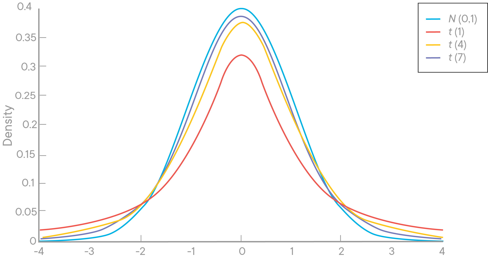
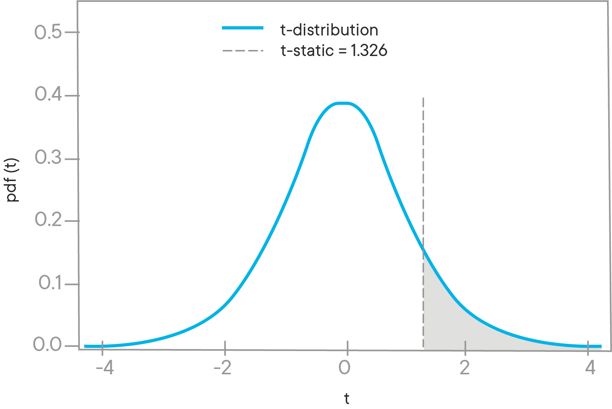
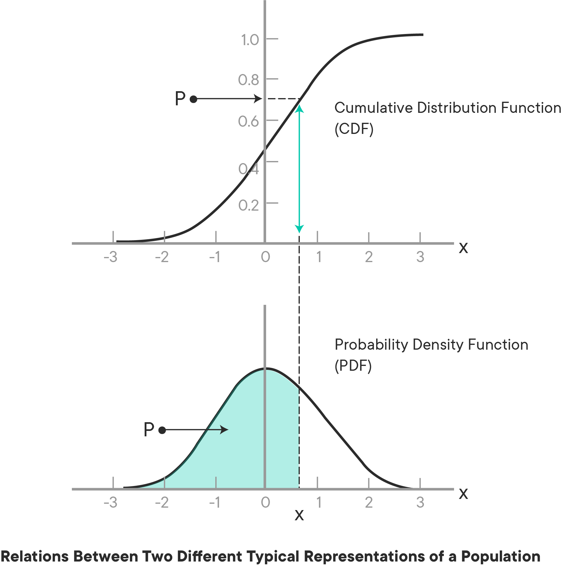

# Welch's T-Test

## Introduction 

Thus far, you've seen the traditional student's T-test for hypothesis testing between two sample means. Recall that z-tests are also appropriate for statistics, such as the mean, which can be assumed to be normally distributed. However, when sample sizes are low (n_observations<30), the t-test is more appropriate, as it has heavier tails. Even with this modification, remember that there are still several assumptions to the model. Most notably, traditional t-tests assume that sample sizes and sample variances between the two groups are equal. When these assumptions are not met, Welch's T-test is generally a more reliable test.

## Objectives
You will be able to:
* Use Welch's t-test for distributions that do not have a normality assumption.

## $t$-test Review

Recall that $t$-tests are a useful method for determing whether the mean of two small samples indicate different underlying population parameters. The reasoning behind this begins with the use of Z-tests to calculate the likelihood of sampling a particular value from a normal distribution. Furthermore, by the central limit theorem, the mean of a sample is a normally distributed variable centered around the actual underlying population mean. That said, $t$-tests are more appropriate for small samples (n_observations < 30), due to disproportionate tails. Finally, recall that the t-distribution actually converges to a normal distribution as the degrees of freedom continues to increase.  



> A normal distribrution vs. T-distributions with varying degrees of freedom. Note how the t-distributuion approaches the normal distribution as the degrees of freedom increases. Recall that when performing a t-test the degrees of freedom equals the number of observations minus one.

## Welch's t-Test

Just as student's $t$-test is a useful adaptation of the normal distribution which can lead to better likelihood estimates under certain conditions, the Welch's $t$-test is a further adaptation that account for additional pertubations in the underlying assumptions of the model. Specifically, the student's $t$-test assumes that the samples are of equal size and equal variance. When these assumptions are not met, then Welch's $t$-test provides a more accurate p-value.

Here is how you calculate it: 


 $ \Large t = \frac{\bar{X_1}-\bar{X_2}}{\sqrt{\frac{s_1^2}{N_1} + \frac{s_2^2}{N_2}}} = \frac{\bar{X_1}-\bar{X_2}}{\sqrt{se_1^2+se_2^2}}$
where  

* $\bar{X_i}$ - mean of sample i
* $s_i^2$ - variance of sample i
* $N_i$ - sample size of sample i  

The modification is related to the **degrees of freedom** in the $t$-test, which tends to increase the test power for samples with unequal variance. When two groups have equal sample sizes and variances, Welch’s tends to give the same result as Student’s t. However, when sample sizes and variances are unequal, Student’s t-test is quite unreliable, whereas Welch’s tends perform better.

## Calculating the Degrees of Freedom

Once the t-score has been calculated for the experiment using the above formula, you then must calculate the degrees of freedom for the t-distribution. Under the student's t-test, this is simply the sample size minus one, but given that the sample sizes may vary using the Welch's t-test, the calculation is a bit more complex:  

$ \Large v \approx \frac{\left( \frac{s_1^2}{N_1} + \frac{s_2^2}{N_2}\right)^2}{\frac{s_1^4}{N_1^2v_1} + \frac{s_2^4}{N_2^2v_2}} $

## Calculating p-Values  

Finally, as with the student's t-test (or a z-test for that matter), you convert the calculated score into a p-value in order to confirm or reject the null-hypothesis of your statistical experiment. For example, you might be using a one-sided t-test to determine whether a new drug had a positive effect on patient outcomes. The p-value for the experiment is equivalent to the area under the t-distribution with the degrees of freedom, as calculated above, and the corresponding t-score.



The easiest method for determining said p-values is to use Statsmodels cdf method to find the complement and subtracting this from 1.



Here's the relevant code snippet:

```python
import scipy.stats as stats


p = 1 - stats.t.cdf(t, df)
```

## Summary

This lesson briefly introduced you to another statistical test for comparing the means of two samples: Welch's $t$-test. Remember that when your samples are not of equal size or do not have equal variances, it is a more appropriate statistical test then the student's $t$-test!
