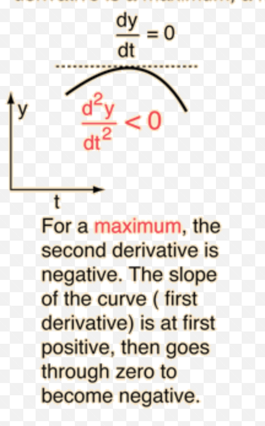
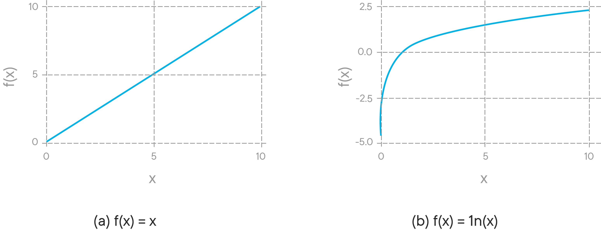

# Maximum Likelihood Estimation (MLE)

## Introduction

"Parameter Inference" is one of the most important concepts of predictive machine learning. In this lesson, you will begin to build an intuition surrounding the the ideas around this concept. You'll first look at the maximum likelihood estimation (MLE) for the posterior probability based on observed data. (A direct application of Bayes Theorem.) From there, you'll conduct a random experiment involving a series of coin tosses to derive the general formula for MLE of a binomial distribution. 

## Objectives

You will be able to:
* Understand and describe parametric inference based in context of identifying optimal values for model parameters
* Understand the concept of likelihood , and the difference between likelihood and a probability
* Describe MLE assumption of IID samples and its implications on model development

## Parameter Inference

Parameter Inference is the process of probabilistically inferring parameter(s) for a model of our choice, that is which parameter values best describe the underlying dataset, used in an analytical context. Let's try to understand this with a simple experiment with a 10 times coin flip and inspecting the outcome. 


```python
import random
def coinToss():
    number = int(input("Number of times to flip coin: "))
    recordList = []
    heads = 0
    tails = 0
    for amount in range(number):
         flip = random.randint(0, 1)
         if (flip == 0):
              print("Toss", amount+1 ,':' , "Heads")
              recordList.append("Heads")
         else:
              print("Toss", amount+1 ,':' , "Tails")
              recordList.append("Tails")
    print(str(recordList))
    print(str(recordList.count("Heads")) + str(recordList.count("Tails")))
    return recordList
```


```python
lst = coinToss()
```

    Number of times to flip coin: 100
    Toss 1 : Tails
    Toss 2 : Heads
    Toss 3 : Tails
    Toss 4 : Tails
    Toss 5 : Heads
    Toss 6 : Tails
    Toss 7 : Heads
    Toss 8 : Heads
    Toss 9 : Heads
    Toss 10 : Tails
    Toss 11 : Heads
    Toss 12 : Heads
    Toss 13 : Heads
    Toss 14 : Heads
    Toss 15 : Heads
    Toss 16 : Heads
    Toss 17 : Heads
    Toss 18 : Tails
    Toss 19 : Heads
    Toss 20 : Tails
    Toss 21 : Heads
    Toss 22 : Tails
    Toss 23 : Tails
    Toss 24 : Heads
    Toss 25 : Tails
    Toss 26 : Heads
    Toss 27 : Heads
    Toss 28 : Heads
    Toss 29 : Heads
    Toss 30 : Tails
    Toss 31 : Heads
    Toss 32 : Heads
    Toss 33 : Tails
    Toss 34 : Tails
    Toss 35 : Heads
    Toss 36 : Heads
    Toss 37 : Tails
    Toss 38 : Tails
    Toss 39 : Heads
    Toss 40 : Heads
    Toss 41 : Tails
    Toss 42 : Tails
    Toss 43 : Heads
    Toss 44 : Tails
    Toss 45 : Tails
    Toss 46 : Heads
    Toss 47 : Tails
    Toss 48 : Tails
    Toss 49 : Heads
    Toss 50 : Heads
    Toss 51 : Heads
    Toss 52 : Tails
    Toss 53 : Heads
    Toss 54 : Heads
    Toss 55 : Heads
    Toss 56 : Tails
    Toss 57 : Heads
    Toss 58 : Heads
    Toss 59 : Tails
    Toss 60 : Heads
    Toss 61 : Tails
    Toss 62 : Tails
    Toss 63 : Heads
    Toss 64 : Heads
    Toss 65 : Tails
    Toss 66 : Heads
    Toss 67 : Tails
    Toss 68 : Tails
    Toss 69 : Heads
    Toss 70 : Heads
    Toss 71 : Heads
    Toss 72 : Tails
    Toss 73 : Heads
    Toss 74 : Tails
    Toss 75 : Heads
    Toss 76 : Tails
    Toss 77 : Heads
    Toss 78 : Tails
    Toss 79 : Tails
    Toss 80 : Tails
    Toss 81 : Heads
    Toss 82 : Tails
    Toss 83 : Tails
    Toss 84 : Heads
    Toss 85 : Tails
    Toss 86 : Heads
    Toss 87 : Heads
    Toss 88 : Heads
    Toss 89 : Heads
    Toss 90 : Heads
    Toss 91 : Heads
    Toss 92 : Heads
    Toss 93 : Tails
    Toss 94 : Heads
    Toss 95 : Tails
    Toss 96 : Tails
    Toss 97 : Tails
    Toss 98 : Tails
    Toss 99 : Tails
    Toss 100 : Tails
    ['Tails', 'Heads', 'Tails', 'Tails', 'Heads', 'Tails', 'Heads', 'Heads', 'Heads', 'Tails', 'Heads', 'Heads', 'Heads', 'Heads', 'Heads', 'Heads', 'Heads', 'Tails', 'Heads', 'Tails', 'Heads', 'Tails', 'Tails', 'Heads', 'Tails', 'Heads', 'Heads', 'Heads', 'Heads', 'Tails', 'Heads', 'Heads', 'Tails', 'Tails', 'Heads', 'Heads', 'Tails', 'Tails', 'Heads', 'Heads', 'Tails', 'Tails', 'Heads', 'Tails', 'Tails', 'Heads', 'Tails', 'Tails', 'Heads', 'Heads', 'Heads', 'Tails', 'Heads', 'Heads', 'Heads', 'Tails', 'Heads', 'Heads', 'Tails', 'Heads', 'Tails', 'Tails', 'Heads', 'Heads', 'Tails', 'Heads', 'Tails', 'Tails', 'Heads', 'Heads', 'Heads', 'Tails', 'Heads', 'Tails', 'Heads', 'Tails', 'Heads', 'Tails', 'Tails', 'Tails', 'Heads', 'Tails', 'Tails', 'Heads', 'Tails', 'Heads', 'Heads', 'Heads', 'Heads', 'Heads', 'Heads', 'Heads', 'Tails', 'Heads', 'Tails', 'Tails', 'Tails', 'Tails', 'Tails', 'Tails']
    5545


Remember its a random experiment so the output will change everytime you run it. Here is the output sequence we'll use in this lesson: 
```
['Heads', 'Heads', 'Tails', 'Tails', 'Tails', 'Heads', 'Tails', 'Heads', 'Heads', 'Heads']
```
Considering its a random experiment, you can say that there has to be *some* underlying parameter for the outcome of a coin flip. Also, consider other random experiments with dice rolls. Can you identify a parameter that determines the outcome of such experiments ? 

Parameter Inference is all to do with identifying that parameter with its optimal value. The first key step in this process is Maximum Likelihood Estimation (MLE).

## Maximum Likelihood Estimation

MLE primarily deals with **determining the parameters** that **maximize the probability of the data**. Such a determination can help you predict the outcome of future experiments e.g. If we Toss the coin 1 more time, what is the probability of seeing a Head? 

* Its a fair coin so probability is 0.5. 

This is a safe assumption as it assumes independence between coin flips and hence past events have no impact on future ones. 


```python
p_head = lst.count("Heads")/10
p_head
```


    5.5


With both these approaches in hand , let's see which answer is more suitable by creating a general case from this example. You want to know the probability of 11th flip $ p_{11}(f_{11})$, being a head so you can write:

> $p_{11}(f_{11}=Heads)$

You can also write above for calculating probability of $ith$ flip being a Head:

> $p_i(f_i = Heads) = \theta_i$


Here $\theta_i$ is the parameter that governs the outcome of ith flip. To signify that the probability distribution depends on $\theta_i$, you can use conditioning as you saw earlier and write down the last equation to show the probability distribution function along with its dependence on theta_i. 

> $p_i((f_i = Heads) | \theta_i)$

*The probability of seeing heads in the ith flip , given theta_i*

This makes sense so far, but raises a few confusing points: If the data depends on theta parameter, then the first ten coin flips f_1 to f_10 depend on theta_1 to theta_10  for i = 1 to 10. So looking at the outcome of first ten experiments, how can we extrapolate it to theta_11? 


Here's how you can do this&mdash;if you say that random outcome of a sequence of flips is governed (or modeled) by the parameters theta_1 to theta_10, you can calculate the probability function based on observed data as:

> $P (Heads, Heads, Tails, Tails, Tails, Heads, Tails, Heads, Heads, Heads) | \theta_{1}\theta_{2} .. \theta_{10})$


This is where Maximum Likelihood Estimation steps into the equation. The problem you have now is that you need to find values of thetas 1 to 10.  MLE helps find theta_i’s such that that probability function shown above is **as high as possible** and this is the basic principle of MLE.


#### Likelihood - The probability of data

MLE looks at the probability of data and it tries to find those parameters (i.e. theta_1 through theta_10 in above case) that maximize the likelihood of this sequence occurring. 

> With maximum liklihood estimation, we want to choose those parameters under which our observations become most **likely**.


Going back to our coin flip example. If in our understanding, the coin flips do not affect each other, i.e., they are independent (the outcome of first flip does not affect the outcome of the second flip):
>$P (H, H, T, T, T, H, T, H, H, H) | \theta_{1}\theta_{2} .. \theta_{10})$

>$= P(F_1 = H | \theta_1).P(F_2 = H | \theta_2) .. P(F_{10} = H | \theta_{10})$

>$= \prod_{i=1}^{10} p_i(F_i = f_i | \theta_i)$ - The general case for coin flip

Note: $\prod$ signifies the product over a series, shown in the previous equation, just as $\Sigma$ denotes summation over a series.

### MLE Assumptions

Note here that the **independence assumption** allows you to simplify the complex likelihood term into ten simpler factors that can be shown through a general notation in the last equation. 

The independence assumption allows simplification of the likelihood term but you still don’t have theta_11 in the equation.

There is another assumption you can introduce, based on the fact that the coin does not change significantly after each flip i.e.:

* **The flips are quantitatively same, i.e., they are identically distributed**. 

This implies that the flips are taking place under similar circumstances, you can assume that the parameter governing the flips is one and same i.e. just the $\theta$ without any subscripts. Based on this assumption, you can rewrite above equation as :

>$\prod_{i=1}^{10} p_i(F_i = f_i | \theta_i) = \prod_{i=1}^{10} p(F_i = f_i | \theta) $

This assumption leads you to believe that the 10 flips are governed by the same parameter theta. You now have just one parameter governing the entire sequence of coin flips, and that includes the 11th flip as well. 

This is how MLE allows you to connect first 10 coin flips to the 11th coin flip and is the key for inference.

### The two assumptions you made are used so often in Machine Learning that they have a special name together as an entity : "The i.i.d. assumption" i.e. Independent and Identically distributed samples.

This means that the 10 flips are independent and identically distributed which is great as it will allow you to explicitly write down the likelihood that you are trying to optimize. 

Remember that theta was defined as the probability of the flip showing up Heads; the probability of the sequence w.r.t. theta can now be formulated as:

$ \prod_{i=1}^{10} p(F_i = f_i | \theta)$ 

$= \theta \theta (1-\theta)(1-\theta)(1-\theta) \theta(1-\theta)\theta\theta\theta$

$=\theta^6(1-\theta)^4$

* theta = Probability of seeing a head
* 1 - theta = Probability of seeing a tail
* The sequence:  H,H,T,T,T,H,T,H,H,H


You see here the i.i.d. assumptions simplifies  the likelihood function to a simple polynomial; to a point where you can **start optimizing the function for the parameter theta**.


This simplified polynomial expression can be interpreted as a function of theta i.e., 
> $f(\theta)$ 

Now you want to find out the maxima (maximum likelihood) of this function. 




Following the intuition in the image above, you can achieve theta this by taking the derivative 
> $\frac{df}{d(\theta)}$ 

Set this  zero, and solve for theta. Then verify the critical point i.e. maxima, by inserting it into the second derivative of f(theta). This is a simple approach, however, the application of product rule repeatedly in this process could be a technically challenging process. This calculation can be simplified using a monotonic function. 


### Monotonic function

> In mathematics, a monotonic function(or monotone function) is a function between ordered sets that preserves or reverses the given order. This concept first arose in calculus, and was later generalized to the more abstract setting of order theory. [Wiki](https://en.wikipedia.org/wiki/Monotonic_function)


According to this theory, if you apply a monotonic function to another function , like the one you are trying to optimize above, this application will preserve the critical points (maxima in this case) of the original function. Logarithmic functions are normally used within the domain of machine learning to achieve the functionality of monotonicity  The logarithmic function is described as:

> $log_b(x)$

* where b is any number such that b > 0, b≠ 1, and x > 0. 
* The function is read "log base b of x".

The logarithm y is the exponent to which b must be raised to get x. The behavior of a log function can be understood from following image.





This helps you realize that **log of f(θ) i.e. log(f(θ)) will have the save maxima as the likelihood function f(θ).** This is better known as the **log likelihood**. 

Thus, the optimization function i.e. $\theta^6(1-\theta)^4$ , that you're trying to optimize w.r.t. theta can be written down as:

>$\underset{\theta}{\operatorname{argmax}} \theta^6(1-\theta)^4$

>In mathematics, the arguments of the maxima (abbreviated arg max or argmax) are the points of the domain of some function at which the function values are maximized

Remember that you are not concerned with the actual maximum value of the function. You want to **learn the value for theta** where the **function has the maximum value**.

Following the monotonicity principle, the argmax function can be written with natural log *ln* as:

>$\underset{\theta}{\operatorname{argmax}} ln(\theta^6(1-\theta)^4)$
 
> $=\underset{\theta}{\operatorname{argmax}} 6 (ln (\theta)) *4 (ln(1-\theta))$

Let's call our log likelihood function $g(\theta)$, take its derivative and set it to zero. 


> $ \frac{d}{d\theta}[g(\theta)] = |H|\frac{1}{\theta} + |T|\frac{1}{1-\theta}(-1)$

|T| are the number of tails = 4 
|H| are the number of heads = 6 

You are simply solving for a general case here , so use |T| and |H|

> $|H|\frac{1}{\theta} + {|T|}\frac{1}{1-\theta}(-1) = 0 $

> $|H|(1-\theta) - |T|\theta = 0$

> $\theta = \frac{|H|}{|H|+ |T|}$

This is the Maximum Likelihood Function $\theta_MLE$ for any given sequence of coins. 

$$\theta_{MLE} = \frac{|H|}{|H|+ |T|}$$

For the initial problem, where H = 6  and T = 4, you get MLE for theta as 6/10 = 0.6 , or , 60% chance of seeing a head for the 11th coin given the data from first 10 coin flips. 

> This maximum is called the **MLE for theta** as it makes the observed sequence **most likely**.

## Limitations of MLE

Consider a scenario where you get this sequence by total chance: [T,T,T,T,T]. According to the derived MLE formula, the probability of seeing a head at 6th coin toss would be zero. This demonstrates how MLE heavily depends on past data to find the likelihood function. It also indicates that MLE is only a first step for Parameter Estimation. We shall come across more sophisticated approaches like Maximum Aposteriori Estimate (MAP) and Fully Bayesian Analysis. 

## Additional Resources
This section was pretty math heavy and included many new concepts like optimization, maximas and minimas, monotonicity and log functions. With that, take some time to go through following resources to see more example of MLE calculation and get a deep dive into the underlying mathematical theory. 

* [Probability Concepts Explained: Maximum Likelihood Estimation](https://towardsdatascience.com/probability-concepts-explained-maximum-likelihood-estimation-c7b4342fdbb1) - Example for calculating MLE with normal distributions.
* [IID Statistics: Independent and Identically Distributed ](https://www.statisticshowto.datasciencecentral.com/iid-statistics/)
* [Monotonically Increasing and Decreasing function: An algebraic approach](https://opencurriculum.org/5512/monotonically-increasing-and-decreasing-functions-an-algebraic-approach/)
* [Logarithm Functions](https://mathbitsnotebook.com/Algebra2/Exponential/EXLogFunctions.html)

## Summary 

In this lesson, you began to develop an intuition surrounding MLE. You saw how to use the principle of monotonicity to simplify complex probability calculations into simple arithmetic operations. You also looked at a simple example of a coin toss for MLE. You're well on your way to conducting further complex statistical experiments using Bayesian techniques!
