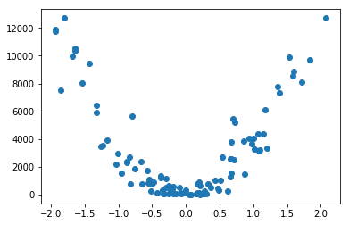

# Generating Data - Codealong

## Introduction
Data analysis often require analysts to test the efficiency/performance of an algorithm with a certain type of data. In such cases, the focus is not to answer some analytical question as we have seen earlier, but to test some machine learning hypothesis dealing with , say, comparing two different algorithms to see which one gives a higher level of accuracy. In such cases, the analysts would normally deal with synthetic random data which they generate themselves. This lab and upcoming lesson will highlight some data generation techniques that you can use later to learn new algorithms while not indulging too much into the domain knowledge.  

## Objectives
You will be able to :

* Generate datasets for classification problems 
* Generate datasets for regression problems 

## Practice Datasets

Practice datasets reflect simple problems that allowing testing and debugging of the algorithms and test its robustness. They are also used for understanding the behavior of algorithms in response to changes in model parameters as we shall see with some ML algorithms. Following are some of the reasons why such datasets are preferred over real world datasets:
- Quick and Easy generation - save data collection time  and efforts
- Predictable outcomes - have a higher degree of confidence in the result
- Randomization - datasets can be randomized repeatedly to inspect performance in multiple cases
- Simple data types - easier to visualize data and outcomes

In this lesson, we shall cover some of the python functions that can help us generate random datasets. 

## `make_blobs()`

Official doc. for this function can be found [HERE](https://scikit-learn.org/stable/modules/generated/sklearn.datasets.make_blobs.html). This function generates isotropic Gaussian blobs for clustering and classification problems, similar to the ones we earlier saw with Naive Bayes Algorithm. We can control how many blobs to generate and the number of samples to generate, as well as a host of other properties. Let's see how to import this in python environment. 
```python
from sklearn.datasets.samples_generator import make_blobs
```


```python
# Code here 

# Import other libs.
import matplotlib.pyplot as plt
import pandas as pd
```

Let's now generate a 2D dataset of samples with three blobs as a multi-class classification prediction problem. Each observation will have two inputs and 0, 1, or 2 class values.

```python
X, y = make_blobs(n_samples=100, centers=3, n_features=2)
```


```python
# Code here 
```

Now we can go ahead and visualize the results as below:
    
```python
# plot a scatter plot, color 
df = pd.DataFrame(dict(x=X[:,0], y=X[:,1], label=y))
colors = {0:'red', 1:'blue', 2:'green'}
fig, ax = pyplot.subplots()
grouped = df.groupby('label')
for key, group in grouped:
    group.plot(ax=ax, kind='scatter', x='x', y='y', label=key, color=colors[key])
plt.show()
```
    


```python
# Code here 
```


So above we see three different classes. We can generate any number of classes from above. This dataset can be used with a number of classifiers to see how accurately they perform. 

## `make_moons()`

This function is used for binary classification problems with two classes and generates moon shaped patterns. This function allows you to create dataset and specify the level of noise in the data. That helps you make the dataset more complex if required to test the robustness of an algorithm . This is how you import this function from sklearn :
```python
from sklearn.datasets import make_moons
X, y = make_moons(n_samples=100, noise=0.1)
```


```python
# Code here 
```

Now we can simply use the code from last example for visualization of the data 


```python
# Code here 

```


The noise parameter controls the shape of the data generated , Give it different values from 0 to 1 above and inspect the outcome. 0 noise would generate perfect moon shapes and 1 would be just noise and no underlying pattern. We can also see that this pattern is not "linearly separable" i.e. we can not draw a straight line to separate classes, this helps us try our non linear classification functions (like sigmoid and tanh etc.) 

 ## `make_circles()` 

This function further complicates the generated data and creates values in form of concentric circles. It also features a noise parameter , similar to make_moons(). Below is how you import this function.  
```python
from sklearn.datasets import make_circles
X, y = make_circles(n_samples=100, noise=0.05)
```


```python
# Code here 
```

Bring in the plotting code from previous examples


```python
# Code here 
```


This is also suitable for testing complex , non-linear classifiers. 

 ## `make_regression()`

This function allows you to create datasets which can be used to test regression algorithms for linear regression. Regression can be performed with a number of algorithms ranging from least squares to more advanced deep networks. We can create datasets by setting number of samples, number of input features, level of noise, and much more. Here is how we import this function:

```python
from sklearn.datasets import make_regression
X, y = make_regression(n_samples=100, n_features=1, noise=0.1)

# plot regression dataset
plt.scatter(X,y)
plt.show()

```


```python
# Code here 
```


```python
# Code here 
```


We can further tweak the generated parameters to create non-linear relationships which can be solved using non-linear regression techniques. 

```python

# Create a new y
y2 = y**2
y3 = y**3
# plot regression dataset
plt.scatter(X,y2)
plt.show()
plt.scatter(X,y3)
plt.show()
```


```python
# Code here 
```





## Level up - Optional 

sklearn comes with a lot of data generation functions. We have seen a few popular ones in this context. Kindly visit [This link](https://scikit-learn.org/stable/datasets/index.html) and have a look at section 5.4 to get more practice with these functions and see other similar functions. 

## Summary 

In this lesson, we looked at generating random datasets for classification and regression tasks using sklearn's built in functions. We looked at some of the attributes for generating data and you are encouraged to dig deeper with the official doc. and see what else can you achieve with more parameters. While learning a new algorithm, these synthetic datasets help you take your focus off the domain and work only with the computational and performance aspects of the algorithm. 
