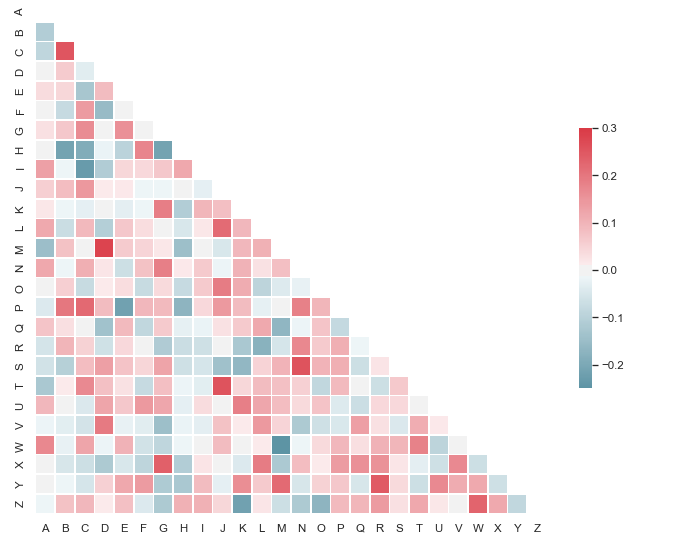

# Scrubbing and Cleaning Data


## Introduction

In this lesson, you'll review common issues to focus on when scrubbing and cleaning data.

## Objectives

You will be able to:

* Cast columns to the appropriate data types
* Identify and deal with null values appropriately
* Remove unnecessary columns
* Check for and deal with multicollinearity
* Normalize our data

## The "Scrub" Step

During the process of working with data, you'll always reach a point where you've gathered all the data you'll need (our "Obtain" step), but the data is not yet in a format where you can use it for modeling.  All the work that you'll be doing in the next lab will be to get the dataset in a format that you can easily explore and build models with. 


## Subsampling to Reduce Size

When building a model for predictive purposes, more data is always better when training the final model.  However, during the development process when working with large datasets, it is common to work with only a subsample of the dataset.  Building a model is an iterative process--often, you fit the model, investigate the results, then train the model again with some small tweaks based on what you noticed.  Since this is an iterative process, you want to avoid long runtimes, and iterate as quickly as possible.  When you're satisfied with the model you've built on the subsample of data, then you would fit the model on the entire dataset. 

In the next lab, you'll work with a subsample of the dataset to increase the iteration speed in refining your model. 


## Dealing With Data Types


One of the most common problems you'll need to deal with during the data scrubbing step is columns that are encoded as the wrong data type. For example, a common formatting issue you may encounter is numeric data that is mistakenly encoded as string data. This makes numerical operations on the data impossible without first reformatting the data. A simple operation such as `2 + 2` will return `22` if the numeric data is accidentally formatted as strings (`'2'+'2'='22'`). Similarly, categorical data is often encoded as integer values. If you don't properly conceptualize how the data is represented, you will fail to formulate meaningful models and insights.

A first step to uncover and investigate such issues is to use the `.info()` method available for all pandas DataFrames. This will tell what type of data each column contains, as well as the number of values contained within that column (which can also help us identify columns that contain missing data)!  Here's an example response:

```
<class 'pandas.core.frame.DataFrame'>
Int64Index: 97839 entries, 0 to 97838
Data columns (total 16 columns):
Store           97839 non-null object
Dept            97839 non-null object
Date            97839 non-null object
Weekly_Sales    97839 non-null float64
IsHoliday       97839 non-null bool
Type            97839 non-null object
Size            97839 non-null int64
Temperature     97839 non-null float64
Fuel_Price      97839 non-null float64
MarkDown1       35013 non-null float64
MarkDown2       27232 non-null float64
MarkDown3       32513 non-null float64
MarkDown4       34485 non-null float64
MarkDown5       35013 non-null float64
CPI             97839 non-null float64
Unemployment    97839 non-null float64
dtypes: bool(1), float64(10), int64(1), object(4)
memory usage: 12.0+ MB

```

From here, a good next step would be to look at examples from each column encoded as strings (remember, pandas refers to string columns as `object`) and confirm that this data is supposed to be encoded as strings. One method to do this is to preview a truncated version of the output from `.value_counts()`. For example, you could preview the 5 most frequent entries from each column with a simple loop like this:  

```python
for col in df.columns:
    try:
        print(col, df[col].value_counts()[:5])
    except:
        print(col, df[col].value_counts())
        #If there aren't 5+ unique values for a column the first print statement
        #will throw an error for an invalid idx slice
    print('\n') #Break up the output between columns
```

It is usually also a good idea to check integer columns to ensure that the data it contains is meant to represent actual numeric data, and is not just categorical data encoded as integers. You may also uncover null values hard coded as strings such as `"?"`, `"999999"` or other extraneous values depending on the dataset and who created it.

### Numeric Data Encoded as Strings

If you've identified numeric data encoded as strings, it's typically a pretty easy problem to solve. Often it's as simple as casting the string data to a numeric type:

```python
df['numeric_string_col'] = df['numeric_string_col'].astype('float')
```

Sadly, it's not always that simple. For example, if there is even a single cell that contains a letter or non-numeric character such as a comma or monetary symbol ($) the above statement will fail. In such cases, a more complex cleaning function must be manually created. This could involve stripping extraneous symbols such as ```',$%'``` or simply casting non convertible strings as null. Recall that when NumPy sees multiple data types in an array, it defaults to casting everything as a string. If you try to cast a column from string to numeric data types and get an error, consider checking the unique values in that column--it's likely that you may have a single letter hiding out somewhere that needs to be removed!

### Categorical Data Encoded as Integers

It's also common to see categorical data encoded as integers.  Given that a big step in the data cleaning process is to convert all categorical columns to numeric equivalents, this may not seem like a problem at first glance.  However, leaving categorical data encoded as integers can have a negative effect by introducing bad information into our model. This is because integer encoding mistakenly adds mathematical relationships between the different categories--our model may mistakenly think that the category represented by the integer `4` twice as much as category `2`, and so on.  

The best way of dealing with this problem is to cast the entire column to a string data type, which will better represent the column's categorical nature.  Since it's categorical, we will then deal with correctly when we one-hot encode categorical data later in the process.

The following example shows the syntax necessary for converting a column from one data type to another:

```python
# Cast to a numeric type
df['Some_Column'] = df.['Some_column'].astype("float32")

# Cast back to a string type
df['Some_Column'] = df.['Some_column'].astype("str")
```

Once done, it is then common to pass these categorical variables to another method such as `pd.get_dummies` in order to transform these features into representations that are more suitable for machine learning algorithms. It may be necessary to drop the first dummy to avoid the dummy variable trap.

## Detecting and Dealing With Null Values

Another important data cleaning check is to inspect for missing or null values. Recall from previous labs that pandas denotes missing values as `NaN`.

### Checking For `NaN`s

You can easily check how many missing values are contained within each column by having pandas create a truth table where the cells that contain `NaN` are marked as `True` and everything else is marked as `False`.

```python
# Create a truth table for missing values
df.isna()
```

Since `False=0` and `True=1` in programming, you can then `sum()` these truth tables to get a column-by-column count of the number of missing values in the dataset. 

```python 
# Check how many missing values in each column
df.isna().sum()
```

As noted above, remember that you dataset may also contain null values that are denoted by placeholder values.  Most datasets that do this will make mention of this in the dataset's data dictionary. However, you may also see these denoted by extreme values that don't make sense (e.g. a person's weight being set to something like 0 or 10000).  Doing a quick manually inspection of the top values for each feature is often the only manner to detect such anomalies.

### Dealing With Null Values

There are several options for dealing with null values. You can always remove observation rows with missing values or similarly remove features with excessive sparsity caused by null values. That said, doing so throws away potentially valuable information. There may be important reasons why said information is missing. Despite this, many machine learning algorithms will not tolerate null values and as such you either have to impute values or drop the data. Some options you have for imputing data include:

**_-Numeric Data-_**
* Replacing Nulls with column median
* Binning data and converting columns to categorical format (_Coarse Classification)_

**_-Categorical Data-_**
* Making Null values their own category
* Replacing null values with the most common category 

## Checking For Multicollinearity

Before proceeding to modeling, you also want to check that the data does not have high multicollinearity or correlation/covariance between predictor columns.  

The easiest way to do this to build and interpret a correlation heatmap with the `seaborn` package



Columns with strong correlation should be dealt with by removing one of the offending columns, or by combining the columns through feature engineering (more on this later in the curriculum). After all, highly correlated features makes feature weights unstable and also impede model interpretability. That said, they are not apt to reduce model performance if that is the sole consideration.

The [seaborn documentation](https://seaborn.pydata.org/examples/many_pairwise_correlations.html) provides a great example code on how to build a correlation heatmap with data stored in a pandas DataFrame. 


## Normalizing Data

An important step during the data cleaning process is to convert all of our data to the same scale by **_normalizing_** it.  

The most common form of data normalization is by converting data to z-scores.

$$ \Large z= \dfrac{x-\mu}{\sigma}$$

$$ \large \mu = \text{Mean}$$
$$ \large \sigma = \text{Standard Deviation}$$

There are also other sorts of scaling methods we can use, such as **_min-max normalization_**:

$$\large z= \dfrac{x-\min(x)}{\max(x)-\min(x)}$$

In practice, z-score normalization is the most widely used.  


## Summary

Shew! That was quite a bit! There's a lot to consider when cleaning your data. Be sure to stay on your toes and try to wrap your head around the context of data; does the current representation seem sensible? Are there any anomalies within it? Cleaning data is always a tricky process and while aspects can be fairly standard, having an inquisitive approach goes a long way.
