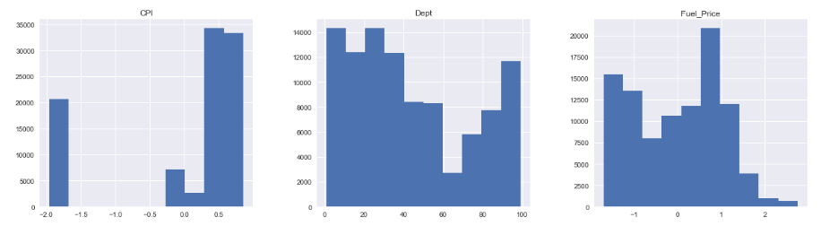
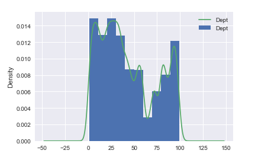
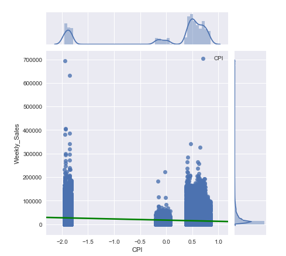

# Exploring Your Data


## Introduction

In this lesson you'll learn about performing an exploratory data analysis task, using all the statistical and visual EDA skills you have seen so far. 

## Objectives

You will be able to:

* Check the distribution of various columns
* Examine the descriptive statistics of our data set
* Create visualizations to help us better understand our data set


## Exploratory Data Analysis

Exploratory Data Analysis, or **_EDA_**, is a crucial part of any Data Science Project.  Before you can go off building models on a dataset, you need to be familiar with the actual data it contains--otherwise, you'll have no intuition about how to interpret the results of these models, or even if you can trust them at all!

This lesson will outline the basic steps that should be taken--and questions that should be answered--during EDA. 

## Understanding the Distribution of the Dataset

One of the foundational pieces of an EDA investigation is to understand the underlying distribution of the data.  Often, some of the most interesting/important business insights come not from machine learning models, but simply from exploring the distribution of the dataset! If your company or organization has not yet mastered reporting on descriptive analytics, the insights gained here can be invaluable to company strategy--think questions such as "who is my most profitable customer segment?" or "is there a seasonality to our customer churn rate?".  These are important questions to any business, and they don't require machine learning models to answer them--just some basic visualizations, and the ability to ask good questions.

Getting a feel for the distribution of a dataset is done in a few different ways. Generally, you'll make use of high-level descriptive statistics, followed by visualizations.  During the EDA process, it is quite common to uncover interesting things in the data that spur further questions for the investigation.  

> "The most exciting phrase to hear in science, the one that heralds new discoveries, is not 'Eureka!' (I found it!) but 'That's funny...'"
>
>                                            - Isaac Asimov


Recall that pandas can easily provide descriptive statistics on a DataFrame by using the DataFrame class's built-in `.describe()` method.  The resulting output is a table containing information such as the count, mean, median, min, max, and quartile values for every column in the DataFrame.  This is especially handy for answering questions such as "how much variance can I expect in column {X}?"

### Visualizing Distributions - Histograms

The easiest way to understand the distribution of a dataset is to visualize it! Recall that since pandas uses the matplotlib library, you can easily create histograms showing the distribution of each column by using a DataFrame's built-in `.hist()` method.  



### Visualizing Distributions - Kernel Density Estimation (KDE) Plots

Another great way of quickly visualizing the distribution of a column is to construct a **_KDE Plot_**. This is often overlaid on a histogram to create a line that visualizes the probability mass for every value in the histogram. 




### Using Joint Plots

A more advanced visualization tool you can make use of is the **_Joint Plot_**.  This allows you to visualize a scatterplot, the distributions of two different columns, a [KDE plot](https://seaborn.pydata.org/generated/seaborn.kdeplot.html), and even a simple regression line all on the same visualization. In practice, this is incredibly handy for doing this like checking the linearity assumption between predictors and a target variable during a regression analysis. 

Since joint plots are more advanced than a basic visualization like a histogram or scatterplot, you'll need to make use of the **_seaborn_** library to create them. The syntax for creating a joint plot is:

```python
# sns is the standard alias for seaborn
sns.jointplot(x= <column>, y= <column>, data=<dataset>, kind='reg')

```



For full details on how to use create joint plots with seaborn, see the [seaborn documentation on joint plots](https://seaborn.pydata.org/generated/seaborn.jointplot.html)!

## Interpreting Your EDA Results

It is worth noting that the goal of EDA is not pretty visualizations--it's _insight into your data_!  Don't fall into the trap of thinking that EDA means building a couple of quick visualizations and then moving onto modeling--you should actively try to generate questions and see if you can answer them by exploring the dataset.  Visualizations are great, but only because they make it easy to quickly interpret our data.  Use them as a tool, not a goal, during the EDA process!

## Summary

In this lesson, you learned how to:

* Check the distribution of various columns
* Examine the descriptive statistics of a data set
* Create visualizations to help better understand a data set
