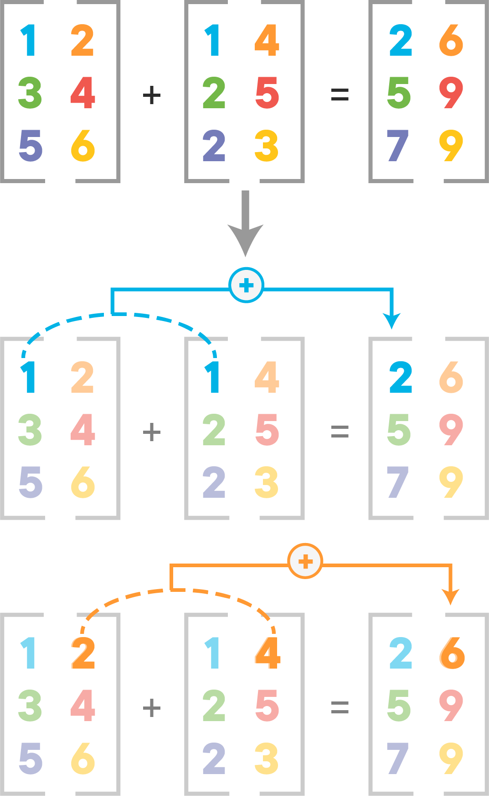
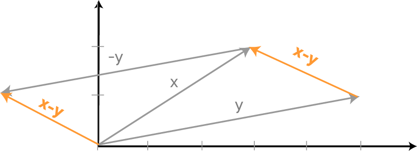

# Vector Addition and Broadcasting in Numpy - Code Along

## Introduction

This lesson is a supplement to the previous lesson where you learned how to create Numpy arrays as vectors or matrices and performed basic manipulations on these objects. In this lesson you'll look at matrix addition and broadcasting features offered by Numpy.

## Objectives
You will be able to:
* Understand and implement vector addition in Numpy 
* Understand how broadcasting differs from addition when adding mismatched dimensions.

## Vector Addition

Let's look at simple vector addition, where all operations are performed element-wise between two vectors/matrices of equal size to result in a new vector/matrix with the same size.

Imagine 2 arrays A and B with the same dimensions. They can be added together if:
* they have the same shape
* each cell of A is added to the corresponding cell of B

$A_{i,j} +B_{i,j} = C_{i,j}$


$$ C=
  \left[ {\begin{array}{cc}
   A_{1,1} & A_{1,2} \\
   A_{2,1} & A_{2,2} \\
   A_{3,1} & A_{3,2} \\
  \end{array} } \right] +
    \left[ {\begin{array}{cc}
   B_{1,1} & B_{1,2} \\
   B_{2,1} & B_{2,2} \\
   B_{3,1} & B_{3,2} \\
  \end{array} } \right] =
   \left[ {\begin{array}{cc}
   A_{1,1} + B_{1,1} & A_{1,2} + B_{1,2}\\
   A_{2,1} + B_{2,1}& A_{2,2} + B_{2,2} \\
   A_{3,1} + B_{3,1} & A_{3,2} + B_{3,2} \\
  \end{array} } \right] 
$$


here $A_(i,j)$ and $B_(i,j)$ represent row and column locations. This is a more standard notation that you will find in most literature. Another visual representation is shown below:



1D-arrays can be added together in exactly the same way using similar assumptions. The addition of two vectors $x$ and $y$ may be represented graphically by placing the start of the arrow y at the tip of the arrow x, and then drawing an arrow from the start (tail) of $x$ to the tip (head) of $y$. The new arrow represents the vector $x + y$.


You can perform addition operations in Numpy as:
```python
import numpy as np

# Adding 1D arrays
a = np.array([1,2,3])
b = np.array ([4,5,6]) 
c = a + b
c
```


```python
# Code here 
```

Subtracting a vector is the same as adding its negative. So, the difference of the vectors x and y is equal to the sum of x and -y: 
> $x - y = x + (-y)$

Geometrically, when we subtract y from x, we place the end points of x and y at the same point, and then draw an arrow from the tip of y to the tip of x. That arrow represents the vector x - y.


Mathematically, we subtract the corresponding components of vector y from the vector x.

```python
# Subtracting 1D arrays
a = np.array([1,2,3])
b = np.array ([4,5,6]) 
c= b - a
c
```


```python
# Code here
```

Now lets try addition with matrices.

``` python
# Adding 2D matrices
A = np.array([[1, 2], [3, 4], [5, 6]])
B = np.array([[1, 4], [2, 5], [2, 3]])
# Add matrices A and B
C = A + B
C
```


```python
# Code here 
```

```python
# Add matrices with mismatched dimensions
A = np.array([[1, 2], [3, 4], [5, 6]])
B = np.array([[1, 4], [2, 5]])
# Add matrices A and B
C = A + B
C
```


```python
# Code here 
```

You received an error, as expected, because there is a dimension mismatch. Here, it seems intuitive to know why this happened , but when working with large matrices and tensors, shape mismatch could become a real problem and as data scientists, you need to make sure to be aware about the dimensions of your data sets.

## Vector Scalar Addition

Scalar values can be added to matrices and vectors. In this case, the scalar value is added to each element of array as shown below:
```python
# Add scalars to arrays
# Add a scalar to a 1D vector
print(a+4)
# Add a scalar to a 2D matrix
print(A+4)
```

## Broadcasting

Numpy can also handle operations on arrays of different shapes as some machine learning algorithms need that. The smaller array gets **extended** to match the shape of the larger array. In the scalar-vector addition, we used broadcasting so the scalar was converted in an array of same shape as $A$.


$$ 
  \left[ {\begin{array}{cc}
   A_{1,1} & A_{1,2} \\
   A_{2,1} & A_{2,2} \\
   A_{3,1} & A_{3,2} \\
  \end{array} } \right] +
    \left[ {\begin{array}{c}
   B_{1,1}\\
   B_{2,1}\\
   B_{3,1}\\
   \end{array} } \right]
$$


$$
  \left[ {\begin{array}{cc}
   A_{1,1} & A_{1,2} \\
   A_{2,1} & A_{2,2} \\
   A_{3,1} & A_{3,2} \\
  \end{array} } \right] +
    \left[ {\begin{array}{cc}
   B_{1,1} & B_{1,1} \\
   B_{2,1} & B_{2,1} \\
   B_{3,1} & B_{3,1} \\
  \end{array} } \right] =
   \left[ {\begin{array}{cc}
   A_{1,1} + B_{1,1} & A_{1,2} + B_{1,1}\\
   A_{2,1} + B_{2,1}& A_{2,2} + B_{2,1} \\
   A_{3,1} + B_{3,1} & A_{3,2} + B_{3,1} \\
  \end{array} } \right] 
$$

Let's see this in action while trying to add arrays with different shapes

```python
A = np.array([[1, 2], [3, 4], [5, 6]])
print(A)
B = np.array([[2], [4], [6]])
print(B)
A+B
```


```python
# Code here 
```

## Summary 

In this lesson, you learned how to add vectors and matrices and looked at the dimension match assumption necessary for this addition. You also looked at how Numpy allows you to use broadcasting to add scalars and vector/matrices to other objects with different dimensions. In the following lessons, you'll learn about more complicated mathematical operations and their use in real life data analysis. 
