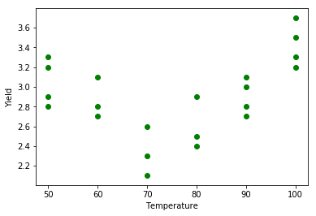
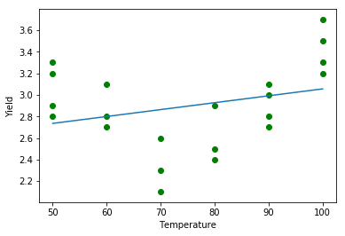
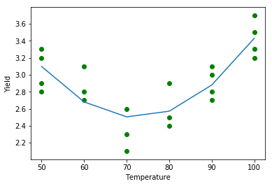
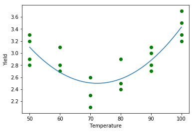
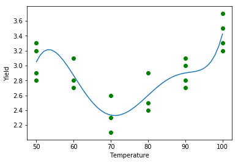

# Polynomial Regression

## Introduction

In the last section, you saw how you can account for interactions between two variables by including interaction effects in your model. In this section you'll learn about another way to extend your regression model by including polynomial terms.

## Objectives

You will be able to:

- Understand how to account for non-linear relationships between predictors and target variable using polynomial terms

## An example with one predictor

The data set "yields.csv", with just 21 cases, contains measurements of the yields from an experiment done at six different levels of temperature in degrees Fahrenheit. Let's plot them.


```python
import pandas as pd
yld = pd.read_csv("yield.csv", sep='\s+', index_col = 0)
import matplotlib.pyplot as plt
yld.head()
y = yld["Yield"]
```


```python
plt.scatter(yld["Temp"],y, color = "green")
plt.xlabel("Temperature")
plt.ylabel("Yield");
```





It's clear that there is no linear relationship between Yield and Temperature. Let's try and plot a line anyways and see how the model performs:


```python
from sklearn.linear_model import LinearRegression
reg = LinearRegression().fit(yld[["Temp"]], y)
```


```python
plt.scatter(yld["Temp"], y, color = "green")
plt.plot(yld["Temp"], reg.predict(yld[["Temp"]]))
plt.xlabel("Temperature")
plt.ylabel("Yield");
```





```python
from sklearn.metrics import mean_squared_error, r2_score

mean_squared_error(y, reg.predict(yld[["Temp"]]))

r2_score(y, reg.predict(yld[["Temp"]]))
```


    0.08605718085106362


## A quadratic relationship

When relationships between predictors and outcome are not linear and show some sort of a curvature, polynomials can be used to generate better approximations. The idea is that you can transform your input variable by e.g, squaring it. The corresponding model would then be:


$\hat y = \hat \beta_0 + \hat \beta_1x + \hat \beta_2 x^2$ 

The idea is simple. You can square your predictor (here, "Temp") and include it in your model as if it were a new predictor.


```python
from sklearn.linear_model import LinearRegression
X = yld[["Temp"]]
X["Temp_sq"] = yld["Temp"]**2

X.head()
```


<div>
<style scoped>
    .dataframe tbody tr th:only-of-type {
        vertical-align: middle;
    }

    .dataframe tbody tr th {
        vertical-align: top;
    }

    .dataframe thead th {
        text-align: right;
    }
</style>
<table border="1" class="dataframe">
  <thead>
    <tr style="text-align: right;">
      <th></th>
      <th>Temp</th>
      <th>Temp_sq</th>
    </tr>
    <tr>
      <th>i</th>
      <th></th>
      <th></th>
    </tr>
  </thead>
  <tbody>
    <tr>
      <th>1</th>
      <td>50</td>
      <td>2500</td>
    </tr>
    <tr>
      <th>2</th>
      <td>50</td>
      <td>2500</td>
    </tr>
    <tr>
      <th>3</th>
      <td>50</td>
      <td>2500</td>
    </tr>
    <tr>
      <th>4</th>
      <td>50</td>
      <td>2500</td>
    </tr>
    <tr>
      <th>5</th>
      <td>60</td>
      <td>3600</td>
    </tr>
  </tbody>
</table>
</div>


```python
reg_q = LinearRegression().fit(X, y)
```


```python
plt.scatter(X["Temp"],y, color = "green")
plt.plot(X["Temp"],reg_q.predict(X))
plt.xlabel("Temperature")
plt.ylabel("Yield");
```





This is the resulting plot. Note that the fit is much better, and this is confirmed by the $R^2$score: where it was 0.086 before, it now is 0.6948!


```python
from sklearn.metrics import mean_squared_error, r2_score
mean_squared_error(y, reg_q.predict(X))
r2_score(y, reg_q.predict(X))
```


    0.6948165884110553


Note that you get a seemingly "piecewise linear" function here,  because the yields were only measured at 50, 60, 70, 80, 90 and 100. In reality, this model generates a smooth curve, as denoted below.


```python
import numpy as np
plt.scatter(X["Temp"],y, color = "green")

X_pred = pd.DataFrame(np.linspace(50,100,50), columns = ["temp"])
X_pred["sq"] = X_pred**2 
y_pred = reg_q.predict(X_pred)

plt.plot(X_pred["temp"],y_pred)
plt.xlabel("Temperature")
plt.ylabel("Yield");
```





## Higher order relationships

The use of polynomials is not restricted to quadratic relationships, you can explore cubic relationships as well! Imagine you want to go until the power of 10, it would be quite annoying to transform your variable 9 times. Of course, Scikit-Learn has a built-in Polynomial option in the `preprocessing` library! Let's call it with a polynomial of 6!


```python
from sklearn.preprocessing import PolynomialFeatures

y = yld["Yield"]
X = yld[["Temp"]]

poly = PolynomialFeatures(6)
X_fin = poly.fit_transform(X)
```

Take a look at what these transformed features really look like. As you can see, Sci-kit Learn transformed the X value of a single 50 into  $50^1$ through $50^6$ ! The first value of 1 represents the intercept in the linear regression, which you can read more about in the [PolynomialFeatures documentation](https://scikit-learn.org/stable/modules/generated/sklearn.preprocessing.PolynomialFeatures.html).


```python
print('The transformed feature names are: {}'.format(poly.get_feature_names()))
print('------------------')
print('The first row of transformed data is: {}'.format(X_fin[0]))
```

    The transformed feature names are: ['1', 'x0', 'x0^2', 'x0^3', 'x0^4', 'x0^5', 'x0^6']
    ------------------
    The first row of transformed data is: [1.0000e+00 5.0000e+01 2.5000e+03 1.2500e+05 6.2500e+06 3.1250e+08
     1.5625e+10]


Now you can fit a linear regression model with your transformed data.


```python
reg_poly = LinearRegression().fit(X_fin, y)
predict_X = reg_poly.predict(X_fin)
```


```python
X_linspace = pd.DataFrame(np.linspace(50,100,50), columns = ["Temp"])
X_linspace_fin = poly.fit_transform(X_linspace)

y_poly_pred = reg_poly.predict(X_linspace_fin)
```


```python
plt.scatter(X["Temp"],y, color = "green")
plt.plot(X_linspace,y_poly_pred)
plt.xlabel("Temperature")
plt.ylabel("Yield");
```





```python
from sklearn.metrics import mean_squared_error, r2_score
mean_squared_error(y, reg_poly.predict(X_fin))
r2_score(y, reg_poly.predict(X_fin))
```


    0.7591145833332826


This seems to be a pretty smooth fit! This good fit is also confirmed with an even better $R^2$). Do note that by adding polynomials, you make your model more complex. Instead of just having 2 parameters ($\beta_0$ and $\beta_1$) for a linear model, you now have 7 (one for the intercept, and 6 for the terms when going until a polynomial with degree 6). More on that later!

## Summary

Great! You now know how to include polynomials in your linear models. Let's go ahead and practice this knowledge!
