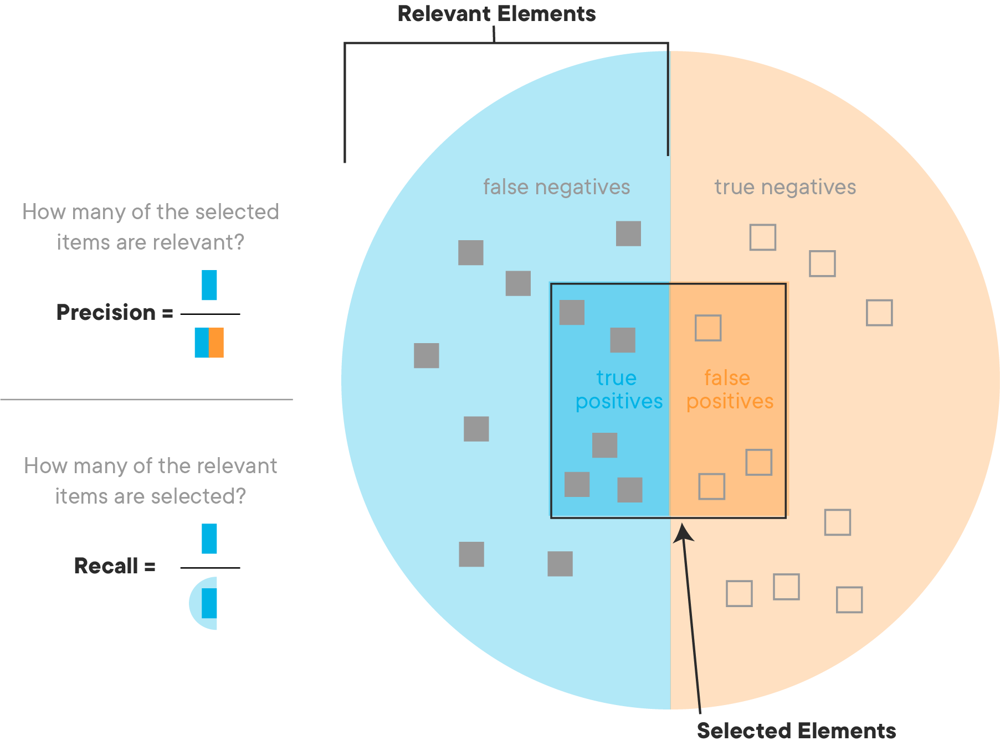
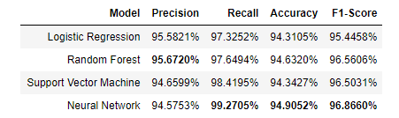

# Evaluation Metrics

## Introduction

In this lesson, you'll learn about common **_Evaluation Metrics_** used to quantify the performance of classifiers!

## Objectives

You will be able to:

* Read and interpret results using a Confusion Matrix
* Calculate and interpret precision and recall and evaluation metrics for classification
* Calculate and interpret accuracy and f1-score as evaluation metrics for classification

## Evaluation Metrics For Classification

Now that we've started discussing classification, it's time to examine comparing models to one other and choosing the models that have the best fit. Previously in regression, you were predicting values so it made sense to discuss error as a distance of how far off the estimates were from the actual values. However, in classifying a binary variable you are either correct or incorrect. As a result, we tend to deconstruct this as how many false positives versus false negatives there are in a model.  In particular, there are a few different specific measurements when evaluating the performance of a classification algorithm.  

Let's work through these evaluation metrics and try to understand what each metric tells us.

## Precision and Recall

**_Precision_** and **_Recall_** are two of the most basic evaluation metrics available to us. **_Precision_** measures how precise the predictions are, while **_Recall_** indicates what percentage of the class(es) we're interested in were actually captured by the model. 



### Precision

The following formula shows how to use information found in a Confusion Matrix to calculate the precision of a model:

$$Precision = \frac{\text{Number of True Positives}}{\text{Number of Predicted Positives}}$$

To reuse a previous analogy of a model that predicts whether or not a person has a certain disease, precision allows us to answer the following question:

"Out of all the times the model said someone had a disease, how many times did the patient in question actually have the disease?"

Note that a high precision score can be a bit misleading.  For instance, let's say we take a model and train it to make predictions on a sample of 10,000 patients. This model predicts that 6000 patients have the disease, when in reality, only 5500 have the disease.  This model would have a precision of 91.6%. Now, let's assume we create a second model that only predicts that a person is sick when it's incredibly obvious.  Out of 10,000 patients, this model only predicts that 5 people in the entire population are sick.  However, each of those 5 times, it is correct.  Model 2 would have a precision score of 100%, even though it missed 5,495 cases where the patient actually had the disease! In this way, more conservative models can have a high precision score, but this doesn't necessarily mean that they are the _best performing_ model!

### Recall

The following formula shows how we can use information found in a Confusion Matrix to calculate the recall of a model:

$$Recall = \frac{\text{Number of True Positives}}{\text{Number of Actual Total Positives}}$$ 

Following the same disease analogy, recall allows us to ask:

"Out of all the patients we saw that actually had the disease, what percentage of them did our model correctly identify as having the disease?"

Note that recall can be a bit of a tricky statistic, because improving our recall score doesn't necessarily always mean a better model overall.  For example, our model could easily score 100% for recall by just classifying every single patient that walks through the door as having the disease in question. Sure, it would have many False Positives, but it would also correctly identify every single sick person as having the disease!

### The Relationship Between Precision and Recall

As you may have guessed, Precision and Recall have an inverse relationship.  As our recall goes up, our precision will go down, and vice versa. If this doesn't seem intuitive, let's examine this through the lens of our disease analogy. 

A doctor that is overly obsessed with recall will have a very low threshold for declaring someone as sick, because they are most worried about sick patients get by them. Their precision will be quite low, because they classify almost everyone as sick, and don't care when they're wrong--they only care about making sure that sick people are identified as sick. 

A doctor that is overly obsessed with precision will have a very high threshold for declaring someone as sick, because they only declare someone as sick when they are absolutely sure that they will be correct if they declare a person as sick. Although their precision will be very high, their recall will be incredibly low, because a lot of people that are sick but don't meet the doctor's threshold will be incorrectly classified as healthy. 

### Which Metric is Better?

A classic Data Science interview question is to ask "What is better--more false positives, or false negatives?" This is a trick question designed to test your critical thinking on the topics of precision and recall.  As you're probably thinking, the answer is "It depends on the problem!".  Sometimes, our model may be focused on a problem where False Positives are much worse than False Negatives, or vice versa. For instance, detecting credit card fraud. A False Positive would be when our model flags a transaction as fraudulent, and it isn't.  This results in a slightly annoyed customer.  On the other hand, a False Negative might be a fraudulent transaction that the company mistakenly lets through as normal consumer behavior. In this case, the credit card company could be on the hook for reimbursing the customer for thousands of dollars because they missed the signs that the transaction was fraudulent! Although being wrong is never ideal, it makes sense that credit card companies tend to build their models to be a bit too sensitive, because having a high recall saves them more money than having a high precision score.

Take a few minutes and see if you can think of at least 2 examples each of situations where a high precision might be preferable to high recall, and 2 examples where high recall might be preferable to high precision. This is a common interview topic, so it's always handy to have a few examples ready!

## Accuracy and F1-Score

The two most informative metrics that are often cited to describe the performance of a model are **_Accuracy_** and **_F1-Score_**. Let's take a look at each and see what's so special about them.

### Accuracy

**_Accuracy_** is probably the most intuitive metric. The formula for Accuracy is:

$$Accuracy = \frac{\text{Number of True Positives + True Negatives}}{\text{Total Observations}}$$

Accuracy is useful because it allows us to measure the total number of predictions a model gets right, including both **_True Positives_** and **_True Negatives_**. 

Sticking with our same analogy, Accuracy allows us to answer:

"Out of all the predictions our model made, what percentage were correct?"

Accuracy is the most common metric for classification. It provides a solid holistic view of the overall performance of our model. 

### F1-Score

The F1-Score is a bit more tricky, but also more informative. F1-Score represents the **_Harmonic Mean of Precision and Recall_**.  In short, this means that the F1-Score cannot be high without both precision and recall also being high. When a model's F1-Score is high, you know that your model is doing well all around. 

The formula for F1-Score is:

$$F1-Score = 2\ \frac{Precision\ x\ Recall}{Precision + Recall}$$

To demonstrate the effectiveness of F1-Score, let's plug in some numbers and compare F1-Score with a regular arithmetic average of precision and recall. 

Let's assume that the model has 98% recall, and 6% precision. 

Taking the arithmetic mean of the two obtains $\frac{0.98 + 0.06}{2} = \frac{1.04}{2} = 0.52 $

However, using these numbers in the F1-Score formula results in:

$$F1 = 2 \frac{0.98 * 0.06}{0.98 + 0.06} = 2 \frac{0.0588}{1.04} = 2(0.061152) = 0.122304$$ or 12.2%!

As you can see, F1-score penalizes models heavily if it skews too hard towards either precision or recall. For this reason, F1-score is generally the  most used metric for describing the performance of a model. 

## Which Metric to Use?

The metrics that are most important to a project will often be dependent on the business use case or goals for that model. This is why it's **_very important_** to understand why you're doing what you're doing, and how your model will be used in the real world! Otherwise, you may optimize your model for the wrong metric! 

In general, it is worth noting that it's a good idea to calculate any and all relevant metrics, when in doubt.  In most classification tasks, you don't know which model will perform best when you start. The common workflow is to train each different type of classifier, and select the best by comparing the performance of each. It's common to make tables like the one below, and highlight the best performer for each metric:




## Calculating Evaluation Metrics With Confusion Matrices

In closing, note that we can only calculate any of the metrics discussed here if we know the **_True Positives, True Negatives, False Positives, and False Negatives_** resulting from the predictions of a model. If we have a confusion matrix, we can easily calculate **_Precision_**, **_Recall_** and **_Accuracy_**--and if we know Precision and Recall, we can easily calculate **_F1-Score_**!

## Classification Reports

Sklearn has a built in function that will create a **_Classification Report_**. This classification report even breaks down performance by individual class predictions for your model. In the `sklearn.metrics` module is the `classification_report()` function, which takes labels and predictions and returns the precision, recall, F1 score and support (number of occurrences of each label in `y_true`) for the results of a model. 

## Summary
In the following lab, you'll write functions to calculate each of these manually, as well as explore how you can use existing tooling in sci-kit learn to quickly calculate and interpret each of these metrics.


```python

```
