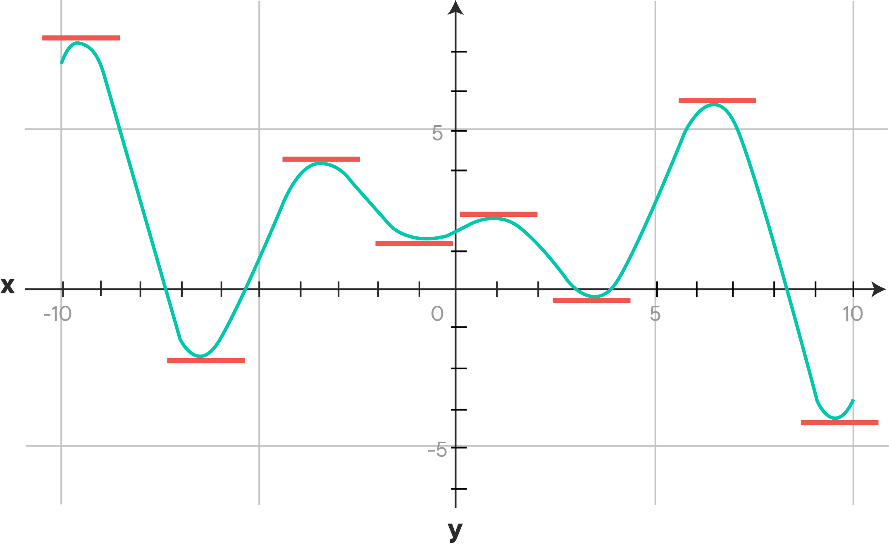
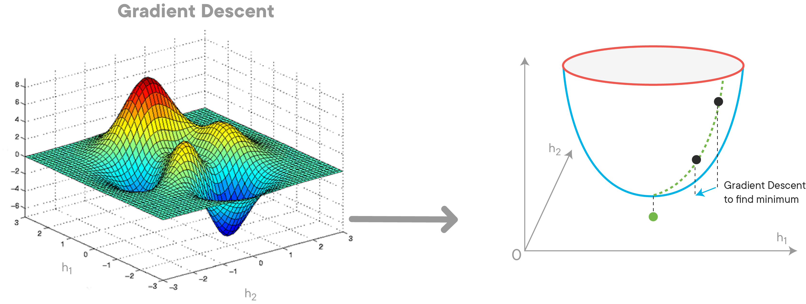

# Gradient Descent Review

## Introduction

Recall that gradient descent is a numerical approximation method for finding optimized solutions to problems with no closed form. That is, some mathematical problems are very easy to solve analytically. A trivial example is basic algebra problems which you undoubtedly saw in grade school:  
$x+2 = 10$
subtracting 2 from both sides:
$x-8$
Similarly, some more complex mathematical problems such as ordinary least squares, our preliminary regression approach, also have closed form solutions where we can follow a rote procedure and be guaranteed a solution. In other cases, this is not possible and numerical approximation methods are used in order to find a solution. The first instance that you witnessed of this was adding the L1 or L2 (lasso and ridge, respectively) penalties to OLS regression. In these cases, numerical approximation methods, such as gradient descent, are used  in order to find optimal or near optimal solutions.


## Objectives
You will be able to:

* Understand what a gradient is
* Understand what gradient descent means

## Gradient descent

Gradient descent is grounded in basic calculus theory. Whenever you have a minimum or maximum, the derivative at that point is equal to zero. This is displayed visually in the picture below; the slope of the red tangent lines is equal to the derivative of the curve at that point. As you can see, the slope of all of these horizontal tangent lines will be zero. 



**The gradient is simply another term for the derivative. Typically, this is the term used when we are dealing with multivariate data. The gradient is the rate of change, which is also the slope of the line tangent**

Building upon this, gradient descent attempts to find the minimum of a function by taking successive steps in the steepest direction downhill.



While this process guarantees a local minimum, the starting point and step size can effect the outcome. For example, for two different runs of gradient descent, one may lead to the global minimum while the other may lead to a local minimum.

Recall that the general outline for gradient descent is:

1. Define initial parameters:
    1. pick a starting point
    2. pick a step size $\alpha$ (alpha)
    3. choose a maximum number of iterations; the algorithm will terminate after this many iterations if a minimum has yet to be found
    4. (optionally) define a precision parameter; similar to the maximum number of iterations, this will terminate the algorithm early. For example, one might define a precision parameter of 0.00001, in which case if the change in the loss function were less then 0.00001, the algorithm would terminate. The idea is that we are very close to the bottom and further iterations would make a negligible difference.
2. Calculate the gradient at the current point (initially, the starting point)
3. Take a step (of size alpha) in the direction of the gradient
4. Repeat steps 2 and 3 until the maximum number of iterations is met, or the difference between two points is less then your precision parameter

## Summary

In this lesson, you briefly review what gradients; the gradient is the derivative of a function, which is the rate of change at a specific point. You then reviewed the intuition behind gradient descent, as well as some of its pitfalls. Finally, you saw a brief outline of the algorithm itself. In the next lab, you'll practice coding gradient descent and applying that to some simple mathematical functions.


```python

```
