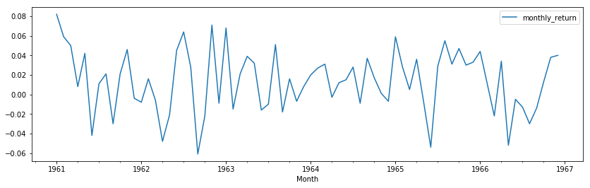

# Basic Time Series Models

## Introduction

We've looked at time series and what they might look like. Now why do we need to model time series? Essentially, you're trying to find patterns and understand the data in a way that you 
can use this information to (hopefully) make accurate predictions about the future.

In this lesson you'll learn about two basic time series models: the White Noise model, and the Random Walk model.

## Objectives

You will be able to:
- Explain what the goal is of time series modeling
- Understand and explain what a White Noise model is
- Understand and explain what a Random Walk model is
- Understand the mathematical formulations of Random Walk and White Noise models

## A White Noise model

The white noise model is the simplest example of a true stationary process - basically what we were talking about when we looked at the plot for data without trend (the monthly NYSE returns). Let's plot this again below: 


```python
import pandas as pd
from pandas import Series
import numpy as np
import matplotlib.pylab as plt
%matplotlib inline

nyse = pd.read_csv("NYSE_monthly.csv")
col_name= 'Month'
nyse[col_name] = pd.to_datetime(nyse[col_name])
nyse.set_index(col_name, inplace=True)

# Draw a line plot using temp and .plot() function. 
nyse.plot(figsize = (14,4))
import matplotlib.pyplot as plt
plt.show();
```





The white noise model has three properties:

- There is a fixed and constant mean
- There is a fixed and constant variance
- There is no correlation over time (we'll talk about correlation in time series later, essentially, what this means is that the pattern seems truly "random).

A special case of a White Noise model is Gaussian White Noise, where the constant mean is equal to zero, and the constant variance is equal to 1. You'll see later on that a white noise model is useful in many contexts!

More information on White Noise series can be found [here](https://machinelearningmastery.com/white-noise-time-series-python/). You can disregard the content on autocorrelation functions for now, we'll cover that later!

## A Random Walk model

Contrary to the white noise model, the random walk model, however

- Has no specified mean or variance
- Has a strong dependence over time

The changes over time are basically a white noise model. Mathematically, this can be written as:

$$\large Y_t = Y_{t-1} + \epsilon_t$$

Where $\epsilon_t$ is a *mean zero* white noise model!

Random walk processes are very common in finance. A typical example is exchange rates. The idea is that generally speaking (and unless any drastic events happen), tomorrow's currency exchange rate will be strongly influenced by today's exchange rate, with a small change (either positive or negative). The data set below contains the exchange rates for the Euro, Australian Dollar, and Danish Crone with the US Dollar, from January 2000 until November 26, 2018.


```python
xr = pd.read_csv("exch_rates.csv")

xr['Frequency'] = pd.to_datetime(xr['Frequency'])
xr.set_index('Frequency', inplace=True)

xr.tail()
```


<div>
<style scoped>
    .dataframe tbody tr th:only-of-type {
        vertical-align: middle;
    }

    .dataframe tbody tr th {
        vertical-align: top;
    }

    .dataframe thead th {
        text-align: right;
    }
</style>
<table border="1" class="dataframe">
  <thead>
    <tr style="text-align: right;">
      <th></th>
      <th>Euro</th>
      <th>Australian Dollar</th>
      <th>Danish Krone</th>
    </tr>
    <tr>
      <th>Frequency</th>
      <th></th>
      <th></th>
      <th></th>
    </tr>
  </thead>
  <tbody>
    <tr>
      <th>2018-11-22</th>
      <td>0.876962</td>
      <td>1.378672</td>
      <td>6.543541</td>
    </tr>
    <tr>
      <th>2018-11-23</th>
      <td>0.880902</td>
      <td>1.383721</td>
      <td>6.573115</td>
    </tr>
    <tr>
      <th>2018-11-24</th>
      <td>NaN</td>
      <td>NaN</td>
      <td>NaN</td>
    </tr>
    <tr>
      <th>2018-11-25</th>
      <td>NaN</td>
      <td>NaN</td>
      <td>NaN</td>
    </tr>
    <tr>
      <th>2018-11-26</th>
      <td>0.880049</td>
      <td>1.378509</td>
      <td>6.566224</td>
    </tr>
  </tbody>
</table>
</div>


```python
xr['Euro'].plot(figsize = (14,5));
```


```python
xr['Australian Dollar'].plot(figsize = (14,5));
```


More on random walk can be found [here](https://machinelearningmastery.com/gentle-introduction-random-walk-times-series-forecasting-python/) (to read up to where autocorrelation is covered).

## A Random Walk with a drift

An extension of the Random Walk model is a so-called "Random Walk with a Drift", specified as follows:

$$\large Y_t = c+ Y_{t-1} + \epsilon_t$$

Here, there is a drift parameter $c$ steering in a certain direction! You'll get more insight in what a Random Walk model looks like in the lab that follows!

## Summary

Great, you now know how a Random Walk and Moving Average model work. In the next lab, you'll practice your knowledge!
