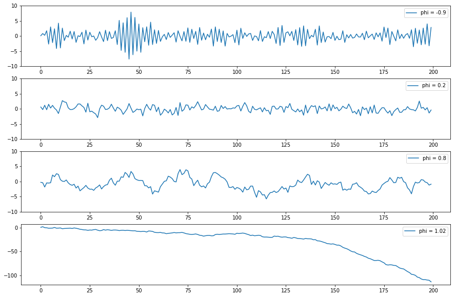
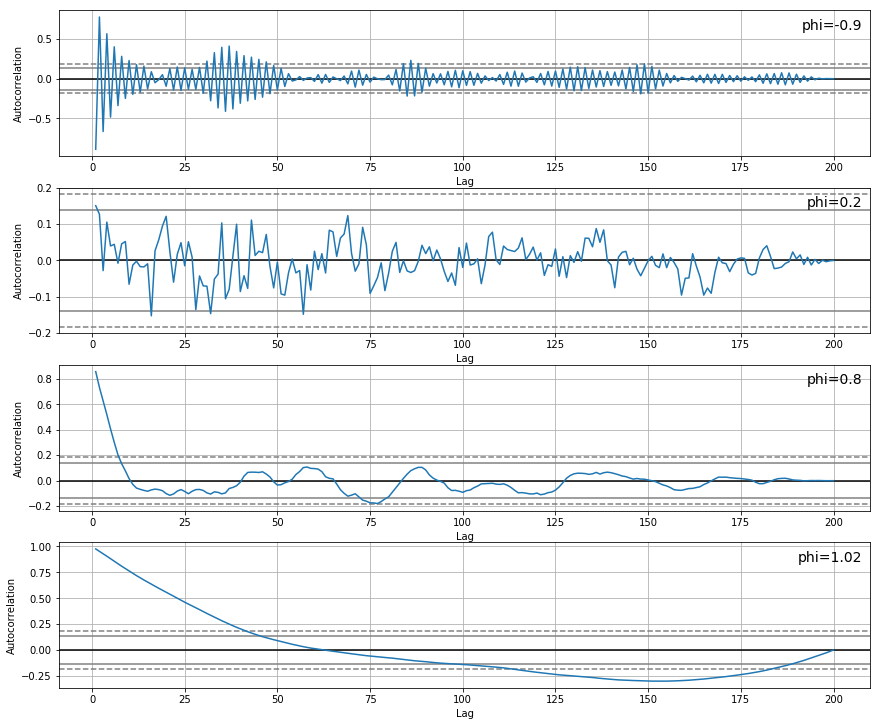
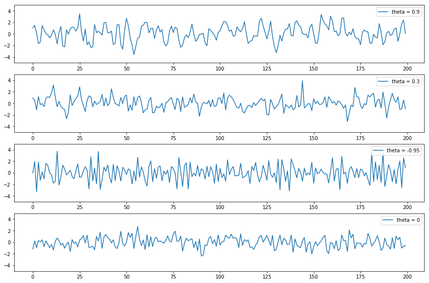
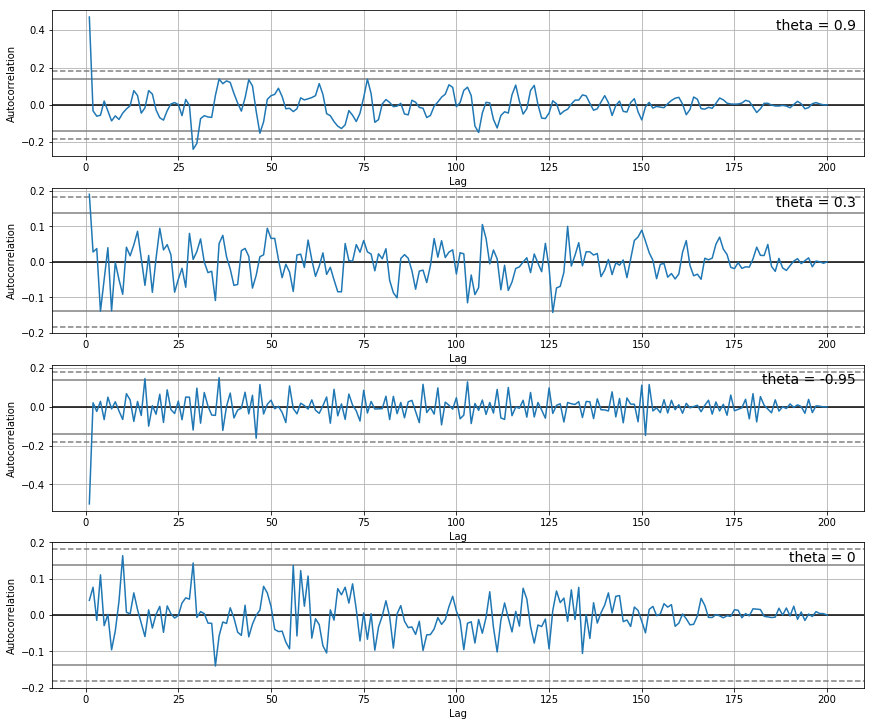
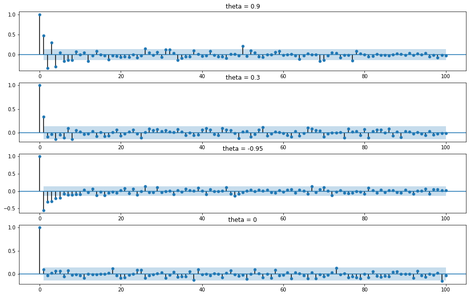

# ARMA Models

## Introduction

You've seen two basic time series models now, the Random Walk and the White Noise model. In this lesson, you'll learn about two other very important time series models that are widely used to understand and predict future values in stochastic processes: The Autoregressive (AR) and Moving Average (MA) model.

## Objectives

You will be able to:
- Understand and explain what a Autoregressive model is
- Understand and explain what a Moving Average model is
- Understand and apply the mathematical formulations for Autoregressive and Moving Average models
- Understand how AR and MA can be combined in ARMA models

## The Autoregressive Model

An autoregressive (AR) model is when a value from a time series is regressed on previous values from the same time series.

In words, the mathematical idea is the following:

$$ \text{Today = constant + slope} \times \text{yesterday + noise} $$

Or, mathematically:
$$\large Y_t = \mu + \phi * Y_{t-1}+\epsilon_t$$

Some notes based on this formula:
- If the slope is 0, the time series is a white noise model with mean $\mu$
- If the slope is not 0, the time series is autocorrelated
- Bigger slope means bigger autocorrelation
- When there is a negative slope, the time series follow an oscillatory process

We simulated some time series below. Have a look at them, and make sure this follows your intuition looking at the formula.

Note that simply having a value for $\phi$ slightly bigger than 1, the time series clearly go in one direction. Note the scale of the y-axis, where the y-axis scale for all the other processes is between -10 and 10, the last time series goes down to values of -100.

Let's look at the autocorrelation functions as well.

The oscillatory process of the time series with $\phi=0.9$ is clearly reflected in the autocorrelation function, returning an oscillatory autocorrelation function as well. $\phi=0.2$ leads to a very low, insignificant,  autocorrelation. $\phi=0.8$ leads to a strong autocorrelation for the first few lags, and then incurs a steep decline. Having a $\phi=1.02$ (just slightly bigger than 1) leads to strong and long-lasting autocorrelation.

Next, let's look at the Partial Autocorrelation function as well.

For each of these PACFs, we notice a high value for 1 lag, then autocorrelations of 0, except for the second one. This is no big surprise, as the slope parameter is fairly small, so the relationship between a value and the next one is fairly limited.

## The  Moving Average Model

The Moving Average model can be described as the weighted sum of today's and yesterday's noise.

In words, the mathematical idea is the following:

$$ \text{Today = Mean + Noise + Slope} \times \text{yesterday's noise} $$

Or, mathematically:
$$\large Y_t = \mu +\epsilon_t + \theta * \epsilon_{t-1}$$

Some notes based on this formula:
- If the slope is 0, the time series is a white noise model with mean $\mu$
- If the slope is not 0, the time series is autocorrelated and depends on the previous white noise process
- Bigger slope means bigger autocorrelation
- When there is a negative slope, the time series follow an oscillatory process

For the Moving Average Model we also simulated some time series with varying parameters below.

When there is a positive $\theta$ there is a certain persistence in level, meaning that each observation is generally close to its neighbors. This is more pronounced for higher . values of $\theta$. MA series with negative coefficients, however, show oscillatory patterns. Recall that when $\theta=0$, the process is a true White Noise Process! 

Let's look at the ACF functions.

Remember that MA processes have autocorrelations, but because of the structure of the MA formula (regressing it on the noise term of the previous observation) there is only a dependence for one period, and the autocorrelation is zero for lags 2 and higher.

If $\theta >0$ the lag one autocorrelation is positive, if $\theta <0$ the lag one autocorrelation is negative.

Next, let's look at the Partial Autocorrelation Function.

For PACFs, a typical structure is that  there is a strong correlation with the 1-period lag (strength depending in theta), and then the PACF gradually tails off. You can particularly observe this for $\theta=0.9$ and $\theta=-0.95$.

## Higher order AR and MA models

Let's look at the formulas of AR and MA again:

- AR: $Y_t = \mu + \phi * Y_{t-1}+\epsilon_t$
- MA: $Y_t = \mu +\epsilon_t + \theta * \epsilon_{t-1}$

Note that these models are constructed in a way that processes only depend directly on the previous observation in the process. These models are so-called "1st order models", and denoted by AR(1) and MA(1) processes respectively. Let's look at AR(2) and MA(2).

- AR(2): $Y_t = \mu + \phi_1 * Y_{t-1}+\phi_2 * Y_{t-2}+\epsilon_t$
- MA(2): $Y_t = \mu +\epsilon_t + \theta_1 * \epsilon_{t-1}+ \theta_2 * \epsilon_{t-2}$

Needless to say, this can be extended to higher orders as well! Generally, the order of an AR model is denoted p, and the order of an MA model is denoted q.

## ACF and PACF intuition for AR(p) and MA(q)

A quick overview of how higher order models affect the ACF and PACF functions

### AR(p)

Considering a time series that was generated by an autoregression (AR) process with an order of p, we would expect the ACF plot for the AR(p) time series to be strong to a lag of p and remain stagnant for subsequent lag values, trailing off at some point as the effect is weakened. the PACF, on the other hand describes the direct relationship between an observation and its lag. This generally leads to no correlation for lag values beyond p.

### MA(q)

With a time series generated by a moving average (MA) process with an order q, we would expect the ACF for the MA(q) process to show a strong correlation with recent values up to the lag of q, then a immediately decline to minimal or no correlation. For the PACF, we would expect the plot to show a strong relationship to the lag and a tailing off to  no correlation from the lag onwards.

## ARMA models

Now that we've seen AR and MA models, it is important to note that **there is no reason why AR and MA models would not coexist**. That's where ARMA models come in, which basically means that in this model, a regression on past values takes place (AR part) and also that the error term is modeled as a linear combination of error terms of the recent past (MA part).
Generally, one denotes ARMA as ARMA(p,q).

An ARMA(2,1) model is given by:

 $$Y_t = \mu + \phi_1 Y_{t-1}+\phi_2 Y_{t-2}+ \theta \epsilon_{t-1}+\epsilon_t$$

A short table to summarize ACF and PACF for AR(p), MA(q) and ARMA(p,q):

| | AR(p)   |   MA(q)  | ARMA(p,q)|
|------|------|------|------|
|   ACF | Tails off   |  Cuts off after lag q |  Tails off   |
|   PACF | Cuts off after lag p  |   Tails off  |  Tails off  |

## Note on modeling

Seeing the table above, you might get an idea of why ACF and PACF are so useful when modeling! What you generally will try to do for any time series you come along is:

- Detrend your time series using differencing. ARMA models represent stationary processes, so we have to make sure there are no trends in our time series
- Look at ACF and PACF of the time series
- Decide on the AR, MA and order of these models
- Fit the model to get the correct parameters and use for prediction

## Additional resources

To learn more about AR, MA and ARMA, have a look at lessons 1 and 2 [here](https://onlinecourses.science.psu.edu/stat510/node/41/).

## Summary

Great! Now that you know the ins and outs of ARMA models, let's look at some time series and how to model them in the next lab!
