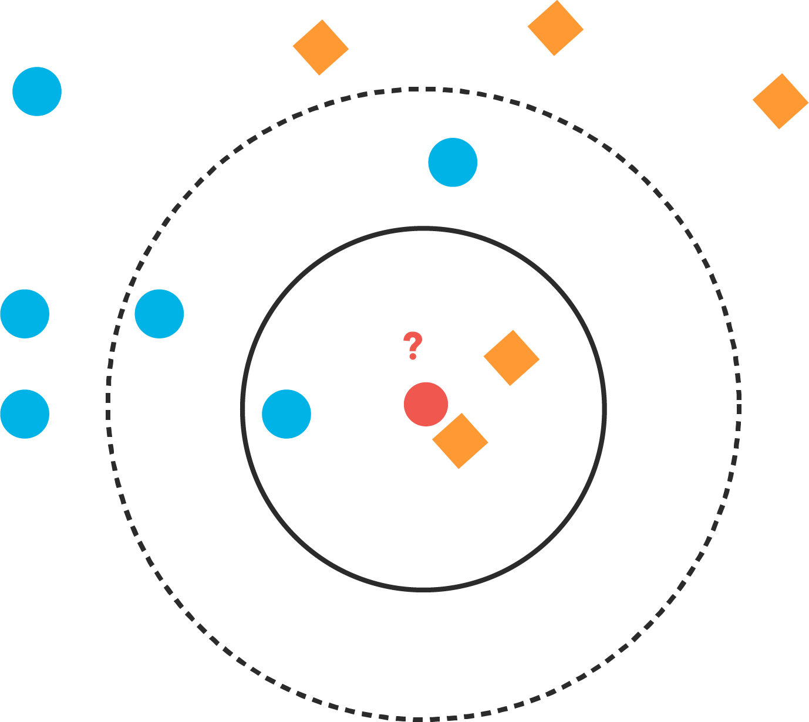
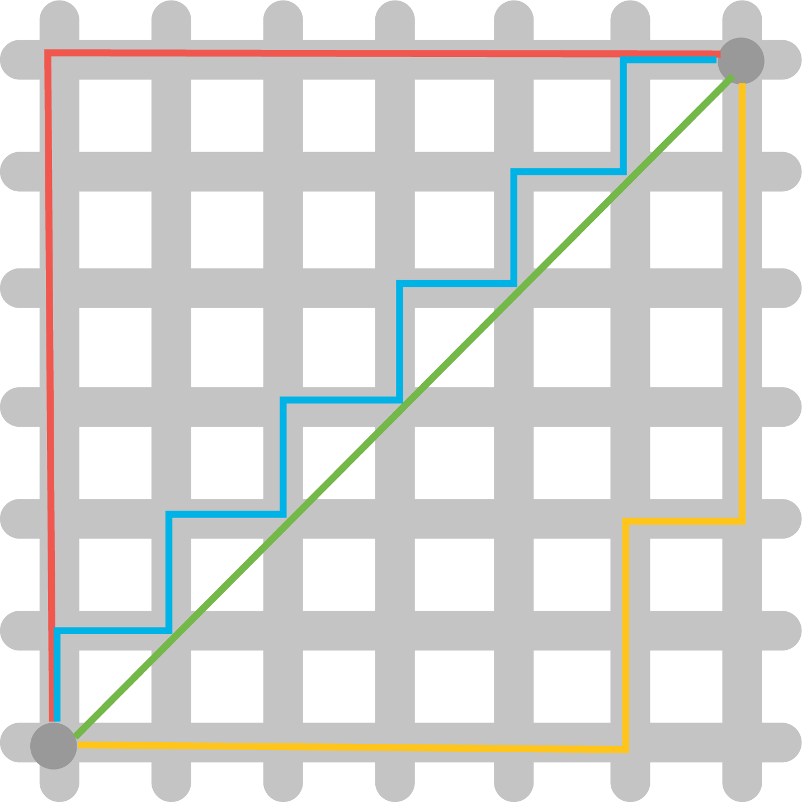

# Distance Metrics

## Introduction

In this lesson, you'll learn about various kinds of distance metrics that you can make use of in Data Science as a way to quantify similarity!

## Objectives

You will be able to:

* Calculate Manhattan Distance between 2 points 
* Calculate Euclidean Distance between 2 points
* Compare and contrast Manhattan, Euclidean, and Minkowski Distance

## The Relationship Between Similarity and Distance

In this section, you'll be focusing on a foundational **_Supervised Learning_** algorithm, **_K-Nearest Neighbors_**, or **_KNN_** for short. In order to understand how this algorithm works, you first have to understand some **_Distance Metrics_**, and how you can use them to tell us how similar two objects are. 



The assumption that distance-based classifiers like KNN are built on is that **_distance helps us quantify similarity_**.  Objects that are more alike are more likely to be the same class.  By treating each column in your dataset as a separate dimension, you can plot each data point that you have, and measure the distance between them! 

You might remember learning about how to calculate the distance between two points on a Cartesian plane from school. That's a certainly an important distance metric that you'll be using--however, there is more than one distance metric you can use, and all of them can be useful depending on the context of the problem.  In this lesson, you'll learn how to calculate different distance metrics so that you have a tool to evaluate how similar or different data points are from one another when we begin exploring the KNN algorithm!


## Manhattan Distance

The first (and easiest) distance metric you'll cover is **_Manhattan Distance_**.  Manhattan distance is aptly named, because it measures the distance from one point to another traveling along the axes of a grid. Take a look at the following image:



In this image, all the lines except for the green line measure the Manhattan Distance between the two points.  You'll notice that if you start from the point in the bottom left corner of the grid and count the number of units moved in the X dimension (left and right) and the number of units moved in the Y dimension (up and down), the distance is the for the red, blue, and yellow lines. 

The easiest way to remember Manhattan Distance is to use the analogy that provides this distance metric it's name--look at the picture above, but picture this grid as the famous grid of streets in Manhattan. If you were to take a taxi from point A (bottom left) to point b (top right), how many blocks east or west would the taxi have to travel? How many blocks north or south? How many blocks total?  By calculating the total number of blocks we have to drive, we're actually calculating the Manhattan Distance between point A and point B.  

So far, this discussion has explored Manhattan Distance in a 2-dimensional space.  However, all of the distance metrics you're going to learn can generalize to an n-dimensional space.  For instance, in 3 dimensions, it's no harder to calculate the distance from one square on a Rubik's Cube to any other square--all you do is take into account how many squares we need to move towards or away from ourselves to measure depth, as well as left/right and up/down. Once you know the total units you need to move in each of these 3 dimensions, you just sum them to calculate the Manhattan Distance in 3 dimensions. 

Here's the formula for Manhattan Distance:

$$ \large d(x,y) = \sum_{i=1}^{n}|x_i - y_i | $$  

Let's break this formula down a bit. 


The left side of the equals sign just means "the distance between point x and point y".

The right side of the equals sign looks like it has a bit more going on, but don't let the mathematical notation scare you.  In basic English, Manhattan Distance essentially just means "calculate the number of units you move in each distinct dimension, and then sum them all up".  This is just saying the same thing with some mathematical notation. 

The $\sum$ just means "the cumulative sum of each step". In a given step, you take a dimension, and then look at the corresponding values for that dimension on point X and point Y. You then compute the absolute value of the difference between them by subtracting Y's value for that dimension from X's value for that dimension, and then add it to our total. The easiest way to compute the **_Absolute Value_** is to square each difference, and then just square root the total when we've added the difference in every dimension.  If the rationale here seems unclear to you, think of it this way--from a practical standpoint, walking 3 blocks to the west is the same as walking 3 blocks to the east. However, when you're doing this on a grid, you still want movements in a negative direction to count! In order to make them count, you square each value, since negative and positive values will have equivalent values. This makes it so that a move from 0 to -3 and a move from 0 to 3 measure the same amount of distance. All you have to do once you're done computing our running total is to take the square root to change the data back to it's original scale.  

Let's think about what this would look like in code.  Let's assume that each point is stored as a tuple of values. If you wanted to calculate the distance between them, you can easily do this with a for loop!

```python
point_1 = (2, 3, 5)
point_2 = (1, -1, 3)

manhattan_distance = 0
for i in range(3):
    manhattan_distance += np.abs(point_1[i] - point_2[i]) # 7
```

### A Hint on Turning Mathematical Notation Into Code

Anytime you see mathematical notation that includes the $\sum$ symbol, this can reliably be represented as a for loop! The math to the right of the symbol tells you what the body of our for loop should look like (what unique things you're doing in each given step).  Similarly, the numbers on the bottom and top of the $\sum$ sign tell you the starting and stopping indexes, respectively. In the case of the Manhattan Distance equation above, the $n$ means "length n", the length of the entire number of dimensions, because we want to count them all in our calculations. **_NOTE_**: Be careful interpreting the starting dimensions! Remember that although mathematicians start counting at 1, computer scientists start counting at 0! Whereas from a mathematical perspective, you are starting at dimension 1 and counting up to and including dimension 3, in your code, you start at dimension 0 and count up to and including dimension 2. 

## Euclidean Distance

The next,and most common distance metric is **_Euclidean Distance_**.  The equation at the heart of this one is probably familiar to you: $a^2 + b^2 = c^2$, or the **_Pythagorean Theorem_**! Take a look at the diagram in the section above with all the colored lines on it. The green line measures the Euclidean Distance between the 2 points, by moving in a straight line. If you take the horizontal and vertical sections of the red line and treat them as $a$ and $b$, then you can easily use the Pythagorean Theorem to calculate the length of the green line to calculate the euclidean distance between the two points. 

In this case, that is:  $6^2 + 6^2 =  \sqrt{72} \approx 8.485$


### Working With More Than 2 Dimensions

Just as with Manhattan Distance, you can generalize this equation to $n$ dimensions. You just add any extra dimensions in, same as we did with the first two. For instance, if you wanted to calculate the Euclidean Distance between 2 points in a 3-dimensional space, then the formula would just be $a^2 + b^2 + c^2 = d^2$, with $d$ being the Euclidean Distance.  

Let's take a look at the Euclidean Distance formula:

$$ \large d(x,y) = \sqrt{\sum_{i=1}^{n}(x_i - y_i)^2} $$  

This is a straightforward equation--for dimension, you subtract one point's value from the other's to get the length of that "side" of the triangle in that dimension, square it, and add it to our running total. The square root of that running total is our Euclidean Distance. 

In python, you can easily calculate Euclidean Distance as follows: 

```python
point_1 = (2, 3, 5)
point_2 = (1, -1, 3)

euclidean_distance = 0
for i in range(3):
    euclidean_distance += (point_1[i] - point_2[i])**2

euclidean_distance = np.sqrt(euclidean_distance)

euclidean_distance # 4.58257
```

## Minkowski Distance

A final distance metric you should be familiar with is **_Minkowski Distance_**. This one is a bit technical, so try and bear with us here. Minkowski Distance is a generalized distance metric across a _Normed Vector Space_. A Normed Vector Space is just a fancy way of saying a collection of space where each point has been run through a function. It can be any function, as long it meets two criteria: the zero vector (just a vector filled with zeros) will output a length of 0, and every other vector must have a positive length. 

Don't worry too much about the specifics of the mathematical definition above--on it's own, that's not something you should probably understand unless you are a mathematician. Instead, you can gain an intuition for what Minkowski Distance actually measures another way.  Both Manhattan Distance and Euclidean Distance are actually _special cases of Minkowski Distance_. Take a look

$$\large d(x,y) = \left(\sum_{i=1}^{n}|x_i - y_i|^c\right)^\frac{1}{c}$$  


Do you see it? It's the exponent!  In this case, the function is just an exponent. If you were to define a value for the exponent, you could say that:

```python 
# Manhattan Distance is the sum of all side lengths to the first power
manhattan_distance = (length_side_1 + length_side2 + ... length_side_n)**1  

# Euclidean Distance is the square root of the sum of all side lengths to the second power
euclidean_distance = np.sqrt((length_side_1 + length_side2 + ... length_side_n)*2)

# Minkowski Distance with a value of 3 would be the cube root of the sum of all side lengths to the third power
minkowski_distance_3 = np.cbrt((length_side_1 + length_side2 + ... length_side_n)**3)

# Minkowski Distance with a value of 5
mink_distance_5 = np.power((length_side_1 + length_side2 + ... length_side_n)**5, 1./5)
```

You'll often see Minkowski Distance used as a parameter for any distance-based machine learning algorithms inside sklearn.  This isn't a concept you'll have to worry about often, but it's definitely worth knowing about Minkowski Distance as a concept!


## Summary 

Knowing what you now know about Minkowski Distance, and its two special cases, Manhattan and Euclidean Distance, think about how you could write a generalized distance function that can calculate any of these, because it's exactly what you'll be doing in our next lab!
