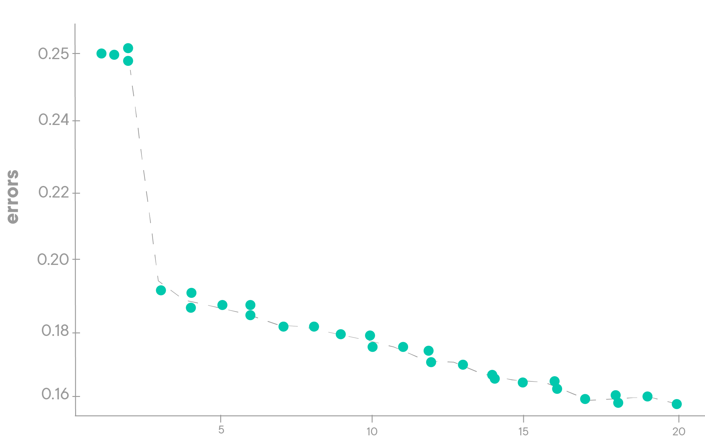

# Finding the Best Value for K

## Introduction

In this lesson, you'll investigate how changing the value for K can affect the performance of the model, and how to use this to find the best value for K.

## Objectives

* Understand and explain how the KNN model reacts as K grows larger
* Conduct a parameter search to find the optimal value for K

## Finding the Optimal Number of Neighbors

By now, you've got a strong understanding of how the K-Nearest Neighbors algorithm works, but you likely have at least one lingering question&mdash;**_what is the best value to use for K_**? There's no set number that works best. If there was, it wouldn't be called **_K_**-nearest neighbors. While the best value for K is not immediately obvious for any problem, there are some strategies that you can use to select a good or near optimal value. 

## K, Overfitting, and Underfitting

In general, the smaller K is, the tighter the "fit" of the model. Remember that with supervised learning, you want to fit a model to the data as closely as possible without **_overfitting_** to patterns in the training set that don't generalize.  This can happen if your model pays too much attention to every little detail and makes a very complex decision boundary. Conversely, if your model is overly simplistic, then you may have **_underfit_** the model, limiting its potential. A visual explanation helps demonstrate this concept in practice:

When k is small, any given prediction only takes into account a very small number of points around it to make the prediction. If k is too small, this can end up with a decision boundary that looks like the overfit picture on the right. 

Conversely, as k grows larger, it takes into account more and more points, that are farther and farther away from the point in question, increasing the overall size of the region taken into account. If k grows too large, then the model begins to underfit the data. 

It's important to try to find the best value for K by iterating over a multiple values and comparing performance at each step. 

As you can see from the image above, `k=1` and `k=3` will provide different results! 

## Iterating Over Values of K

Since the model arrives at a prediction by voting, it makes sense that you should only use odd values for k, to avoid ties and subsequent arbitrary guesswork.  By adding this constraint (an odd value for k) the model will never be evenly split between two classes. From here, finding an optimal value of K requires some iterative investigation.

The best way to find an optimal value for K is to choose a minimum and maximum boundary and try them all! In practice, this means:

1. Fitting a knn classifier for each value of K.
2. Creating predictions with that model. 
3. Calculating and evaluating a performance metric using the predictions the model made.
4. Compare the results for every model and find the one with the lowest overall error, or highest overall score!

A common way to do find the best value for k at a glance is to plot the error for each value of K. Find the value for K where the error is lowest. If this graph continued into higher values of K, we would likely see the error numbers go back up as K increased. 

## KNN and The Curse of Dimensionality

Note that KNN isn't the best choice for extremely large datasets, and/or models with high dimensionality. This is because the time complexity (what computer scientists call "Big O") of this algorithm is exponential. As you add more data points to the dataset, the number of operations needed to complete all the steps of the algorithm grows exponentially! That said, for smaller datasets, KNN often works surprisingly well, given the simplicity of the overall algorithm. However, if your dataset contains millions of rows and thousands of columns, you may want to choose another algorithm, as the algorithm may not run in any reasonable amount of time&mdash;in some cases, it could quite literally take years to complete! 
