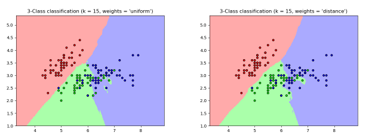

# KNN with scikit-learn

## Introduction

In this lesson, you'll explore how to use scikit-learn's implementation of the K-Nearest Neighbors algorithm for both Classification and Regression. In addition, you'll also learn about some more best practices for using the algorithm. 

## Objectives

You will be able to:

* Use KNN to make classification predictions on a real-world dataset
* Perform a parameter search for 'k' to optimize model performance
* Evaluate model performance and interpret results

## Why Use scikit-learn?

While you've written your own implementation of the KNN algorithm, scikit-learn adds many backend optimizations which can make the algorithm perform faster and more efficiently. Building your own implementation of any machine learning algorithm is a valuable experience, providing great insight into how said algorithm works.  However, in general, you should always use professional toolsets such as scikit-learn whenever possible&mdash;their implementations will always be best-in-class, in a way a single developer or data scientist simply can't hope to rival on their own. In the case of KNN, you'll find scikit-learn's implementation to be much more robust and fast, because of optimizations such as caching distances in clever ways under the hood. 

## Using the sklearn Docs

As a rule of thumb, you should familiarize yourself with any documentation available for any libraries or frameworks you use. scikit-learn provides some of best documentation in the world. For every algorithm, you'll find a general [documentation page](https://scikit-learn.org/stable/modules/generated/sklearn.neighbors.KNeighborsClassifier.html) which tells you inputs, parameters, outputs, and caveats of any algorithm. In addition, you'll also find very informative [User Guides](https://scikit-learn.org/stable/modules/neighbors.html#classification) that explain both how the algorithm works, and how to best use it, complete with sample code! 

For example, the following image can be found in the scikit-learn User Guide for K-Nearest Neighbors, along with an explanation of how different parameters can affect the overall performance of the model. 

## Best Practices

You'll also find that scikit-learn provides robust implementations for additional components of the algorithm implementation process such as evaluation metrics. With that, you can easily evaluate models using precision, accuracy or recall scores on the fly using built in methods!

With that, it's important to focus on practical questions when completing the upcoming lab. In particular, try to focus on the following questions:

* What decisions do I need to make regarding my data? How might these decisions affect overall performance?

* Which predictors do I need? How can I confirm that I have the right predictors?

* What parameter values (if any) should I choose for my model? How can I find the optimal value for a given parameter?

* What metrics will I use to evaluate the performance of my model? Why?

* How do I know if there's room left for improvement with my model? Are the potential performance gains worth the time needed to reach them?

## A Final Note

After cleaning, preprocessing, and modeling the data in the next lab, you'll be given the opportunity to iterate on your model. 

## Summary 
In this section, you got a brief overview of some of the advantages of using scikit-learn's built in KNN implementation. While you haven't seen specific code examples, you now have an indispensable resource: the official documentation to guide you. Since it's an incredibly important skill to know where to seek out information and how to digest that into actionable processes, it'll be up to you to piece through the necessary documentation to complete the upcoming lab. Good luck!
