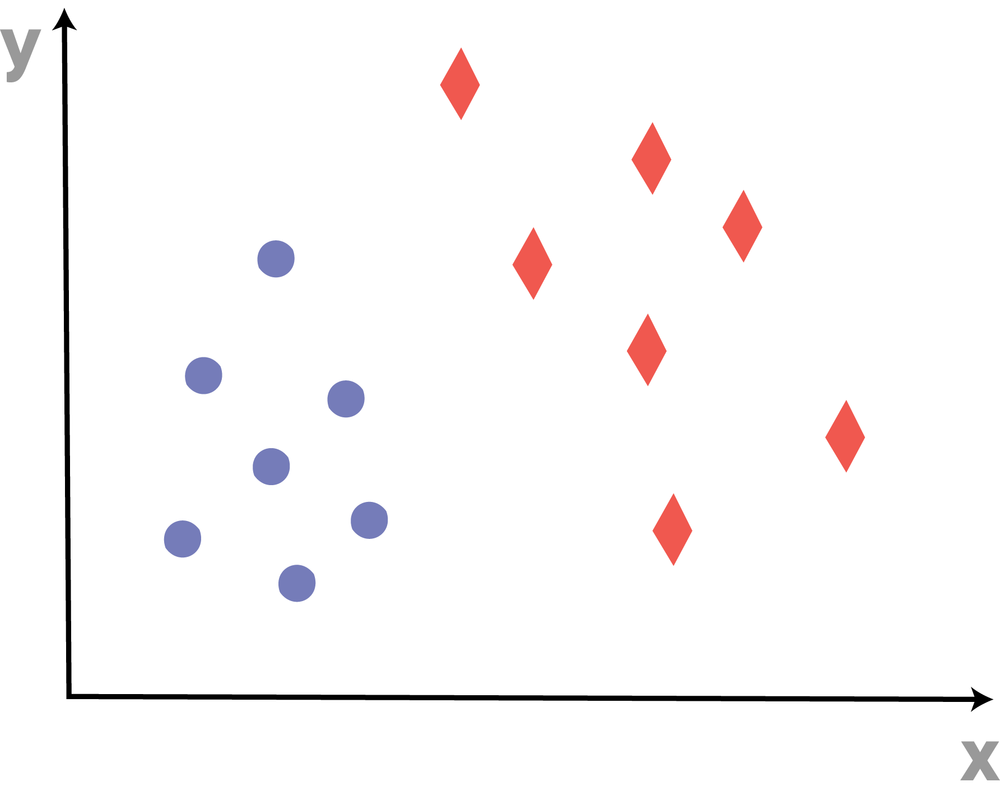
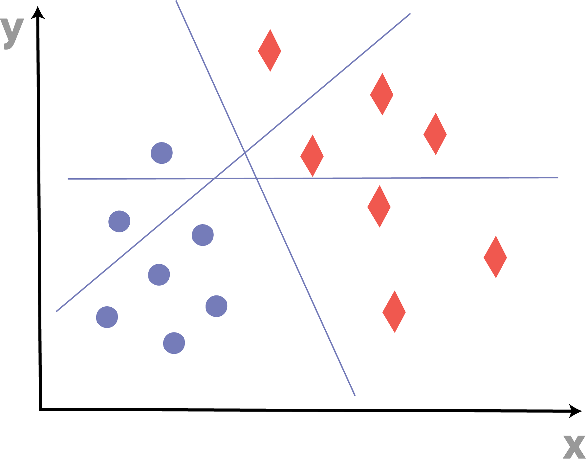
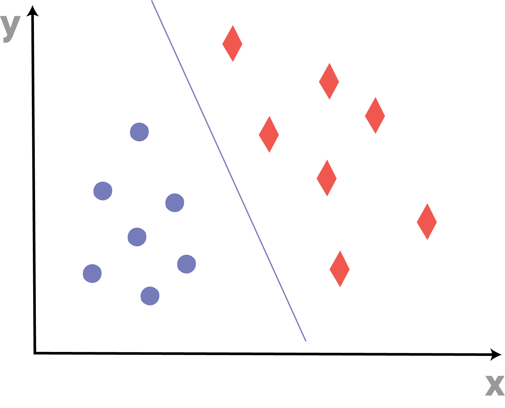
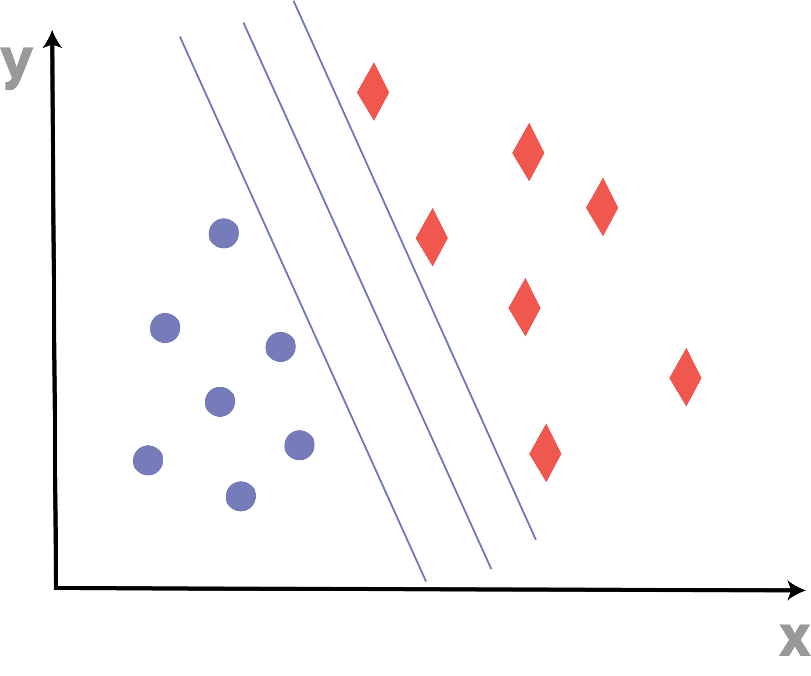
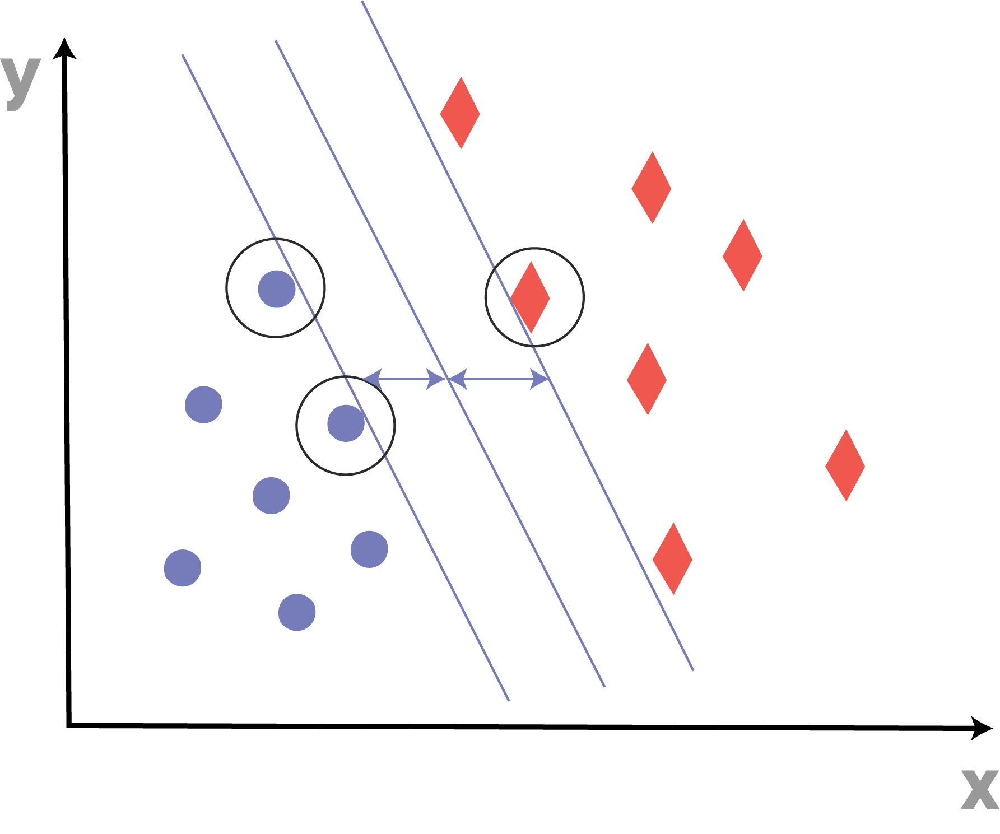
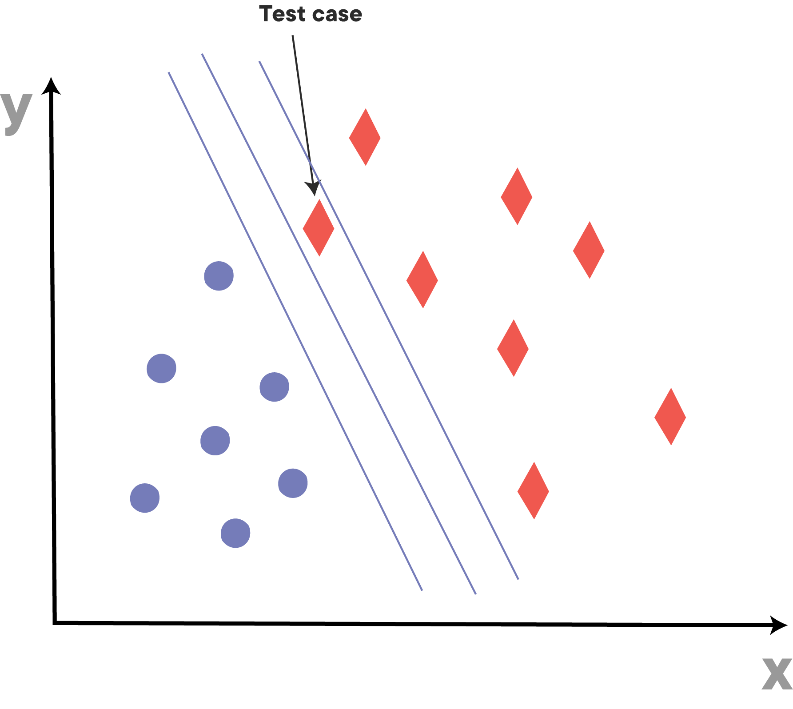
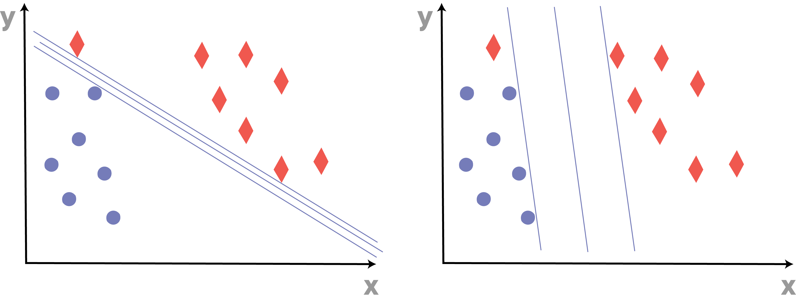

# Introduction to Support Vector Machines

## Introduction

By now you've learned a few techniques for classification; you touched upon it when talking about Naive Bayes, and again when you saw some supervised learning techniques such as logistic regression and decision trees. Now it's time for another popular classification technique&mdash;Support Vector Machines.

## Objectives

You will be able to:

- Understand what a Support Vector Machine is
- Understand the mathematical formulation of a simple max-margin classifier
- Understand the mathematical formulation of a simple soft-margin classifier

## The idea

The idea behind Support Vector Machines (also referred to as SVMs) is that you perform classification by finding the separation line or (in higher dimensions) "hyperplane" that maximizes the distance between two classes. With this, taking a look at the concept visually helps make sense of the process.

Imagine you have a data set containing 2 classes:

In SVM, you want to find a hyperplane or "decision boundary" that divides one class from the other. Which one works best?

This would be a good line.

While this seems intuitive, there are other decision boundaries which also separate the classes. Which one is best? Rather then solely focus on the final accuracy of the model, Support Vector Machines aim to **maximize the margin** between the decision boundary and the various data points.

The margin is defined as the distance between the separating line (hyperplane) and the training set cases that are closest to this hyperplane. These edges cases define the "support vectors". The suport vectors in this particular case are highlighted in the image below. As you can see, the max margin hyperplane is the midpoint between the two lines defined by the support vectors.

## The Max Margin Classifier

Why would you bother maximizing the margins? Don't these other hyperplanes discriminate just as well? Remember that you are fitting the hyperplane on your training data. Imagine you start looking at your test data, which will slightly differ from your training data.

Assuming your test set is big enough and randomly drawn from your entire data set, you might end up with a test case as shown on the image below. This test case diverts a little bit from the training set cases observed earlier. While the max margin classifier would classify this test set case correctly, the hyperplane closer to the right would have been classified incorrectly. Of course this is just one example, and other test cases will end up in a different spots. Nonetheless, the purpose of choosing the max margin classifier is to minimize the generalization error when applying the model to future unseen data points.

Before diving into the underlying mathematics, take a look at the image again:

Now you can start exploring the mathematics behind the image. First, define some numeric labels for the two classes. Set the circles to be -1 and the diamonds to be 1. Normally, 0 and 1 are used for class labels but in this particular case using -1 and 1 simplifies the mathematics.  

Now some terminology: The lines defined by the support vectors are the negative (to the left) and the positive (to the right) hyperplanes, respectively. These hyperplanes are defined by two terms: $w_T$ and $b$. 

The $w_T$ term is called the **weight vector** and contains the weights that are used in the classification.

The $b$ term is called the **bias** and functions as an offset term. If there were no bias term, the hyperplane would always go through the origin which would not be very generalizable! 

The equation describing the positive hyperplane is:
$$ b + w_Tx_{pos} =1$$

and the equation describing the negative hyperplane is:
$$ b + w_Tx_{neg} =-1$$

Remember, your goal is to the maximize the separation between the two hyperplanes. To do this, first subtract the negative hyperplane's equation from the positive hyperplane's equation:

$$ w_T(x_{pos}-x_{neg}) = 2$$

Next, normalize $w_T$ by dividing both sides of the equation by its norm, $||w||$:

$$ || w ||= \sqrt{\sum^m_{j-1}w_j^2} $$

Dividing the former expression by $||w||$ yields the equation below. The left side of the resulting equation can be interpreted as the distance between the positive and negative hyperplane. This is the **margin** you're trying to maximize.

$$ \dfrac{w_T(x_{pos}-x_{neg})}{\lVert w \rVert} = \dfrac{2}{\lVert w \rVert}$$

The objective of the SVM is then maximizing $\dfrac{2}{\lVert w \rVert}$ while constraining that the samples are classified correctly. Mathematically,

$ b + w_Tx^{(i)} \geq 1$  if $y ^{(i)} = 1$

$ b + w_Tx^{(i)} \leq -1$  if $y ^{(i)} = -1$

For $i= 1,\ldots ,N$

These equations basically say that all negative samples should fall on on the left side of the negative hyperplane, whereas all the positive samples should fall on the right of the positive hyperplane. This can also be written in one line as follows:

$y ^{(i)} (b + w_Tx^{(i)} )\geq 1$  for each $i$

Note that maximizing $\dfrac{2}{\lVert w \rVert}$ means we're minimizing $\lVert w \rVert$, or, as is done in practice because it seems to be easier to be minimized, $\dfrac{1}{2}\lVert w \rVert^2$.

## The Soft Margin Classifier

Introducing slack variables $\xi$. The idea for introducing slack variables is that the linear constraints need to be relaxed for data that are not linearly saparable, as not relaxing the constraints might lead to the algorithm that doesn't converge. 

$ b + w_Tx^{(i)} \geq 1-\xi^{(i)}$  if $y ^{(i)} = 1$

$ b + w_Tx^{(i)} \leq -1+\xi^{(i)}$  if $y ^{(i)} = -1$

For $i= 1,\ldots ,N$

The objective function is 

 $$\dfrac{1}{2}\lVert w \rVert^2+ C(\sum_i \xi^{(i)})$$

You're basically adding these slack variables in your objective function, making clear that you want to minimize the amount of slack you allow for. You can tune this with the C variable as well. C will define how much slack we're allowing.

- A big value for C will lead to the picture on the left: Misclassifications are heavily punished, so the optimization prioritizes classifying correctly over having a big margin.
- A small value for C will lead to the picture on the right: it is OK to have some misclassifications, in order to gain a bigger margin overall. (This can help avoid overfitting to the training data.)

## Summary 

Great! You now understand what Max Margin Classifiers are as well as Soft Margin Classifiers. In the next lab, you'll try to code these fairly straightforward linear classifiers from scratch!
