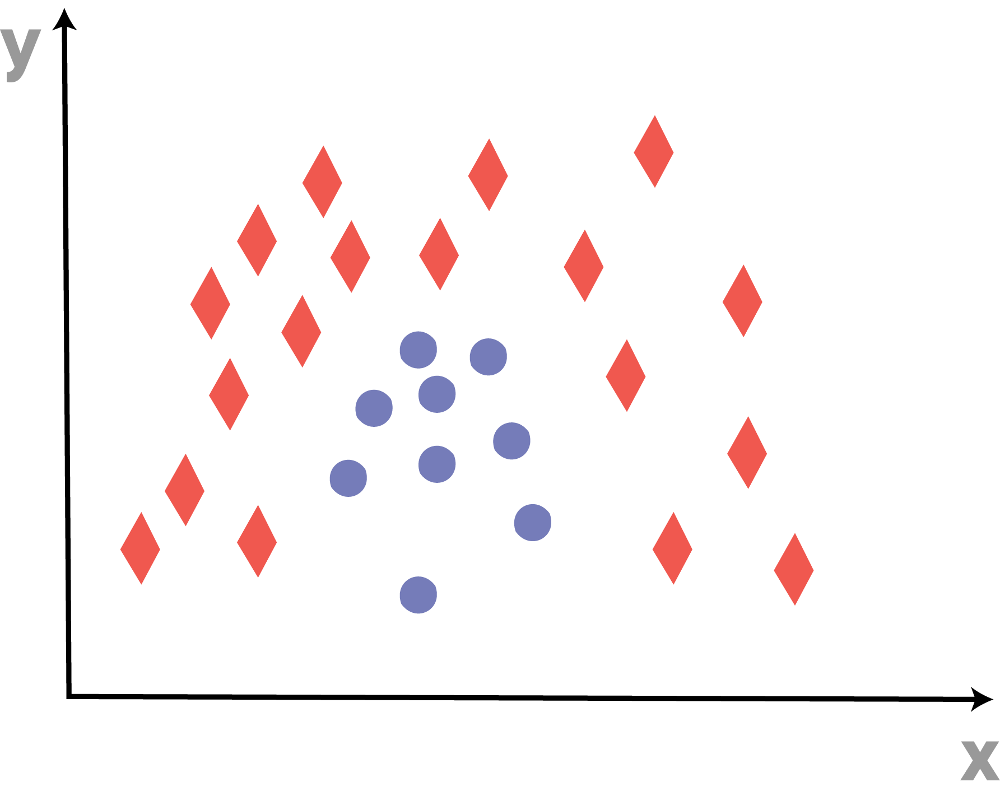
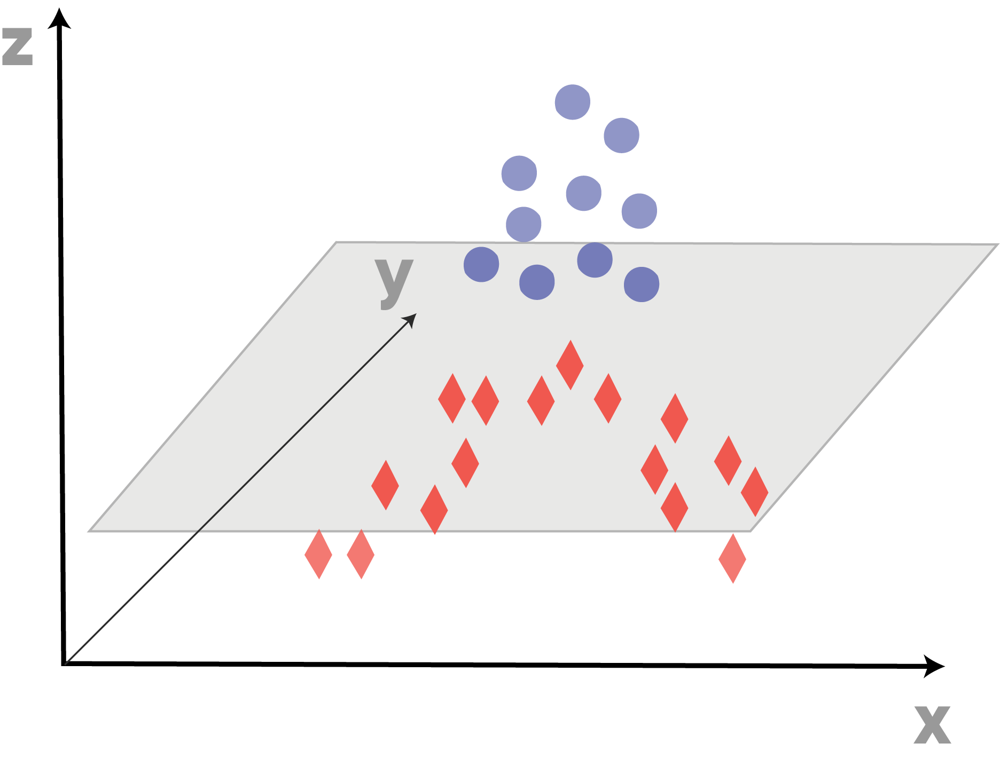

# The Kernel Trick

## Introduction

In this lesson, you'll learn how to create SVMs with non-linear decision boundaries data using kernels!

## Objectives
You will be able to:
- Understand what the kernel trick is and why it is important
- Explain what a radial basis function kernel is
- Explain what a sigmoid kernel is
- Explain what a polynomial kernel is
- Apply several non-linear kernel functions in sci-kit learn

## Non-linear problems: the kernel trick

In the previous lab, you looked at a plot where a linear boundary was clearly not sufficient to separate the two classes cleanly. Another example where a linear boundary would not work well is shown below. How would you draw a max margin classifier here? The intuitive solution is to draw an arc around the circles, separating them from the surrounding diamonds. To generate non-linear boundaries such as this, you use what is known as a kernel.

The idea behind kernel methods is to create (nonlinear) combinations of the original features, and project them onto a higher-dimensional space. For example, take a look at how this dataset could be transformed with an appropriate kernel from a two-dimensional dataset onto a new three-dimensional feature space.

## Types of kernels

There are several kernels, and an overview can be found in this lesson, as well as in the sci-kit learn documentation [here](https://scikit-learn.org/stable/modules/svm.html#kernel-functions).  
The idea is that kernels are inner products in a transformed space. 

### The Linear kernel

The linear kernel is, as you've seen, the default kernel and simply creates linear decision boundaries. The linear kernel is represented by the inner product of the $\langle x, x' \rangle$. While you won't have a full understanding of the mathematics behind kernels, it important to note that some kernels have additional parameters that can be specified and knowing how these parameters work is critical to tuning SVMs.

### The RBF kernel

There are two parameters when training an SVM with the Radial Basis Function: C and gamma. 

- The parameter C is common to all SVM kernels. Again, by tuning the C parameter when using kernels, you can provide a trafe-off between misclassification of the training set and simplicity of the decision function. a high C will classify as many samples correctly as possible (and might potentially lead to overfitting).

- Gamma defines how much influence a single training example has. The larger gamma is, the closer other examples must be to be affected.

The RBF kernel is specified as 

$$\exp{(-\gamma \lVert  x -  x' \rVert^2)} $$

Gamma has a strong effect on the results: gamma too large will lead to overfitting, a gamma which is too small will lead to underfitting (kind of like a simple linear boundary for a complex problem)

In sci-kit learn, you can specify a value for gamma using the attribute `gamma`. The default gamma value is "auto", if no other gamma is specified, gamma is set to 1/number_of_features (so, 0.5 if 2 classes, 0.333 when 3 classes, etc.). More on parameters in the RBF kernel [here](https://scikit-learn.org/stable/auto_examples/svm/plot_rbf_parameters.html).

### The Polynomial kernel

The Polynomial kernel is specified as 

$$(\gamma \langle  x -  x' \rangle+r)^d $$

- d can be specified by the keyword `degree`. The default degree is 3. 
- r can be specified by the keyword `coef0`. The default is 0.

### The Sigmoid kernel

The sigmoid kernel is specified as: 

$$\tanh ( \gamma\langle  x -  x' \rangle+r) $$

This kernel is similar to the signoid function in logistic regression.

## Some more notes on SVC, NuSVC and LinearSVC

### NuSVC

NuSVC is similar to SVC, but adds an additional parameter, $\nu$, which controls the number of support vectors and training errors. $\nu$ jointly creates an upper bound on training errors, and a lower bound on support vectors.

Just like SVC, NuSVC implements the "one-against-one" approach when there are more than 2 classes. This means that when there are n classes, $\dfrac{n*(n-1)}{2}$ classifiers are created, and each one classifies samples in 2 classes. 

### LinearSVC

LinearSVC is similar to SVC, but instead of the "one-versus-one" method, a "one-vs-rest" method is used. So in this case, when there are n classes, just $n$ classifiers are created, and each one classifies samples in 2 classes, the one of interest, and all the other classes. This means that SVC generates more classifiers, so in cases with many classes, LinearSVC actually tends to scale better. 

## Probabilities and predictions 

You can make predictions using support vector machines. The SVC decision function gives a probability score per class. This is not done by default, however, You'll need to set the `probability` argument equal to `True`. sci-kit learn internally performs cross-validation to compute the probabilities, so you can expect that setting `probability` to `True` makes the calculations longer. For large data sets, computation can take considerable time to execute.

## Summary

Great! You now know have a basic understanding of how to use kernel functions in Support Vector Machines. You'll do just that in the upcoming lab!
