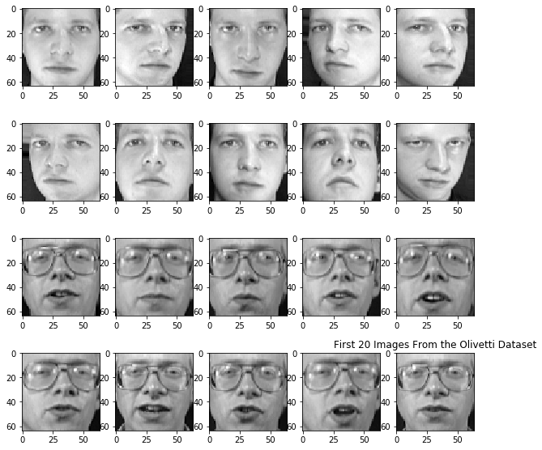
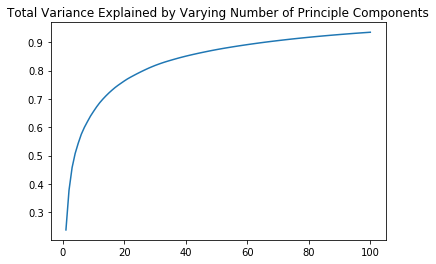
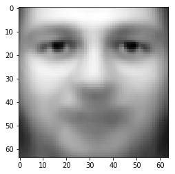
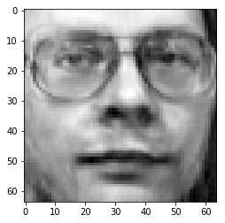
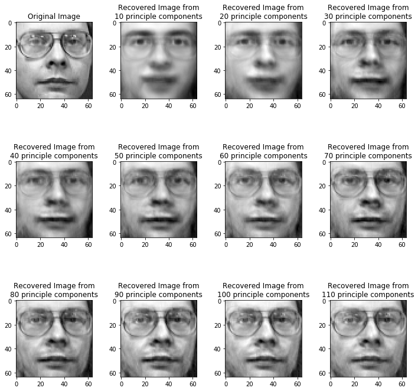

# PCA for Facial Image Recognition

## Introduction

In this lesson you'll get to explore an exciting application of PCA: as preprocessing for facial image recognition!

## Objectives

You will be able to:
* Load the Olivetti Dataset using sci-kit learn
* See the performance gains of using PCA as a preprocessing step for complex datasets in machine learning pipelines

## Loading the Data

First, let's load the dataset.


```python
import matplotlib.pyplot as plt
from sklearn.datasets import fetch_olivetti_faces
```


```python
data = fetch_olivetti_faces()
```

## Previewing the Images in the Dataset

Next, we'll take a quick preview of the images within the dataset.


```python
fig, axes = plt.subplots(nrows=4, ncols=5, figsize=(10,10))
for n in range(20):
    i = n //5
    j = n%5
    ax = axes[i][j]
    ax.imshow(data.images[n], cmap=plt.cm.gray)
plt.title('First 20 Images From the Olivetti Dataset');
```





## Training a Baseline Classifier

In a minute, you'll take a look at the performance gains by using PCA as a preprocessing technique. To compare the performance, here's an out of the box classifier's performance.


```python
from sklearn import svm
from sklearn.model_selection import train_test_split
```


```python
X = data.data
y = data.target
X_train, X_test, y_train, y_test = train_test_split(X,y, random_state=22)
```


```python
clf = svm.SVC(C=5, gamma=0.05)
%timeit clf.fit(X_train, y_train)
```

    989 ms ± 14.5 ms per loop (mean ± std. dev. of 7 runs, 1 loop each)


```python
train_acc = clf.score(X_train, y_train)
test_acc = clf.score(X_test, y_test)
print('Training Accuracy: {}\tTesting Accuracy: {}'.format(train_acc, test_acc))
```

    Training Accuracy: 1.0	Testing Accuracy: 0.74


## Grid Search on the Baseline Classifier

To produce a more robust baseline to compare against, let's see how much performance you can squeeze out of an initial model. To do that, you could run a grid search to find optimal hyperparameters for the model. It's also worth timing the duration of training such a model, as PCA will drastically decrease training time, and it's interesting to observe this performance gain.

> **Warning**: It's not recommended to run the cell below. (Doing so is apt to take well over an hour, depending on the particular specs of your machine.)


```python
import numpy as np
from sklearn.model_selection import GridSearchCV

clf = svm.SVC()
param_grid = {"C" : np.linspace(.1, 10, num=11),
             "gamma" : np.linspace(10**-3, 5, num=11)}
grid_search = GridSearchCV(clf, param_grid, cv=5)
%timeit grid_search.fit(X_train, y_train)
```

    10min 17s ± 6.79 s per loop (mean ± std. dev. of 7 runs, 1 loop each)


```python
grid_search.best_estimator_.score(X_test, y_test)
```


    0.91


## Preprocessing with PCA

Now, it's time to perform some dimensionality reduction with PCA! To start, you can simply pick an arbitrary number of components. Later, you could compare the performance of a varying number of components.

Note that to avoid information leakage from the test set, PCA should only be fit on the training data.


```python
from sklearn.decomposition import PCA
```


```python
X[0].shape
```


    (4096,)


```python
pca = PCA(n_components=100, whiten=True)
X_pca_train = pca.fit_transform(X_train)
X_pca_train.shape
```


    (400, 100)


```python
X_pca_train[0].shape
```


    (100,)


## Exploring the Explained Variance Captured by Principal Components

How much of the total data was capture in these compressed representations? Take a quick look at a plot of the explained variance to explore this.


```python
plt.plot(range(1,101), pca.explained_variance_ratio_.cumsum())
plt.title('Total Variance Explained by Varying Number of Principle Components');
```





## Training a Classifier on the Compressed Dataset

Now its time to compare the performance of a classifier trained on the compressed dataset.


```python
X_pca_test = pca.transform(X_test)
clf = svm.SVC()
%timeit clf.fit(X_pca_train, y_train)
```

    33.7 ms ± 228 µs per loop (mean ± std. dev. of 7 runs, 10 loops each)


```python
train_pca_acc = clf.score(X_pca_train, y_train)
test_pca_acc = clf.score(X_pca_test, y_test)
print('Training Accuracy: {}\tTesting Accuracy: {}'.format(train_pca_acc, test_pca_acc))
```

    Training Accuracy: 1.0	Testing Accuracy: 0.78


## Grid Search for Appropriate Parameters

Going further, you can also refine the model using grid search.


```python
import numpy as np
from sklearn.grid_search import GridSearchCV
clf = svm.SVC()
param_grid = {"C" : np.linspace(.1, 10, num=11),
             "gamma" : np.linspace(10**-3, 5, num=11)}
grid_search = GridSearchCV(clf, param_grid, cv=5)
%timeit grid_search.fit(X_pca_train, y_train)
```

    /Users/matthew.mitchell/anaconda3/lib/python3.6/site-packages/sklearn/cross_validation.py:41: DeprecationWarning: This module was deprecated in version 0.18 in favor of the model_selection module into which all the refactored classes and functions are moved. Also note that the interface of the new CV iterators are different from that of this module. This module will be removed in 0.20.
      "This module will be removed in 0.20.", DeprecationWarning)
    /Users/matthew.mitchell/anaconda3/lib/python3.6/site-packages/sklearn/grid_search.py:42: DeprecationWarning: This module was deprecated in version 0.18 in favor of the model_selection module into which all the refactored classes and functions are moved. This module will be removed in 0.20.
      DeprecationWarning)


    16.8 s ± 25.3 ms per loop (mean ± std. dev. of 7 runs, 1 loop each)


```python
grid_search.best_params_
```


    {'C': 10.0, 'gamma': 0.001}


```python
grid_search.best_estimator_.score(X_pca_test, y_test)
```


    0.89


## Visualizing Some of the Features Captured by PCA

While the model is clearly more accurate and faster to train, let's take a moment to circle back and visualize some of the information captured by PCA. Specifically, you'll take a look at 2 perspectives. First, you'll take a look at visualizing the feature means. Second, you'll get to visualize the compressed encodings of the dataset.

### Visualizing Feature Means

While a very simple mathematical model, just observing the mean values of the features produces quite an informative picture:


```python
plt.imshow(X.mean(axis=0).reshape(data.images[0].shape), cmap=plt.cm.gray)
```


    <matplotlib.image.AxesImage at 0x1a21557278>





### Visualizing Compressed Representations

Visualizing the components from PCA is slightly tricky, as they have new dimensions, which may not correspond accurately to the 64x64 size of the original images. Fortunately, sci-kit learn provides a useful `inverse_transformation` method to PCA allowing you to reproject the compressed dataset back to the original size. This allows you to observe what features are retrieval and encapsulated within the principle components.


```python
fig, axes
plt.imshow(pca.inverse_transform(X_pca_train[0]).reshape(64,64), cmap=plt.cm.gray)
```


    <matplotlib.image.AxesImage at 0x1a1f9a0080>





To make this even more interesting, take a look at some of the varied levels of detail based on varying number of principle components:


```python
fig, axes = plt.subplots(ncols=4, nrows=3, figsize=(10,10))
ax = axes[0][0]
ax.set_title('Original Image')
ax.imshow(X_train[0].reshape(64,64), cmap=plt.cm.gray)
for n in range(1,12):
    i = n //4
    j = n%4
    ax = axes[i][j]
    ax.set_title('Re')
    n_feats = n*10
    pca = PCA(n_components=n_feats)
    pca.fit(X_train)
    compressed = pca.transform(X_train)
    ax.set_title('Recovered Image from\n{} principle components'.format(n_feats))
    ax.imshow(pca.inverse_transform(compressed[0]).reshape(64,64), cmap=plt.cm.gray)
plt.tight_layout()
```





## Summary

Awesome! In this lesson, you got to preview of using PCA to reduce the dimensionality of a complex dataset. In the next lab, you'll get a chance to put these same procedures to test in working with the MNIST dataset.
