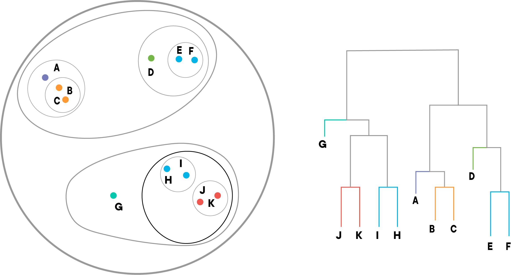

# Common Problems with Clustering Algorithms

## Introduction

In this lesson, we'll discuss some of the common problems often seen when attempting clustering with K-Means or Hierarchical Agglomerative Clustering. 

## Objectives

You will be able to:

* Identify the problems that can arise from bad centroid initializations
* Identify and explain the problems that can arise from bad initial groups with HAC

## Common Problems With Clustering

When working with clustering algorithms, there are certain problems that we should always keep aware of, in order to help us prevent situations where we unknowingly accept the results of a bad clustering. Understanding the potential problems that can arise with each clustering algorithm also tends to provide greater insight into how each algorithm works. 

The most common issue is one that is applicable to all forms of clustering--we have no way of verifying if the results of the cluster analysis are correct or not! Always try to keep this in mind when working with Clustering algorithms, and never make the mistake of treating the results of a Cluster Analysis as ground-truth. 

To further drive this point home, let's spend some time looking at common problems with the two kinds of clustering we've talked about so far, so that we can gain insight into the situations where clustering algorithms fall short. 

## Advantages & Disadvantages of K-Means Clustering

The advantages of the K-Means Clustering approach are:

* Very easy to implement!
* With many features, K-Means is usually faster than HAC (as long as K is reasonably small).
* Objects are locked into the cluster they are first assigned, and can change as the centroids move around.
* Clusters are often tighter than those formed by HAC.

However, this algorithm often comes with several disadvantages to consider:

* Quality of results depends on picking the right value for K. This can be a problem when we don't know how many clusters to expect in our dataset.
* Scaling our dataset will completely change the results.
* Initial start points of each centroid have a very strong impact on our final results. A bad start point can cause sub-optimal clusters (see example below)


[gif courtesy of Andrey A. Shabalin](http://shabal.in/visuals/kmeans/right.gif)

The animation above shows what can happen when we get a bad centroid initialization. Because of the random points that the centroids were initialized at, this led to one centroid cluster containing no points, while another cluster centroid has combined two clusters by being located in between them!  Even though we had the correct value for K (since we have 4 centroids, and data clearly contains 4 clusters), we ended up with incorrect results. 

Since every dataset is different, and centroids are generated randomly, there is no way to make sure that we have good centroid initialization every time. One way to deal with this is to run a clustering algorithm multiple times, and keep track of how many times the same results come up. The good news here is that bad centroid initializations are typically much less likely than good centroid initializations, so the chances of getting bad results due to poor centroid initialization multiple times in a row are somewhat unlikely. 

Now, let's take a look at HAC. 

## Advantages & Disadvantages of HAC

HAC is useful as a clustering algorithm because:

* It produces an ordered relationship between clusters, which can be useful when visualized.
* Smaller clusters are created. This allows us to get a very granular understanding of our dataset, and zoom in at the level where the clusters make the most sense to us (note the coloration of the lines in the example dendrogram above).

However, this algorithm is also built on some assumptions with can be disadvantages:

* Results are usually dependent upon the distance metric used.
* Objects can be grouped 'incorrectly' early on, with no way to relocate them. For instance, consider two points that belong to separate clusters, but are both nearer to each other than the center of the cluster they actually belong to (both are near the "boundary" between their cluster and the opposing cluster). These will be incorrectly grouped as a cluster, which will throw off the clustering of the groups they actually belong to, as well.

Let's look at an example. Consider the circled points in the following plot:



The two points circled are from different clusters. However, they are right on the boundary between the two clusters, which has significant overlap between them. Because of this, there is a good chance that the clusters will meet the linkage criteria, and the HAC algorithm will group them together. The centroid of this new (incorrect) cluster is also close to many points on the boundary, meaning that is quite likely that those points will be merged and the incorrect cluster will grow bigger. Early mistakes with the HAC algorithm tend to act as a bit of a slippery slope--and since HAC doesn't constantly reassign points like K-Means does, this means that things can go from bad to worse if mistakes are made early on. 

## A Note on Visualization

So far, we've checked our work by looking at visualizations of the clusters, and using our eyes and our judgment to check if we agree with the results of the algorithm. However, it's worth remembering that this is highly unlikely to be an option on real-world data, since we can't visualize anything with more than 3 dimensions. Because of this, its often much harder to tell when a clustering algorithm has made a mistake, because we aren't able to use our eyes to confirm or deny the results!


## Summary

In this lesson, we learned about some of the challenges that come with come with clustering, and the relative advantages and disadvantages of K-Means and Hierarchical Agglomerative Clustering. 


```python

```
