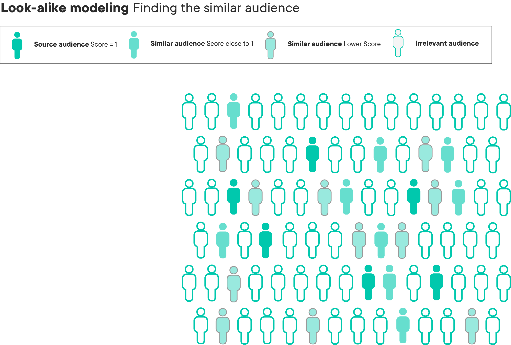
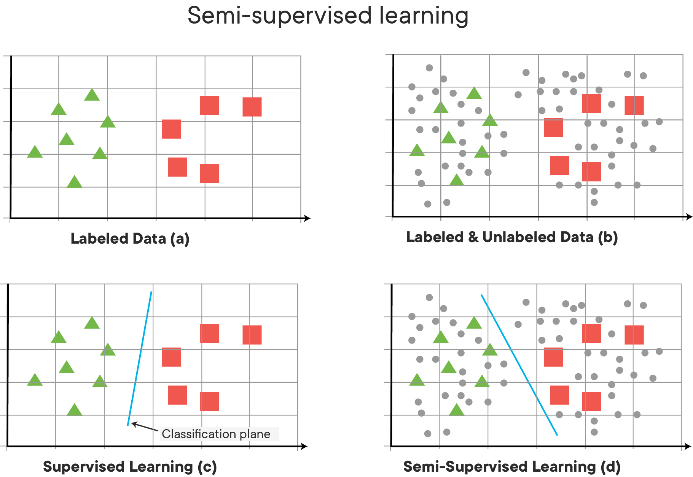

# Semi-Supervised Learning and Look-Alike Models

## Introduction

In this lesson, we'll learn about some unsupervised learning techniques we can use to supplement our supervised learning techniques.

## Objectives

You will be able to:

* Identify appropriate use cases for Look-Alike Models
* Identify appropriate use cases for Semi-Supervised Learning

## Combining Supervised and Unsupervised Learning

For the majority of this section, we've focused exclusively on popular unsupervised learning techniques, and their most common use cases. However, in the real world, there are also plenty of examples where it works to our advantage to bring supervised and unsupervised learning algorithms together to supplement each other. For this lesson, we'll look at two common areas combining supervised and unsupervised learning algorithms allows us to be more effective than just using them on their own. 


## Use Case 1: Look-Alike Models

As we've learned when working with clustering algorithms, one of their most common use cases is for market segmentation. A more advanced, but similar use case is to then use these market segments to create **_Look Alike Models_** to help us identify more customers or market segments that we can plausibly assume are equally valuable, do to their similarity with valuable customers or market segments we've already identified. 

Take a look at the following infographic that provides a visual representation of look-alike modeling:



In the example above, the Dark Blue smiley faces represent customer segments that we already know are valuable. These are customers that we have identified in our data, and know for a fact have been good for us. Under normal circumstances, this would mean that we can divide our customers (or, more often, potential customers) into two groups: the group we know is valuable, and everyone else, who are all unknown to us. 

 This is where _Look-Alike Modeling_ comes in. A Look-Alike model uses a distance metric of our choice to rate the similarity of all each customer in our group of unknowns to customers in our known, valuable group. For customers that look extremely similar to customers in own known valuable group, we can assume with a very high likelihood that these customers will also be valuable, and should direct resources at capturing them! We'll likely also see customers that are only somewhat similar with to our valuable group, which tells us that they _could possibly be valuable_, but we aren't sure--and finally, customers that are look nothing like our known valuable customers segment. 
 
 If this sounds suspiciously like clustering to you, you are absolutely correct! Although this could also be framed as a classification or regression problem, its quite common to see clustering used to help determine similarity. After all, if we want to build a supervised learning model to predict if an unknown customer looks like our known valuable customers, then we need plenty of labeled examples, and we don't always have that luxury! 
 
 In the real-world, using Look-Alike Models to find other customers that could potentially be valuable to us is called often referred to as **_Prospecting_**. Viewed in terms of the infographic above, we would choose direct resources to market to the customers that look like our valuable customers to increase our **_Top-Of-Funnel_**, meaning that we are trying to increase the number of potential customers that haven't shown interest in our product or company yet, but are likely to, due to their similarity to customers that already have. 

## Use Case 2: Semi-Supervised Learning

The second use-case we'll talk about combines Supervised and Unsupervised Learning to allow us access to more (pseudo) labeled data, so that we can better train our supervised learning models. This technique is called **_Semi-Supervised Learning_**.  You may also hear it commonly referred to as **_Weakly Supervised Learning_**, but it means the same thing. 

Picture the following scenario: 

We are trying to build a supervised learning model, and we have 100,000 observations in our dataset. However, labels are exceedingly expensive, so only 5,000 of these 100,000 observations are labeled. In traditional Supervised Learning, this means that in a practical sense, we really only have a dataset of 5,000 observations, because we can't do anything with the 95,000 unlabeled examples--or can we?

The main idea behind _Semi-Supervised Learning_ is to generate **_Pseudo-Labels_** that are possibly correct (at least better than random chance). To do this, we don't usually use clustering algorithms--instead, we use our supervised learning algorithms in an an unsupervised way. 



Supervised Learning typically follows a set pattern:

1. **_Train your model on your labeled training data_**. In the case of our example above, we would build the best model possible with our tiny dataset of 5,000 labeled examples. 

2. **_Use your trained model to generate pseudo-labels for your unlabeled data_**. This means having our trained model make predictions on our 95,000 unlabeled examples. Since our trained model does better than random chance, this means that our generated pseudo-labels will be at least somewhat more correct than random chance. We can even put a number to this, by looking at the performance our trained model had on the test set. For example, if our trained model had an accuracy of ~70%, then we can assume that ~70% of the pseudo-labels will be correct, will ~30% will be incorrect. 

3. **_Combine your labeled data and your pseudo-labeled data into a single, new dataset._**. This means that we concatenate all our labeled data of 5,000 examples with the 95,000 pseudo-labeled examples. 

4. **_Retrain your model on the new dataset_**. Although some of the pseudo-labeled data will certainly be wrong, it's likely that the amount that is correct will be more useful, and the signal that these correctly pseudo-labeled examples provide will outweigh the incorrectly labeled ones, thereby resulting in better overall model performance. 

### Benefits and Drawbacks of Semi-Supervised Learning

If Semi-Supervised Learning sounds a bit risky to you, you're not wrong. When done correctly, Semi-Supervised Learning can increase overall model performance by opening up access to much more data that we would have access to, and more data almost always results in better performance, but without the exorbitant costs of paying to have humans generate labels for the data needed. 

However, there are definitely some problems that can arise from using a Semi-Supervised Learning approach, if we're not careful and thoughtful throughout.

#### Feedback Loops and Self-Fulfilling Prophecies

Semi-Supervised Learning tends to work fairly well in many use cases, and has become quite a popular technique in the field of Deep Learning, which requires massive amounts of labeled data, which is often very expensive to obtain.   But what happens when our dataset is extremely noisy to begin with? In that case, our incorrect pseudo-labels may skew the model by introducing more "noise" than "signal". This is partially because we end up can end up in a feedback loop of sorts. Think about an example where the model has generated an incorrect pseudo-label. If a model trained only on the real data with no pseudo-labels got this example wrong, then what happens when you train the model on the same example, but this time provide a pseudo-label that "confirms" this incorrect belief? When done correctly, we can hope that the signal provided by all the correctly pseudo-labeled examples will generalize to help the model correct its mistakes on the ones it got wrong. However, if the dataset is noisy, or the original model wasn't that good to begin with (or both), then it can be quite likely that we are introducing even more incorrect information than correct information, moving the model in the wrong direction.

So how do we make sure that we're not making these mistakes when using a Semi-Supervised approach? **_Use a Holdout Set!_** You should definitely have a test set that the model has never seen before to check the performance of your Semi-Supervised model. Obviously, make sure that your test set only contains actual, ground-truth labeled examples, no pseudo-labels allowed! Also, the noisier your dataset or more complicated your problem, the more likely you are to run into trouble with Semi-Supervised Learning. When possible, try to structure your tasks as binary classification tasks, rather than multi-categorical, and make sure that your dataset is as clean as possible before attempting Semi-Supervised Learning. Although it seems risky, when done right, it works wonders--there's a reason companies that are heavy into Deep Learning and AI research such as Google, Microsoft, and Facebook make heavy use of Semi-Supervised Learning--when done correctly, it works wonders, without costing an arm and a leg to pay for labeling!

## Summary

In this lesson, we learned about two popular methodologies for using Unsupervised Learning in applied, focused ways to help companies generate more revenue, get more customers, or increase model performance without paying for more labeled training data!


```python

```
