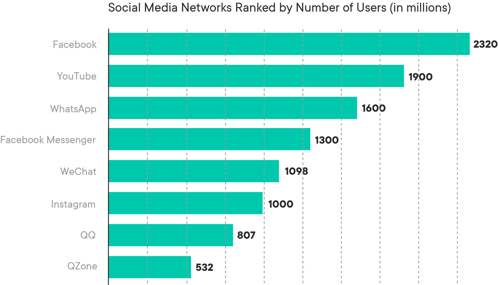

# Introduction to Big Data 

## Introduction

In the information age, data in huge quantities has become available to analysts and decision makers. Due to a vast increase in the amount of such data in recent times, a number of specialized platforms and development paradigms have been developed that can handle big data. Using such specialist approaches allow data scientists to gain valuable insights from complex data, ranging from daily transactions to customer interactions and social network data.

This section aims to focus on some of the different analytical approaches and tools data data scientists apply to big data in order to gain valuable insights to aid business decision making. 

## Objectives
You will be able to:
- Understand and explain how big data differs from routine data that is routinely analyzed
- Describe 3 V's of big data as attributes that differentiate big data
- Evaluate big data technologies and application areas for Big Data Analytics

## What is Big Data

The topic of "Big Data" has received a lot of hype lately, accompanied by a huge amount of interest from big businesses as it can potentially provide them data-driven decision-making abilities. Big data is one of the most discussed topics in business today across industry sectors, although it was barely known a few years ago. This lesson will focus on what big data is, why it is important, and the benefits it brings. 

Big data is no different than normal data that we have seen so far; it's only "bigger." This changes the analytical landscape that must be used as the huge size increase of the data requires specialist tools, techniques, and platforms. It helps us solve new problems and find improved ways to find answers to old problems. 

### Defining Big Data

Despite all the hype around this topic, there is no clear consensus on how to define  __Big Data__. The term often gets related to Business Analytics and Data mining for identifying relationships and associations present in huge amounts of transaction data.  

In the data science domain, Big Data usually refers to datasets that grow so large that they become awkward to work with using traditional database management systems and analytical approaches. They are data sets whose size is beyond the ability of commonly used software tools and storage systems to capture, store, manage, as well as process the data within a tolerable elapsed time.

#### How big is "Big" Data?

Big data sizes are constantly increasing, currently ranging from a few terabytes (TB) to many petabytes (PB) of data in a single data set. Consequently, some of the difficulties related to big data include capture, storage, search, sharing, analytics, and visualizing. Today, enterprises are exploring large volumes of highly detailed
data to discover trends and pieces of information considered incapable of being captured before. 

Here are some of the examples of big data:
- Web Traffic data: Data points such as number of page views, previous web page, user information, advertisement click-through rate, pages per visit, average visit duration
- Text data: Emails, tweets, news reports, voice recordings, and text gathered from crawling the web can make massive datasets that are valuable to data scientists
- Location and Time data: GPS data helps Google determine which roads have higher traffic and which businesses will be busier at certain hours
- Social network data: Using the information of relationships between users on Facebook, LinkedIn, Twitter, Reddit, and countless more
- Smart grid and sensor data: With the advent of the Internet of Things, more and more devices are able to record data at all times, making it possible to gather lots of data instantaneously
 

## 3 V's of Big Data 

Doug Laney published a [paper](https://blogs.gartner.com/doug-laney/files/2012/01/ad949-3D-Data-Management-Controlling-Data-Volume-Velocity-and-Variety.pdf) on three defining characteristics of big data. Three main features characterize big data: volume, variety, and velocity, or the three V’s. The volume of the data is its size, and  how enormous it is. Velocity refers to the rate with which data is changing, or how
often it is created. Finally, Variety includes the different formats and types of data, as well as the different kinds of uses and ways of analyzing the data:

Let's look a bit deeper into what these 3Vs refer to:

### VOLUME
Volume refers to the __amount of data__ generated through websites, portals and online applications in a data-driven business. Especially for online retailers, volume encompasses the available data that are out there and need to be assessed for relevance. 

Consider the following:

As of 2019, Facebook has 2.32 billion users, Youtube: 1.9 billion users, WhatsApp: 1.6 billion users and Instagram 1 billion users. Every day, these users contribute to billions of images, posts, videos, tweets, etc. You can now imagine the insanely large amount (or Volume) of data that is generated every minute around the world.
Data volume is the primary attribute of big data. Big data can be quantified by size in Terabytes (TBs) or Petabytes (PBs), as well as even the number of records, transactions, tables, or files. Additionally, one of the things that make big data really big is that it’s coming from a greater variety of sources than ever before, including logs, clickstreams, and social media as we will see below. 

### VELOCITY
Velocity refers to the speed with which data is generated, and as internet speeds have increased and the number of users has increased, the velocity has also increased substantially.

The following image created by [Lori Lewis and Chadd Callahan](https://www.allaccess.com/merge/archive/29580/2019-this-is-what-happens-in-an-internet-minute) shows what happens on major social media platforms in one minute. 

Velocity is basically the frequency of data generation or the frequency of data delivery. The leading edge of
big data is streaming data, which is collected in real-time from the websites

Tools within the Big Data stack help companies hold this explosion in velocity, accept the incoming flow of data and at the same time process it quickly enough so that it does not create bottlenecks.

### VARIETY

Variety in Big Data refers to all the structured and unstructured data that has the possibility of getting generated either by humans or by machines. Structured data is whatever data you could store in a spreadsheet. It can easily be cataloged and summary statistics can be calculated for it. Unstructured data are raw things like texts, tweets, pictures, videos, emails, voice mails, hand-written text, ECG reading, and audio recordings. Humans can only make sense of data that is structured, and it is usually up to data scientists to create some organization and structure to unstructured data.

Variety is all about the ability to classify the incoming data into various categories and turn unstructured data into something with more structure.

This leads us to the most widely used definition in the industry by Gartner.

### *Big data is high-volume, high-velocity and/or high-variety information assets that demand cost-effective, innovative forms of information processing that enable enhanced insight, decision making, and process automation*.

All of the above are examples for 3Vs are sources of Big Data, no matter how you define it.

**NOTE**: *Some researchers have discussed the addition of a fourth V, or __Veracity__. Veracity focuses on the quality of the data. This characterizes big data quality as good, bad, or undefined due to data inconsistency, incompleteness, ambiguity, latency, deception, and approximations*

The important thing to remember from this three-pronged definition of Big Data is that there is not a single component that makes data "big" or not. It is also a futile effort to try and make a definition of what the threshold is to make something "big data" rather than normal data. As technologies evolve and new distributed algorithms are created, what was once big data will no longer be big, and we will raise the bar.

## Big Data Analytics

With the evolution of technology and the increased amounts of data, as shown above, the need for faster and more efficient ways of analyzing such data has also grown exponentially. Having Big data __alone__ is no longer enough to make efficient decisions at the right time. As we mentioned above, Big Data cannot be easily analyzed with traditional data management and analysis techniques and infrastructures. Therefore, there arises a need for new
tools and methods specialized for big data analytics, as well as the required architectures for storing and managing such data. Accordingly, the emergence of big data has an effect on everything from the data itself to its collection, analysis, visualization, and the final extracted decisions.

The image below shows the technology stack showing key tools and platforms heavily being employed in big data analytics today. 

Explaining each one of these tools/platforms etc. is outside the scope of this lesson. You are, however, encouraged to look up these technologies and see their role in big data analytics. Such a stack maps the different big data storage, management, analytics tools/methods, visualization, and evaluation tools to the different phases of the decision making process. 

The key activities associated with big data analytics are reflected in four main areas: 

- Big data warehousing and distribution
- Big data storage
- Big data computational platforms
- Big data analyses, visualization, and evaluation

Such a framework can be applied for knowledge discovery and informed decision-making in big data-driven organizations.

### Example Business Applications of Big Data Analytics

Along with some of the most common advanced data analytics methods such as regression analysis, association rules, clustering, and classification, some additional analyses have become common with big data.

For example, social media has recently become important for social networking and content sharing. Yet, the content that is generated from social media websites is enormous and remains largely unexploited. However, social media analytics can be used to analyze such data and extract useful information and predictions.

>__Social media analytics__ is based on developing and evaluating informatics frameworks and
tools in order to collect, monitor, summarize, analyze, as well as visualize social media
data. 

Social media analytics facilitates understanding the reactions and conversations between people in online communities, as well as extracting useful patterns and intelligence from their interactions, in addition to what they share on social media websites.

On the other hand, __Text Mining__ and __NLP__ techniques are used to analyze a document or set of documents in order to understand the content within and the meaning of the information contained. Text mining has become very important nowadays since much of the information stored consists of text - in the form of emails, SMS texts, social media feeds, blogs, etc. While data mining deals with structured data, text presents special characteristics which basically follows a non-relational form and requires wisely thought schema to grant it more structure.

__Sentiment Analysis/Opinion Mining__ is also becoming more and more important as online opinion data, such as blogs, product reviews, forums, and social data from social media sites like Twitter and Facebook, grow tremendously. 

>__Sentiment Analysis__ focuses on analyzing and understanding emotions from subjective text patterns and is enabled through text mining. It identifies the opinions and attitudes of individuals towards certain topics, and it is useful in classifying viewpoints as positive or negative. 

Sentiment analysis uses NLP and text analytics in order to identify and extract information by finding words that are indicative of a sentiment, as well as relationships between words so that sentiments can be accurately identified

And finally, one of the leading application in big data analytics is __Recommendation Systems__. Powerful recommendation engines can be built for anything from movies and videos to music, books, and products as offered by Netflix, Pandora, or Amazon. As customers of an online retailer browse through products, the Recommendation system offers recommendations of products they might be interested in. In our daily online browsing and shopping routine, most of us often come across messages like the one shown below. This is a recommendation system doing its job. 

Regardless of business or consumer the perspective, Recommendation systems have been immensely beneficial. Big data is the driving force behind Recommendation systems. A typical Recommendation system cannot do its job without sufficient data and big data supplies plenty of user data such as past purchases, browsing history, and feedback for the Recommendation systems to provide relevant and effective recommendations. In a nutshell, even the most advanced Recommenders cannot be effective without big data.

### So what's next?

After this quick introduction, we will look at Map-Reduce, a distributed computation platform designed to incorporate big data analytics and how it is used by Hadoop/Apache Spark development environments to analyze big data. 

## Additional Reading 

Big Data is a huge subject and incorporates a lot of underlying technologies and principles. You are advised to visit the following resources and also read around good Bid data articles to develop a sound and holistic understanding of the domain. 

- [Youtube: Big Data Trap](https://www.youtube.com/watch?v=0cizsKDn3TI) - Highly recommended, an excellent lecture on the social dimension of big data.

- [Big Data vs Data Science](https://www.educba.com/big-data-vs-data-science/) - How to relate big data analytics to routine analytics that we have so far!

- [Big Data Analytics](https://pdfs.semanticscholar.org/d392/0f02dbb15da19b04d782fc0546ef113e0bf7.pdf) - A great paper summarizing big data related terms, ideas, etc. 

- [Introduction to Big Data](https://www.ntnu.no/iie/fag/big/lessons/lesson2.pdf) - A paper discussing the basics of big data

## Summary 

In this introductory lesson on big data, we looked at what data qualifies at "Big Data". We looked at how it is hard to come up with a standard definition of Big Data due to the variety of its applications and use cases. Up next, we will get into how we actually make parallelizable applications that are efficient with big data. 
