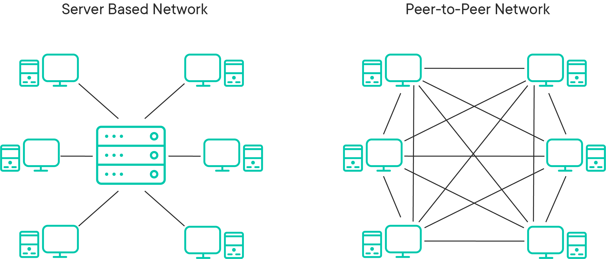
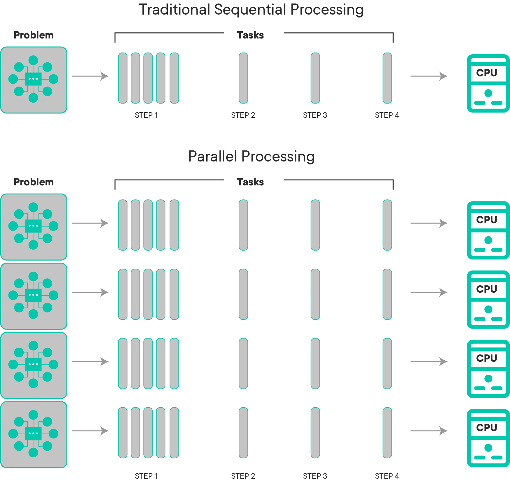
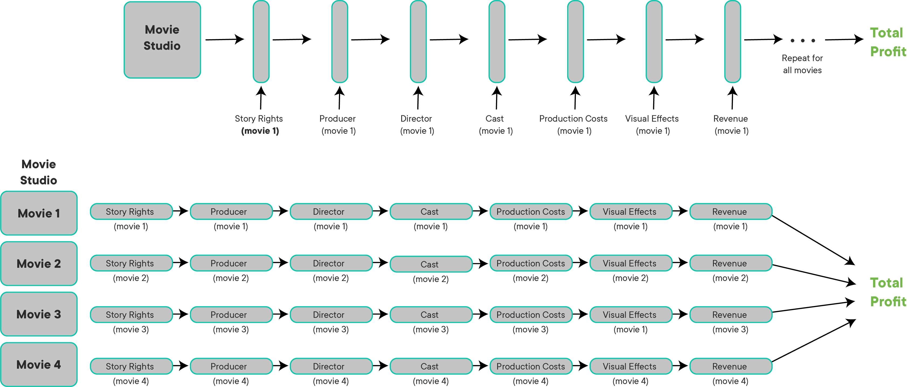
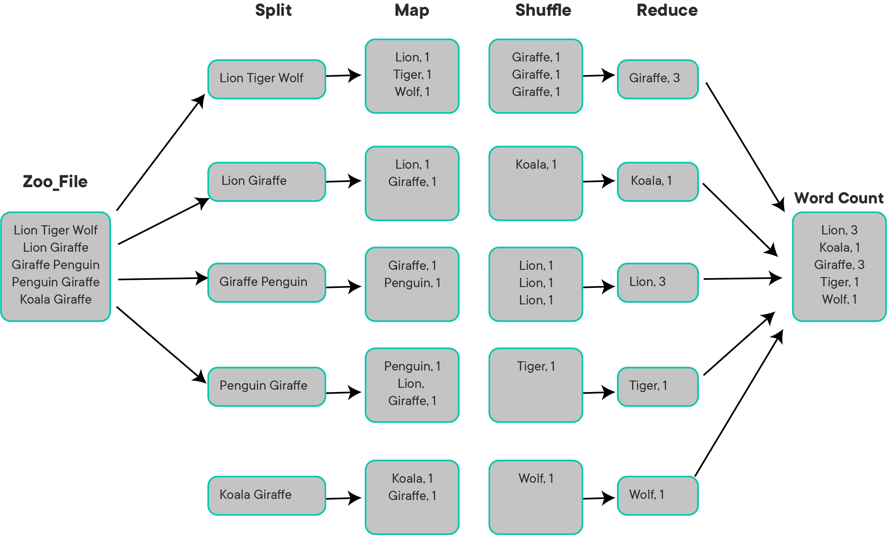

# Parallel and Distributed Computing with Map-Reduce

## Introduction 

MapReduce is a programming paradigm that enables the ability to scale across hundreds or thousands of servers for big data analytics. The underlying concept can be somewhat difficult to grasp, because this paradigm differs from the traditional programming practices. This lesson aims to present a simple yet intuitive account of MapReduce that we shall put into practice in upcoming labs. 

*In a nutshell, the term "MapReduce" refers to two distinct tasks. The first is the __Map__ job, which takes one set of data and transforms it into another set of data, where individual elements are broken down into tuples __(key/value pairs)__, while the __Reduce__ job takes the output from a map as input and combines those data tuples into a smaller set of tuples.*

Let's see this with help of some simple examples in this lesson.

## Objectives
You will be able to:

- Understand distributed and parallel computing environments
- Explain how Map-Reduce differs from traditional programming approaches
- Understand how Map-Reduce works using a simple word count example

## Parallel and Distributed Processing

The MapReduce programming paradigm is designed to allow __Parallel and Distributed Processing__  of large sets of data that classify as Big Data. MapReduce allows us to convert such big datasets into sets of __Tuples__ as __key:value__ pairs, as we'll see shortly. These pairs are analogous to the data structure we saw with dictionaries and JSON files etc. These tuples are __mapped__ and __reduced__ under in a computational environment to allow distributed execution of complex tasks on a group (cluster) of interconnected computers. 

So in simpler terms, _MapReduce use parallel distributed computing to turn big data into regular data._

Let's first see what we mean by parallel and distributed processing below

### Distributed Processing Systems

>A distributed processing system is a group of computers in a network working in tandem to accomplish a task

When computers are in a distributed system, they do not share hard drive memory or processing memory; they communicate with one other through messages, which are transferred over a network. The individual computers in this network are referred to as __nodes__. As you've seen before, computers can send requests as well as packets of data to one another.

The two most common ways of organizing computers into a distributed system are the Client/Server system and  peer-to-peer system.

The client server architecture has nodes that make requests to a central server. The server will then decide to accept of reject these requests and send additional methods out to the outer nodes.

Peer-to-peer systems allow nodes to communicate with one another directly without requiring approval from a server.




### Parallel Processing Systems

These networks are useful for many applications all over the web, but they are generally ill-suited for dealing with the processing power required for very large sets of data and complex problems.

Just like in the workplace, whenever there is an extremely complex task, it is best to divide and conquer. In the world of big data, if the data is "big" enough, it is generally better to take the approach of splitting up the larger task into smaller pieces.

Even though individual processors are getting faster (remember [Moore's Law](https://en.wikipedia.org/wiki/Moore%27s_law), they will never have the ability to keep up with the amount of data we are able to produce. The best solution computer scientists have developed has been to use the power of __multiple processors__ to put them to the same task. If using a well-developed distributed system, multiple processors can accomplish tasks at a fraction of the time it would take to a single processor the accomplish. As noted in the picture below, if you can divide the work between multiple processors, everything will be more efficient. 

With parallel computing:


* a larger problem is broken up into smaller pieces
* every part of the problem follows a series of instructions
* each one of the instructions is executed simultaneously on different processors
* all of the answers are collected from the small problems and combined into one final answer


In the image below, you can see a simple example of a process being broken up and completed both sequentially and in parallel.



Of course, not all problems can be parallelized, but there are some that are formally called [embarrassingly parallel](https://en.wikipedia.org/wiki/Embarrassingly_parallel) problems that require hardly any effort to ensure that a certain task is able to easily parallelizable. One example of this task would be password cracking. An example of something that would be embarrassingly parallelizable would be a movie production company trying to calculate the total profit they made from all of the movies they released in a given year. Let's think about all of the components that go into determining whether or not a movie is profitable.

* story rights
* producer
* director
* cast
* production costs
* visual effects
* music

and of course

* box office revenue

Here is what this would look like if it was calculated sequentially.

If a movie studio was to compute each one it's movie's profits sequentially, it would take far more time than if it calculated each movie's profit and combined them in parallel.

Here is a diagram of what it parallel processing looks like in actions



So how can we make all these nodes communicate with one another? By using a programming paradigm called MapReduce!!

### Map

__MapReduce__ is a software framework developed for processing datasets that qualify as "Big Data", in a __distributed and parallel__ processing environment over several computers/nodes connected to each other as part of a __cluster__. It is a specific instance of the generalized split-apply-combine technique used to perform different data analyses.

We will soon look into a simple example that is shown to introduce MapReduce,  __The Word Count Problem__. The overall concept of MapReduce is very simple yet very powerful as:

- Somehow, all data can be mapped to <key:value> pairs.
- Keys and Values themselves can be of ANY data type.

For our example, let's say a national association of zoos wants to determine the total number of species of animals in the country. After receiving responses from every zoo in the country, a data scientist in charge of receives a large file that has a different zoo located on each line with the species at that location. 

Here are the first five zoos the data scientist reads over in the data document they receives:

| Animals              |
|----------------------|
| lion tiger bear      |
| lion giraffe         |
| giraffe penguin      |
| penguin lion giraffe |
| koala giraffe        |


Let's now look at how you would use a map reduce framework in this simple word count problem example that could be generalized to much more data.



Let's take a look at an image of this process in action and determine what's actually going on.

### 1. MAP Task ((Splitting & Mapping)

The dataset that needs processing must first be transformed into <key:value> pairs and split into fragments, which are then assigned to map tasks. Each computing cluster is assigned a number of map tasks, which are subsequently distributed among its nodes. In this example, let's assume that we are using 5 nodes (a server with 5 different worker.

First, split the data from one file or files into however many nodes are being used.

We will then use the map function to create key value pairs represented by:   
*{animal}* , *{# of animals per zoo}* 

After processing of the original key:value pairs, some __intermediate__ key:value pairs are generated. The intermediate key:value pairs are __sorted by their key values__ to create a new list of key:value pairs.


### 2. Shuffling

This list from the map task is divided into a new set of fragments that sorts and shuffles the mapped objects into an order or grouping that will make it easier to reduce them. __The number these new fragments, will be the same as the number of the reduce tasks__. 

### 3. REDUCE Task (Reducing)

Now, every properly shuffled segment will have a reduce task applied to it. After the task is completed, the final output is written onto a file system. The underlying file system is usually HDFS (Hadoop Distributed File System). 

It's important to note that MapReduce will generally only be powerful when dealing with large amounts of data. When using on a small dataset, it will be faster to perform operations not in the MapReduce framework.

There are two groups of entities in this process to ensuring that the map reduce task gets done properly:

__Job Tracker__: a "master" node that informs the other nodes which map and reduce jobs to complete

__Task Tracker__: the "worker" nodes that complete the map and reduce operations

There are different names for these components depending on the technology used, but there will always be a master node that informs worker nodes what tasks to perform.

A general pseudocode for a word count map and reduce tasks would look like 

```python
# Count word frequency
def map( doc ) :
    for word in doc.split( ' ' ) :
    emit ( word , 1 )

def reduce( key , values ) :
    emit ( key , sum( values ) )
```

Similarly, we can discuss combining several Map-Reduce jobs in order to complete a given task. This means that once a first MapReduce job is finished, the output will become an input for the second MapReduce job and that output could be the final result (or fed into another job MapReduce job). 

Let's assume that we would like to extend the word count program and we would like to count all words in a given Twitter dataset. The first MapReduce will read our twitter data and extract the tweets text. The second MapReduce is the word count Map-Red which analyze twitter and produce the statistics about it. So it is simply chaining together multiple jobs. 

> __InputFile -> Map-1 -> Reduce1 -> output1 -> Map2 - > Reduce-2 -> output2 -> ....Map-x -> Reduce-x__  


Next, we are going to look at Apache Spark, which adds extra features of security and fault tolerance to it's MapReduce offering, making it an industry standard. We will also look at programming for the above mentioned word count problem.

## Additional Resources

Visit following external links to read about above descriptions and example in more detail. 

- [MapReduce Introduction](https://www.tutorialspoint.com/map_reduce/map_reduce_introduction.htm)

- [What is MapReduce? How it Works](https://www.guru99.com/introduction-to-mapreduce.html)

## Summary 

In this lesson, we looked at How MapReduce allows a programming paradigm, quite different than traditional programming practices, yet very powerful and effective towards processing large amounts of data. Next we shall look at Spark programming environment and some coding exercises to get grips with PySpark programming. 
