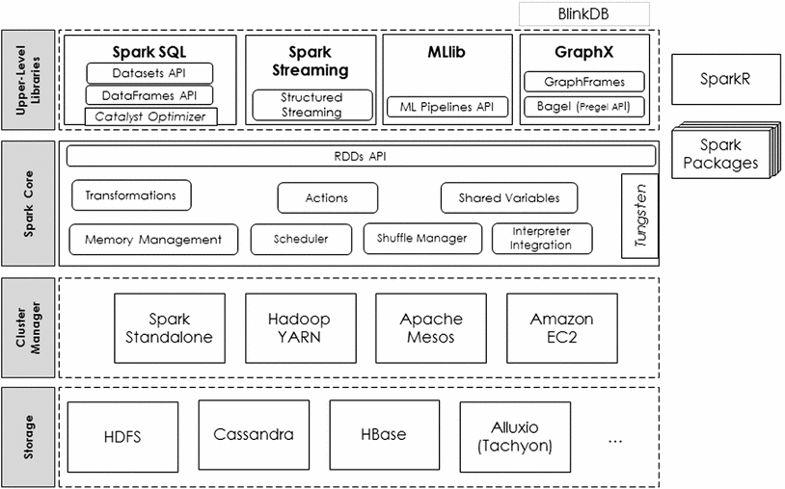

# Big Data Analytics on Apache Spark

## Introduction

Big Data Analytics is an emerging area of interest both for business and academia. There are a lot of details around the characteristics of big data and How Apache spark eases up the job of analyzing huge amounts of data using a simple programming paradigm. In this section, we will look at understanding and implementing a simple problem using MapReduce in Pyspark. Real world problems, however, are much more complicated than this and you should be able to scale up the takeaways from the simple word count example we will complete to much bigger problems. This lesson aims to provide you with a wider understanding of MapReduce and big data computation in Apache Spark Environment. 

## Objectives
You will be able to:
- Understand the role of Apache Spark in Big Data analytics 
- Get an understanding of Apache spark stack allowing abstraction of data and computation
- Describe RDDs as fundamental units of computation in Apache spark environment
- Get an insight into Spark's Machine Learning Library, Graph analysis library, and streaming features

In this lesson, you are required to read the following review article: 

### Big data analytics on Apache Spark
- International Journal of Data Science and Analytics
- November 2016, Volume 1, Issue 3–4, pp 145–164
- Authors: Salman Salloum, Ruslan Dautov, Xiaojun Chen, Patrick Xiaogang Peng, Joshua Zhexue Huang

The article is available at 
https://link.springer.com/article/10.1007/s41060-016-0027-9

*"In this paper, we present a technical review on big data analytics using Apache Spark. This review focuses on the key components, abstractions and features of Apache Spark. More specifically, it shows what Apache Spark has for designing and implementing big data algorithms and pipelines for machine learning, graph analysis and stream processing. In addition, we highlight some research and development directions on Apache Spark for big data analytics."* - from the abstract. Here is an image from the paper giving a general overview of how the spark ecosystem functions:

You are expected to spend around 90 - 120 minutes reading this article. It is an excellent article and all the key aspects of spark computational environment are summarized and presented in an excellent manner. 

## Summary

In this lesson, you read the scientific article "Big Data Analytics on Apache Spark", which covers the key aspects of Spark's computational environment. You'll now move on to working with Spark through Python.
