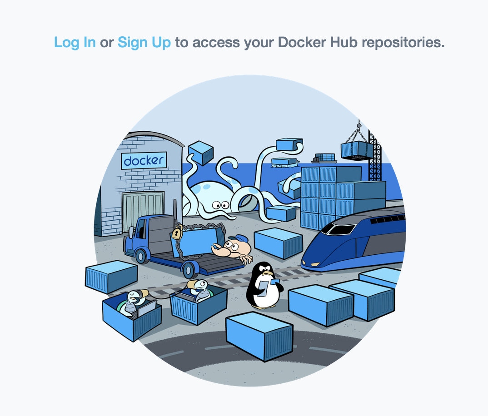

# Installing and Configuring PySpark with Docker

## Introduction

In addition to running on the clusters, Spark provides a simple standalone deploy mode. We can launch a standalone cluster either manually, by starting a master and workers by hand or use our provided launch scripts. It is also possible to run these daemons on a single machine for testing. In this lesson, we'll look at installing a standalone version of Spark on Windows and Mac machines. All the required tools are open source and directly downloadable from official sites referenced in the lesson. 

## Objectives
You will be able to:
- Install Docker on Windows/Mac environments
- Install a standalone version of Spark on a local server 
- Test the spark installation by running a simple test script

## Docker
For this section, we shall run PySpark on a single machine in a virtualized environment using __Docker__. Docker is a container technology that allows __packaging__ and __distribution__ of software  so that it takes away the headache of things like setting up an environment, configuring logging, configuring options, etc. Docker basically removes the excuse "*It doesn't work on my machine*". 

[Visit this link learn more about docker and containers](https://www.zdnet.com/article/what-is-docker-and-why-is-it-so-darn-popular/)

Spark is notoriously difficult to install, and you are welcome to try it, but it is often easier to use a virtual machine via Docker.

### Install Docker
 
 
- Download & install Docker on Mac : https://download.docker.com/mac/stable/Docker.dmg
- Download and install Docker on Windows:  https://hub.docker.com/editions/community/docker-ce-desktop-windows


### Kitematic

["Kitematic"](https://kitematic.com/) allows for a "one-click install" of containers in Docker running on your Mac and windows and lets you control your app containers from a graphical user interface (GUI). This takes away a lot of cognitive load required to set up and configure virtual environments. *Kitematic used to be a separate program, but now it is automatically included with new versions of Docker*

Once Docker is successfully installed, we need to perform the following tasks in the given sequence to create a notebook that is pyspark enabled.


### Click on the docker toolbar on mac and select Kitematic


### Sign up on Docker Hub 
Upon running Kitematic, you will be asked to sign up on Docker Hub. This is optional, but it is recommended as it can allow to share your Docker containers and run them on different machines. 

This option can be accessed via "My Repos" Section in the Kitematic GUI. 
 


### Search for `pyspark-notebook` repository, and click on the image provided by `jupyter` 
It is imperative to use the one from __jupyter__ for everything to run as expected, as there are lots of other offerings available. Once you click "Create" the pyspark-notebook image will start to download (it might take some time).


Run the image when it is downloaded, it will start an `ipython-kernel`. To run jupyter notebooks, click on the right half of kitematic where it says "web preview".


This will open a browser window asking you for a token ID. Go back to the kitematic and check the left bottom of the terminal-like screen for a string that says: `token?= --- ` as shown below. Copy the text after that and put it into the jupyter notebook page.


This will open a new jupyter notebook, just as we've seen before. We are now ready to program in spark!

## Testing the installation

In order to make sure everything went smooth, Let's run a simple script in a new jupyter notebook. 

```python
import pyspark
sc = pyspark.SparkContext('local[*]')
rdd = sc.parallelize(range(1000))
rdd.takeSample(False, 5)
```

If everything went fine, you should see an output like this:
```
[941, 60, 987, 542, 718]
```

Do not worry if you don't fully comprehend what the above code meant. Next, we will look into some basic programming principles and methods from Spark which will explain this. 

## User Docker to Complete Lessons and Labs
The best way to use Docker to work with the labs in this section is to mount the folders containing the labs to a docker container. In order to do this, run the command:

```bash
docker run -it -p 8888:8888 -v {absolute file path}:/home/jovyan/work --rm jupyter/pyspark-notebook

```

Once this command has been executed, you can go through the same process as above to input the token into your browser after going to http://localhost:8888. After doing so, navigate to the folder "work" and execute the cell below.


```python
import pyspark
sc = pyspark.SparkContext('local[*]')
rdd = sc.parallelize(range(1000))
rdd.takeSample(False, 5)
```

## Summary 

In this lesson, we looked at installing Spark using a Docker container. The process is the same for both Mac and Windows-based systems. In this section, the focus will be entirely on Spark. 
