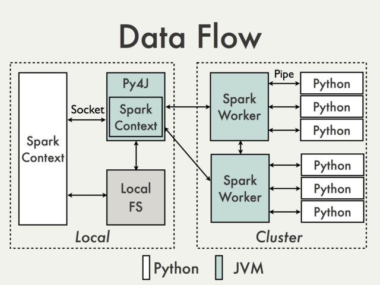
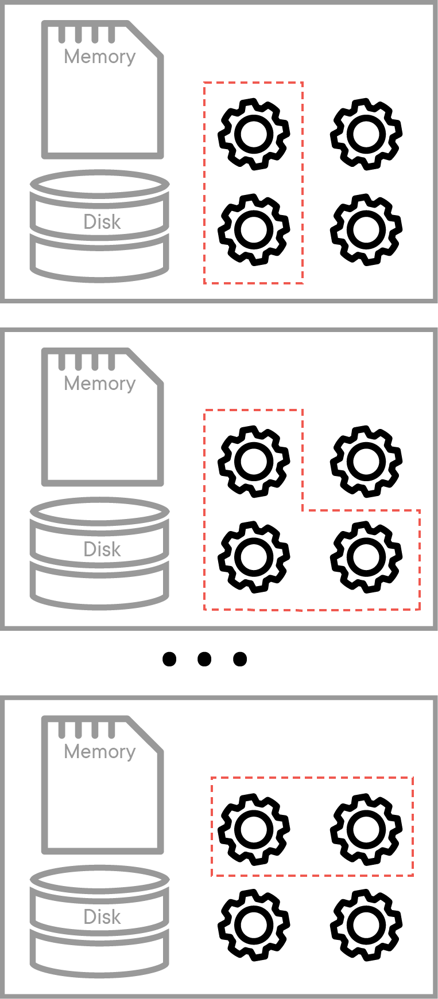

# Understanding `SparkContext` - Lab

## Introduction

The following series of PySpark lessons and labs in this section will provide you with an introduction to **Apache Spark**, the leading framework for big data processing in jupyter notebooks and PySpark, using a PySpark docker image in a standalone mode. These lessons require you explore the spark documentation and explore and practice methods and properties which are not directly covered in the labs. In this first lesson, we'll look at creating a spark session , called a Spark Context and explore its properties. 

## Objectives

You will be able to:

* Describe Spark's parallalism with master and executor nodes
* Understand SparkContext() for managing connections in parallel applications 
* Provide an overview of major SparkContext() properties and methods

## Cluster Resource Manager

Spark comes bundled with a **Cluster Resource Manager** which divides and shares the physical resources of a cluster of machines between multiple Spark applications. Spark's **Standalone cluster manager** operates in the standalone mode and allows Spark to manage its own cluster on a local machine. We will mainly use the standalone cluster manager for resource allocation in these labs. 


In Spark computational model, communication routinely occurs between a **driver** and **executors**. The driver has Spark jobs that it needs to run and these jobs are split into tasks that are submitted to the workers for completion. The results from these tasks are delivered back to the driver. 

This image, taken from the [Spark documentation](https://spark.apache.org/docs/latest/spark-standalone.html) demonstrates this process well.


The spark driver declares the transformations and actions on data and submits such requests to the **master**. 

> The machine on which the Spark cluster manager runs is called the **Master Node**. 

For our labs, this distributed arrangement will be simulated on a single machine allowing you to initialize master and worker nodes. 

## `SparkContext()`

In order to use Spark and its API we will need to use a **SparkContext**. SparkContext is how we are able to control what is happening in the Spark program from python. When we run any Spark application, a driver program starts, which has the main function and your SparkContext gets initiated here. The driver program then runs the operations inside the executors on worker nodes as shown above.

SparkContext uses Py4J to create a bridge between python and java, the language spark is built with. Even though all the code we'll be executing is in python, java is the code being executed underneath the hood in a JavaSparkConext. You'll see in error messages that they will frequently contain errors related specifically to Java. 

*Py4j provides a bridge between python and Java. [Click here](https://www.py4j.org/) to see more details on this. Here is a visual representation of how SparkContext functions found in the [Apache documentation](https://cwiki.apache.org/confluence/display/SPARK/PySpark+Internals)* 



Spark applications driver program launches parallel operations on executor Java Virtual Machines (JVMs). This can occur either locally on a single machine using multiple cores to create parallel processing or across a cluster of computers that are controlled by a master computer. When running locally, "PySparkShell" is the driver program. The driver program contains the key instructions for the program and it determines how to best distribute datasets across the cluster and apply operations to those datasets.

The key takeaways for SparkContext are listed below:

- SparkContext is a client of Spark’s execution environment and it acts as the master of the Spark application.
- SparkContext sets up internal services and establishes a connection to a Spark execution environment. 
- The driver is the program that creates the SparkContext, connecting to a given Spark Master. 

After creation, SparkContext asks the master for some cores to use to do work. The master sets these cores aside and they are used to complete whatever operation they are assigned to do. You can visualize the setup in the figure below:



This image depicts the worker nodes at work. Every worker has 4 cores to work with, and the master allocates tasks to run on certain cores within each worker node.

As stated before, a SparkContext object (usually shown as `sc`) is the main entry point for Spark functionality and can be used to create `Resilient Distributed Datasets` (RDDs) on a cluster as we will see in our next lab.

Lets start a spark application by importing pyspark, creating a spark context as `sc` and try printing out type of `sc`. For this SparkContext, we are going to assign the `master` parameter to 'local[ * ]' to indicate that we are running this SparkContext to be parallelized on our local machine.


```python
# Create a local spark context with pyspark
import pyspark
sc = pyspark.SparkContext('local[*]')
```


```python
# Display the type of the Spark Context
type(sc)

# pyspark.context.SparkContext
```


    pyspark.context.SparkContext


```python
# Create second spark context
sc1 = pyspark.SparkContext('local[*]')
```

As you can see, only one SparkContext can be created within a python kernel at once!

### SparkContext attributes

We can use Python's `dir()` function to get a list of all the attributes (including methods) accessible through the `sc` object.


```python
# Use Python's dir(obj) to get a list of all attributes of SparkContext

# Code here 


```

Alternatively, you can use Python's `help()` function to get an easier to read list of all the attributes, including examples, that the sc object has.


```python
# Use Python's help ( help(object) ) function to get information on attributes and methods for sc object. 


# Code here 

```

You should also have a look at [Spark's SparkContext Documentation Page](https://spark.apache.org/docs/0.6.0/api/core/spark/SparkContext.html) to explore these in further detail.

Let's try to check a few spark context attributes including `SparkContext.version` and `SparkContext.defaultParalellism` to check the current version of Apache Spark and number of cores being used for parallel processing.


```python
# Check the number of cores being used

# Code here 

# Check for the current version of Spark

# Code here 


# Default number of cores being used: 2
# Current version of Spark: 2.3.1
```

Let's also check the name of current application by using `SparkContext.appName` attribute. 


```python
# Check the name of application currently running in spark environment


# Code here 


# 'pyspark-shell'
```


    'pyspark-shell'


We can access complete configuration settings (including all defaults) for the current spark context using `_conf.getAll()` method. 


```python
 # Get all configuration settings

# Code here 

# [('spark.driver.port', '36035'),
#  ('spark.rdd.compress', 'True'),
#  ('spark.driver.host', '588b1d2e9e9b'),
#  ('spark.serializer.objectStreamReset', '100'),
#  ('spark.master', 'local[*]'),
#  ('spark.executor.id', 'driver'),
#  ('spark.submit.deployMode', 'client'),
#  ('spark.ui.showConsoleProgress', 'true'),
#  ('spark.app.name', 'pyspark-shell'),
#  ('spark.app.id', 'local-1545010504175')]
```

A Spark Context can be shut down using `SparkContext.stop()` method. Let's use this method to shut down the current spark context. 


```python
#Shut down SparkContext

# Code here
```

Once shut down, you can no longer access spark functionality before starting a new SparkContext. 

## Additional Resources

- [Apache Spark Context](https://data-flair.training/blogs/learn-apache-spark-sparkcontext/)

## Summary

In this short lab, we saw how SparkContext is used as an entry point to Spark applications. We learned how to start a SparkContext, how to list and use some of the attributes and methods in SparkContext and how to shut it down. Students are encouraged to explore other attributes and methods offered by the sc object. Some of these, namely creating and transforming datasets as RDDs will be explored in later labs. 
