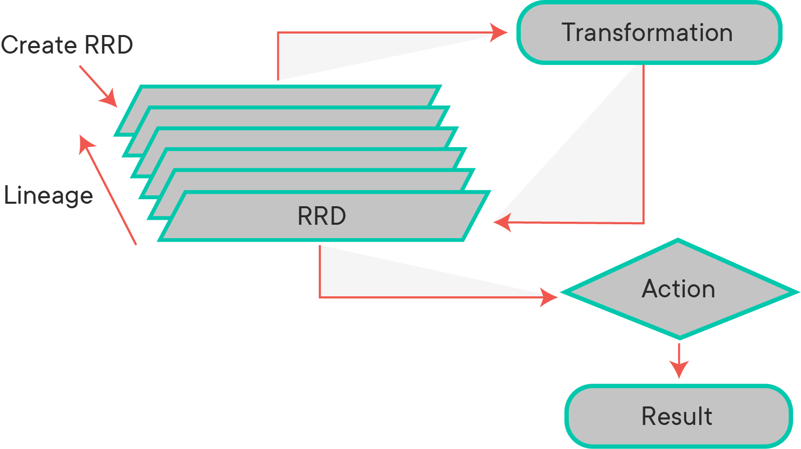
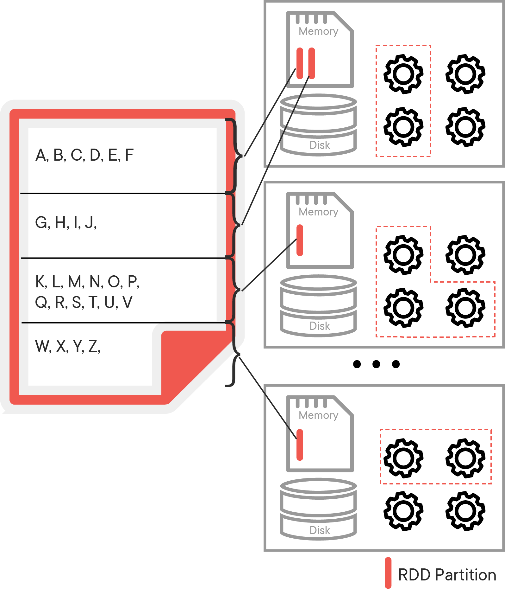
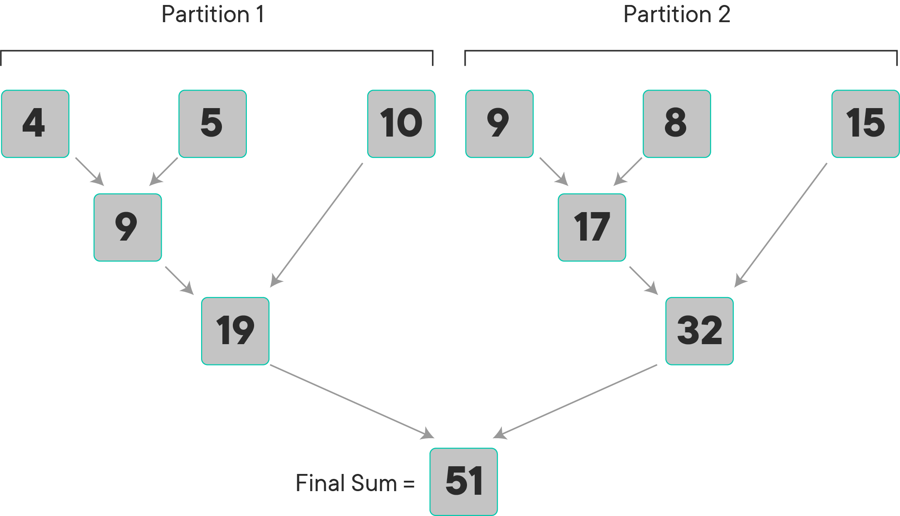

## Resilient Distributed Datasets (RDDs) - Lab

Resilient Distributed Datasets (RDD) are fundamental data structures of Spark. An RDD is, essentially, the Spark representation of a set of data, spread across multiple machines, with APIs to let you act on it. An RDD can come from any data source, e.g. text files, a database, a JSON file, etc.


## Objectives

You will be able to:

* Describe RDDs as fundamental storage units in the Spark computing environment
* Create RDDs from Python collections
* Set number of partitions for parallelizing RDDs
* Review an RDD's dependency graph at different stages of processing. 
* Apply the map(func) transformation to a given function on all elements of an RDD in different partitions
* Use collect() action to trigger the processing stage of spark's lazy evaluation
* Use count() action to calculate the number of elements of a parallelized RDD
* Use filter(func) to filter unwanted data from RDDs
* Develop an understanding of Python's lambda functions for RDDs processing


## What are RDDs? 

To get a better understanding of RDDs, let's break down each one of the components of the acronym RDD:

Resilient: RDDs are considered "resilient" because they have built-in fault tolerance. This means that even if one of the nodes goes offline, RDDs will be able to restore the data. This is already a huge advantage compared to standard storage. If a standard computer dies will performing an operation, all of its memory will be lost in the process. With RDDs, multiple nodes can go offline, and the action will still be held in working memory.

Distributed: The data is contained on multiple nodes of a cluster-computing operation. It is efficiently partitioned to allow for parallelism.

Dataset: The dataset has been * partitioned * across the multiple nodes. 

RDDs are the building block upon which more high-level Spark operations are based upon. Chances are, if you are performing an action using Spark, the operation involves RDDs. 


Key Characteristics of RDDs:

- Immutable: Once an RDD is created, it cannot be modified.
- Lazily Evaluated: RDDs will not be evaluated until an action is triggered. Essentially, when RDDs are created, they are programmed to perform some action, but that function will not get activated until it is explicitly called. The reason for lazy evaluation is that allows users to organize the actions of their Spark program into smaller actions. It also saves unnecessary computation and memory load.
- In-Memory: The operations in Spark are performed in-memory rather than in the Database. This is what allows Spark to perform fast operations with very large quantities of data.


### RDD Transformations vs Actions

In Spark, we first create a __base RDD__ and then apply one or more transformations to that base RDD following our processing needs. Being immutable means, **once an RDD is created, it cannot be changed**. As a result, **each transformation of an RDD creates a new RDD**. Finally, we can apply one or more **actions** to the RDDs. Spark uses lazy evaluation, so transformations are not actually executed until an action occurs.




### Transformations

Transformations create a new data set from an existing one by passing each dataset element through a function and returning a new RDD representing the results. In short, creating an RDD from an existing RDD is ‘transformation’.
All transformations in Spark are lazy. They do not compute their results right away. Instead, they just remember the transformations applied to some base data set (e.g. a file). The transformations are only computed when an action requires a result that needs to be returned to the driver program.
A transformation is an RDD that returns another RDD, like map, flatMap, filter, reduceByKey, join, cogroup, etc.

### Actions
Actions return final results of RDD computations. Actions trigger execution using lineage graph to load the data into original RDD and carry out all intermediate transformations and return the final results to the Driver program or writes it out to the file system. An action returns a value (to a Spark driver - the user program).

Here are some of key transformations and actions that we will explore.


| Transformations   | Actions       |
|-------------------|---------------|
| map(func)         | reduce(func)  |
| filter(func)      | collect()     |
| groupByKey()      | count()       |
| reduceByKey(func) | first()       |
| mapValues(func)   | take()        |
| sample()          | countByKey()  |
| distinct()        | foreach(func) |
| sortByKey()       |               |


Let's see how transformations and actions work through a simple example. In this example, we will perform several actions and transformations on RDDs in order to obtain a better understanding of Spark processing. 

### Create a Python collection 

We need some data to start experimenting with RDDs. Let's create some sample data and see how RDDs handle it. To practice working with RDDs, we're going to use a simple Python list.

- Create a Python list `data` of integers between 1 and 1000 using the `range()` function. 
- Sanity check: confirm the length of the list (it should be 1000)


```python
data = None
len(data)

#1000
```

### Initialize an RDD

When using Spark to make computations, datasets are treated as lists of entries. Those lists are split into different partitions across different cores or different computers. Each list of data held in memory is a partition of the RDD. The reason why Spark is able to make computations far faster than other big data processing languages is that it allows all data to be stored __in-memory__, which allows for easy access to the data and, in turn, high-speed processing. Here is an example of how the alphabet might be split into different RDDs and held across a distributed collection of nodes:

  
To initialize an RDD, first import `pyspark` and then create a SparkContext assigned to the variable `sc`. Use 'local[*]' as the master.


```python

sc = None
```

Once you've created the SparkContext, you can use the `parallelize` method to create an rdd will distribute the list of numbers across multiple cores. Here, create one called `rdd` with 10 partitions using `data` as the collection you are parallelizing.


```python
rdd = None
print(type(rdd))
# <class 'pyspark.rdd.RDD'>
```

Determine how many partitions are being used with this RDD with the getNumPartitions method.


```python
rdd.getNumPartitions()
# 10
```

### Basic descriptive RDD actions

Let's perform some basic operations on our RDD. In the cell below, use the methods:
* `count`: returns the total count of items in the RDD 
* `first`: returns the first item in the RDD
* `take`: returns the first n items in the RDD
* `top`: returns the top n items
* `collect`: returns everything from your RDD


It's important to note that in a big data context, calling the collect method will often take a very long time to execute and should be handled with care!


```python
# count

```


```python
# first

```


```python
# take

```


```python
# top

```


```python
# collect

```

## Map functions

Now that you've been working a little bit with RDDs, let's make this a little more interesting. Imagine you're running a hot new e-commerce startup called BuyStuff, and you're trying to track of how much it charges customers from each item sold. In the next cell, we're going to create simulated data by multiplying the values 1-1000 be a random number from 0-1.


```python
import random
import numpy as np

nums = np.array(range(1,1001))
sales_figures = nums * np.random.rand(1000)
sales_figures
```

We now have sales prices for 1000 items currently for sale at BuyStuff. Now create an RDD called `price_items` using the newly created data with 10 slices. After you create it, use one of the basic actions to see what's in the RDD.


```python
price_items = None

```

Now let's perform some operations on this simple dataset. To begin with, create a function that will take into account how much money BuyStuff will receive after sales tax has been applied (assume a sales tax of 8%). To make this happen, create a function called `sales_tax` that returns the amount of money our company will receive after the sale tax has been applied. The function will have this parameter:

* `item`: (float) number to be multiplied by the sales tax.


Apply that function to the rdd by using the map method and assign it to a variable `renenue_minus_tax`


```python
def sales_tax(num):
    pass

revenue_minus_tax = None
```

Remember, Spark has __lazy evaluation__, which means that the `sales_tax` function is a transformer that is not executed until you call an action. Use one of the collection methods to execute the transformer now a part of the RDD and observe the contents of the `revenue_minus_tax` rdd.


```python
# perform action to retrieve rdd values
```

### Lambda Functions

Note that you can also use lambda functions if you want to quickly perform simple operations on data without creating a function. Let's assume that BuyStuff has also decided to offer a 10% discount on all of their items on the pre-tax amounts of each item. Use a lambda function within a map method to apply the additional 10% loss in revenue for BuyStuff and assign the transformed RDD to a new RDD called `discounted`.


```python
discounted = None
```


```python
discounted.take(10)
```

## Chaining Methods

You are also able to chain methods together with Spark. In one line, remove the tax and discount from the revenue of BuyStuff use a collection method to see the 15 costliest items.

## RDD Lineage


We are able to see the full lineage of all the operations that have been performed on an RDD by using the `RDD.toDebugString()` method. As your transformations become more complex, you are encouraged to call this method to get a better understanding of the dependencies between RDDs. Try calling it on the `discounted` RDD to see what RDDs it is dependent on.

### Map vs. Flatmap

Depending on how you want your data to be outputted, you might want to use flatMap rather than a simple map. Let's take a look at how it performs operations versus the standard map. Let's say we wanted to maintain the original amount BuyStuff receives for each item as well as the new amount after the tax and discount are applied. Create a map function that will a tuple with (original price, post-discount price).


```python
mapped =None
print(mapped.count())
print(mapped.take(10))
```

Note that we have 1000 tuples created to our specification. Let's take a look at how flatMap differs in its implementation. Use the `flatMap` method with the same function you created above.


```python
flat_mapped = None
print(flat_mapped.count())
print(flat_mapped.take(10))
```

Rather than being represented by tuples, all of the  values are now on the same level. When we are trying to combine different items together, it is sometimes necessary to use flatmap rather than map in order to properly reduce to our specifications. This is not one of those instances, but int he upcoming lab, you just might have to use it.

## Filter
After meeting with some external consultants, BuyStuff has determined that its business will be more profitable if it focuses on higher ticket items. Now, use the filter method to select items that bring in more than $300 after tax and discount have been removed. A filter method is a specialized form of a map function that only returns the items that match a certain criterion. In the cell below:
* use a lambda function within a filter function to meet the consultant's suggestion's specifications. set RDD = `selected_items`
* calculate the total number of items remaining in BuyStuff's inventory


```python
# use the filter function
selected_items = None

# calculate total remaining in inventory 

```

## Reduce

Reduce functions are where you are in some way combing all of the variables that you have mapped out. Here is an example of how a reduce function works when the task is to sum all values:

  


As you can see, the operation is performed within each partition first, after which, the results of the computations in each partition are combined to come up with one final answer.  

Now it's time to figure out how much money BuyStuff would make from selling one of all of its items after they've reduced their inventory. Use a reduce method with a lambda function to add up all of the values in the RDD. Your lambda function should have two variables. 

The time has come for BuyStuff to open up shop and start selling its goods. It only has one of each item, but it's allowing 50 lucky users to buy as many items as they want while they remain in stock. Within seconds, BuyStuff is sold out. Below, you'll find the sales data in an RDD with tuples of (user, item bought).


```python
import random
random.seed(42)
# generating simulated users that have bought each item
sales_data = selected_items.map(lambda x: (random.randint(1,50),x))

sales_data.take(7)
```

It's time to determine some basic statistics about BuyStuff users.

Let's start off by creating an RDD that determines how much each user spent in total.
To do this we can use a method called __reduceByKey__ to perform reducing operations while grouping by keys. After you have calculated the total, use the __sortBy__ method on the RDD to rank the users from the highest spending to the least spending.


```python
# calculate how much each user spent
```


```python
# sort the users from highest to lowest spenders

```

Next, let's determine how many items were bought per user. This can be solved in one line using an RDD method. After you've counted the total number of items bought per person, sort the users from most number of items bought to least number of items. Time to start a customer loyalty program!

### Additional Reading

- [The original paper on RDDs](https://cs.stanford.edu/~matei/papers/2012/nsdi_spark.pdf)
- [RDDs in Apache Spark](https://data-flair.training/blogs/create-rdds-in-apache-spark/)
- [Programming with RDDs](https://runawayhorse001.github.io/LearningApacheSpark/rdd.html)
- [RDD Transformations and Actions Summary](https://www.analyticsvidhya.com/blog/2016/10/using-pyspark-to-perform-transformations-and-actions-on-rdd/)

## Summary

In this lab we went through a brief introduction to RDD creation from a Python collection, setting a number of logical partitions for an RDD, and extracting lineage and of an RDD in a spark application. We also used transformations and actions to perform calculations across RDDs on a distributed setup. Up next, you'll get the chance to apply these transformations on different books to calculate word counts and various statistics.

