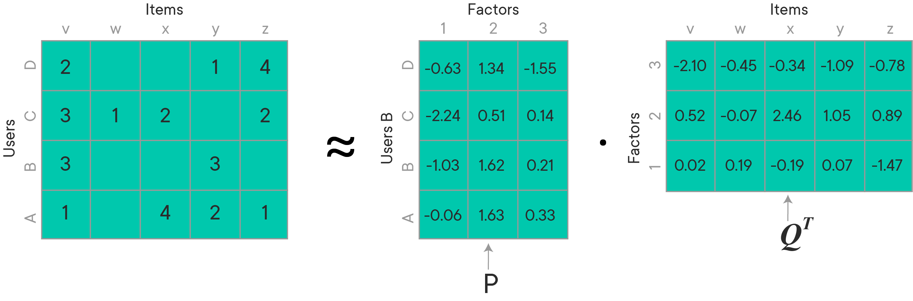

# Matrix Factorization with Alternating Least Squares

## Introduction
In this lesson, we will look at another matrix factorization technique called Alternating Least Squares (ALS). This method can prove to be much more effective and robust than the SVD we saw earlier. ALS allows you to set regularization measures and minimize a loss function while optimizing the model parameter `k`.  We will briefly look at the math behind this approach in this lesson, before putting it into practice next with spark. 

## Objectives

You will be able to:

- Introduce a learning function for optimal matrix decomposition
- Learn how the ALS functions by alternating between two regularization parameters to reduce loss
- Understand how ALS is implemented in Spark


## Recap Matrix Factorization

In the past few lessons, we learned that Matrix factorization functions with the following assumptions:

- Each user can be described by k attributes or features. 

For example, feature 1 could be a number that says how much each user likes sci-fi movies. 2, how much he/she likes horror movies and so on. 

- Each item can be described by an analogous set of k attributes or features. 

For our MovieLens example, feature 1 for a chosen movie might be a number that says how close the movie is to pure sci-fi.

> By multiplying the features of the user by the features of each item and adding these items together, we will approximate what a user would rate a particular item


## Introducing a Learning Function 

The simplicity in Matrix Factorization is that we do not have to know what these features are. Nor do we know how many (k) features are relevant. We pick a number for $k$ and learn the relevant values for all the features for all the users and items. This is essentially the same process used for dimensionality reduction with PCA.

__How do we integrate learning into this problem? By minimizing a loss function, of course__

We can use matrix factorization to represent each user and item by k-dimensional vectors. By letting each item i can be k-dimensional vector $q_i$ and each user u represented by k-dimensional $p_u$, User u’s predicted rating for item $i$ is just the dot product of their two vectors. This means that we can represent the entire utility matrix by approximating with the that we can reconstruct the entire utility matrix by multiplying matrix p and q together. So how do we find out what the values for p and q are?


$$ R = PQ^T $$ for the entire matrix 

or 

$$r̂_{u,i}=q_i^⊤p_u $$ for individual ratings


- R is the full user-item rating matrix

- P is a matrix that contains the users and the k factors represented as (user,factor)

- $Q^T$ is a matrix that contains the items and the k factors represented as

- $r̂_{u,i}$ represents our prediction for the true rating $r_{ui}$ In order to get an individual rating, you must take the dot product of a row of P and a column of Q


These user and item vectors are called **latent vectors**. The $k$ attributes are called **latent factors**.

The image below is a representation of how a matrix is decomposed into two separate matrices. 



If we wanted to calculate the rating for user B, item W. Our calculation would be the dot product of `[-1.03 , 1.62, 0.21]` and `[-0.78,0.89,-1.47]`. Let's calculate these values in numpy. 


```python
import numpy as np

# users X factors
P =np.array([[-0.63274434,  1.33686735, -1.55128517],
       [-2.23813661,  0.5123861 ,  0.14087293],
       [-1.0289794 ,  1.62052691,  0.21027516],
       [-0.06422255,  1.62892864,  0.33350709]])
```


```python
# factors X items
Q = np.array([[-2.09507374,  0.52351075,  0.01826269],
       [-0.45078775, -0.07334991,  0.18731052],
       [-0.34161766,  2.46215058, -0.18942263],
       [-1.0925736 ,  1.04664756,  0.69963111],
       [-0.78152923,  0.89189076, -1.47144019]])
```


```python
# the original 
R = np.array([[2, np.nan, np.nan, 1, 4],
       [5, 1, 2, np.nan, 2],
       [3, np.nan, np.nan, 3, np.nan],
       [1, np.nan, 4, 2, 1]])
```


```python
print(P[2])
```

    [-1.0289794   1.62052691  0.21027516]


```python
print(Q.T[:,4])
```

    [-0.78152923  0.89189076 -1.47144019]


```python
P[2].dot(Q.T[:,4])
```


    1.9401031341455333


Now we can do the calculation for the entire matrix ratings matrix. You can see that the values in the predicted matrix are *very* close to the actual ratings for those that are present in the original rating array. The other values are new! 


```python
P.dot(Q.T)
```


    array([[ 1.99717984, -0.10339773,  3.80157388,  1.00522135,  3.96947118],
           [ 4.95987359,  0.99772807,  1.9994742 ,  3.08017572,  1.99887552],
           [ 3.00799117,  0.38437256,  4.30166793,  2.96747131,  1.94010313],
           [ 0.99340337, -0.02806164,  3.96943336,  2.00841398,  1.01228247]])


This should remind you of how things were calculated for the SVD array, so let's see what is different. We want our predictions to be as close to the truth as possible. In order to calculate these matrices, we establish a loss function in order to minimize. To avoid overfitting, the loss function also includes a regularization parameter $\lambda$.  We will choose a $\lambda$ to minimize the square of the difference between all ratings in our dataset $R$ and our predictions. 

The Loss function $L$ can be calculated as:

$$ L = \sum_{u,i ∈  \kappa}(r_{u,i}− q_i^T p_u)^2 + λ( ||q_i||^2 + |p_u||^2)$$

Where $\kappa$ is the set of (u,i) pairs for which $r_{u,i}$ is known.

In the equation, there are two L2 regularization terms to prevent overfitting of the user and item vectors. As always, our goal is to minimize this loss function. This could be done with something like Gradient Descent of course, but due to the massive size of sparse matrices so frequently associated with recommendation system datasets, this is not always feasible. That's where Alternating Least Squares comes into play.

## Alternating Least Squares

For ALS minimization, we hold one set of latent vectors constant. Essentially ALS alternates between holding the $q_i$'s constant and the $p_u$'s constant. While all $q_i$'s are held constant, each $p_u$ is computed by solving the least squared problem, each independently. After that process has taken place, all the $p_u$'s are held constant while the $q_i$'s are altered to solve the least squares problem, again, each independently. This process repeats many times until you've reached convergence (ideally).

If we assume either the user-factors or item-factors was fixed, this should be just like a regularised least square problem. Let's look at these least square equations written out mathematically.

First let's assume first the item vectors are fixed, we first solve for the user vectors:

### __$$p_u=(\sum_{r_{u,i}\in r_{u*}}{q_iq_i^T + \lambda I_k})^{-1}\sum_{r_{u,i}\in r_{u*}}{r_{ui}{q_{i}}}$$__

Then we hold the user vectors constant and solve for the item vectors

### __$$q_i=(\sum_{r_{u,i}\in r_{i*}}{p_up_u^T + \lambda I_k})^{-1}\sum_{r_{u,i}\in r_{u*}}{r_{ui}{p_{u}}}$$__


This process repeats until convergence


Above two steps are iterated until convergence OR some stopping criterion is reached. [Literature on ALS suggests 10 iterations for optimal results](https://endymecy.gitbooks.io/spark-ml-source-analysis/content/%E6%8E%A8%E8%8D%90/papers/Large-scale%20Parallel%20Collaborative%20Filtering%20the%20Netflix%20Prize.pdf). Here is [another good source](https://datajobs.com/data-science-repo/Collaborative-Filtering-[Koren-and-Bell].pdf). 


## Modification to Include Bias

Although this can produce great results on its own, it doesn't take into account trends related to different characteristics of certain items and certain users as well as the data as a whole. To account for this, more advanced implementations of ALS include a __bias__ term to capture some of these aspects of the overall utility matrix. A common implementation of this is captured with 3 bias terms:

* $\mu$ : a global average - the overall average rating of all items
* $b_{i}$ : item bias - the deviations of item i from the average
* $b_{u}$ : user bias - the deviations of user u from the average

Let's look at a basic example of how this would work. Imagine we're trying to calculate the rating for *The Shawshank Redemption* for user Matt. Assume the overall average rating is 3.5 and that * The Shawshank Redemption* tends to be rated 0.4 points higher than average. Matt is a generous rater and tends to rate 0.2 higher than the average. This would make his rating for the Shawshank Redemption 3.5 + 0.4 + 0.2 = 4.1 

Putting these biases into an equation becomes:

### $$ \hat{r}_{ui} = \mu + b_{i} + b_{u} + q_{i}^{T}p_{u} $$

and the overall loss function becomes:

### $$ L = \sum_{u,i ∈  \kappa}(r_{u,i}− \mu - b_{u} - b_{i} - p_u^T q_i)^2 + \lambda( ||q_i||^2 + |p_u||^2 + b_{u}^{2} + b_{i}^{2})$$

## ALS v SVD

ALS is generally less computationally efficient than directly computing the SVD solution, but it shines when you are dealing with a giant, sparse matrices. SVD requires that all entries of the matrix be observed, and this is not a requirement with ALS. Because of ALS's "alternating" nature, it lends itself to performing computations in parallel. This can make it extremely beneficial to use distributed computing when using ALS. Do you remember anything that works in parallel? Spark!

## ALS in Spark 

As we will see in our next lab, Spark's machine learning library `ml` offers an implementation of alternating least squares algorithm out of the box. It factors the user to item matrix A into the user-to-feature matrix U and the item-to-feature matrix M. It runs the ALS algorithm in a parallel fashion.  The ALS algorithm helps uncover the latent factors for big data in a distributed computation setup. It explains the observed user to item ratings and tries to find optimal factor weights to minimize the least squares between predicted and actual ratings while the data is split in a cluster of computers.


## Additional Resources
- [A detailed explanation of ALS](https://datasciencemadesimpler.wordpress.com/tag/alternating-least-squares/)
- [Great Video on recommendation systems in spark](https://sparkhub.databricks.com/video/a-more-scalable-way-of-making-recommendations-with-mllib/)
- [The maths behind ALS](http://stanford.edu/~rezab/classes/cme323/S15/notes/lec14.pdf)
- [Spark ALS for kaggle Santander competition](https://www.elenacuoco.com/2016/12/22/alternating-least-squares-als-spark-ml/)

## Summary 

In this lesson, we looked at another matrix factorization technique, called alternating least squares and learned how we can train such a model to minimize a loss function, based on least squares. Let's try what we have seen so far in the spark environment in the last lab for this section. 
